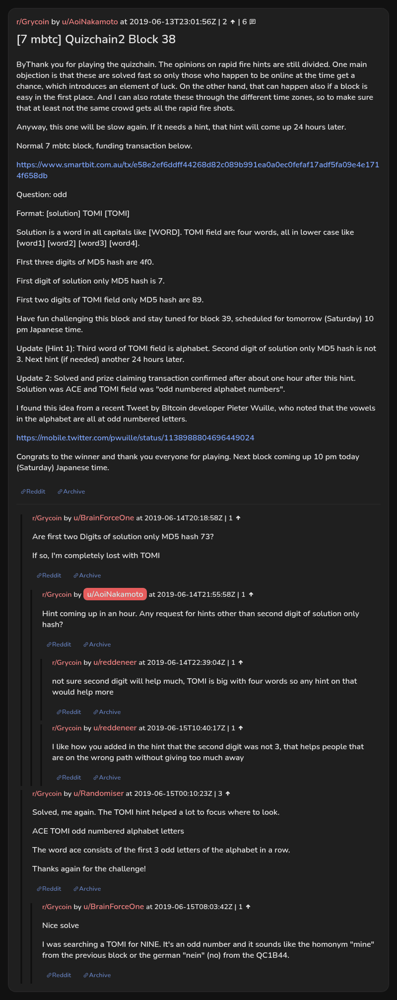

# [7 mbtc] Quizchain2 Block 38

[Original thread](https://www.reddit.com/r/Grycoin/comments/c0cq0b/7_mbtc_quizchain2_block_38/). The `sourceUrl` of the [quizchain2/38](../../../src/collections/quizchain2/38.ts) record and the source of its question, format, hash digits, hint and funding transaction, with the solution the author edited in. The author's update gives the TOMI field as "odd numbered alphabet numbers", while u/Randomiser's comment has "odd numbered alphabet letters", the string the posted hash digits and the claim's public key confirm. The post went up on June 13, 2019, at 23:01:56 UTC, almost ten hours after the block time of its funding transaction. Its last edit is stamped 00:21:18 UTC on June 15, 2019, so the transcript shows the post as it stood after the claim.

## Historical provenance

No capture found. On October 2, 2026 the Wayback Machine index listed one capture of the thread under the `www.reddit.com` URL, June 11, 2023, 18:01:57 UTC. Its `id_` body is Reddit's app shell titled "Reddit - Dive into anything", with neither the post nor a comment in its HTML. The one capture of the `old.reddit.com` URL, four seconds later, is a 302 redirect to a subreddit search for Grycoin. The archive.today timemaps for the `www.reddit.com`, `old.reddit.com` and bare `reddit.com` URLs answered 404. MemGator answered "No snapshots" for all three, but it gave the same answer for the block 11 thread, whose Wayback capture exists, so it settles nothing here.

The transcript below comes from the [Arctic Shift](https://arctic-shift.photon-reddit.com/) Reddit archive: the post record and the comment tree for `c0cq0b`, read on October 2, 2026. The [pullpush](https://pullpush.io/) Reddit archive, read the same day, gives the same post text, time and edit stamp, and the same 6 comments with the same authors, times, scores and parents.

The record names none of the commenters: nothing on the chain ties a claim to a name.

## Transcript

> ByThank you for playing the quizchain. The opinions on rapid fire hints are still divided. One main objection is that these are solved fast so only those who happen to be online at the time get a chance, which introduces an element of luck. On the other hand, that can happen also if a block is easy in the first place. And I can also rotate these through the different time zones, so to make sure that at least not the same crowd gets all the rapid fire shots.
>
> Anyway, this one will be slow again. If it needs a hint, that hint will come up 24 hours later.
>
> Normal 7 mbtc block, funding transaction below.
>
> https://www.smartbit.com.au/tx/e58e2ef6ddff44268d82c089b991ea0a0ec0fefaf17adf5fa09e4e1714f658db
>
> Question: odd
>
> Format: [solution] TOMI [TOMI]
>
> Solution is a word in all capitals like [WORD]. TOMI field are four words, all in lower case like [word1] [word2] [word3] [word4].
>
> FIrst three digits of MD5 hash are 4f0.
>
> First digit of solution only MD5 hash is 7.
>
> First two digits of TOMI field only MD5 hash are 89.
>
> Have fun challenging this block and stay tuned for block 39, scheduled for tomorrow (Saturday) 10 pm Japanese time.
>
> Update (Hint 1): Third word of TOMI field is alphabet. Second digit of solution only MD5 hash is not 3. Next hint (if needed) another 24 hours later.
>
> Update 2: Solved and prize claiming transaction confirmed after about one hour after this hint. Solution was ACE and TOMI field was "odd numbered alphabet numbers".
>
> I found this idea from a recent Tweet by BItcoin developer Pieter Wuille, who noted that the vowels in the alphabet are all at odd numbered letters.
>
> https://mobile.twitter.com/pwuille/status/1138988804696449024
>
> Congrats to the winner and thank you everyone for playing. Next block coming up 10 pm today (Saturday) Japanese time.

## Comments

**u/BrainForceOne**, 1 point:

> Are first two Digits of solution only MD5 hash 73?
>
> If so, I'm completely lost with TOMI

**u/AoiNakamoto**, 1 point, reply to u/BrainForceOne:

> Hint coming up in an hour. Any request for hints other than second digit of solution only hash?

**u/reddeneer**, 1 point, reply to u/AoiNakamoto:

> not sure second digit will help much, TOMI is big with four words so any hint on that would help more

**u/reddeneer**, 1 point, reply to u/AoiNakamoto:

> I like how you added in the hint that the second digit was not 3, that helps people that are on the wrong path without giving too much away

**u/Randomiser**, 3 points:

> Solved, me again. The TOMI hint helped a lot to focus where to look.
>
> ACE TOMI odd numbered alphabet letters
>
> The word ace consists of the first 3 odd letters of the alphabet in a row.
>
> Thanks again for the challenge!

**u/BrainForceOne**, 1 point, reply to u/Randomiser:

> Nice solve
>
> I was searching a TOMI for NINE. It's an odd number and it sounds like the homonym "mine" from the previous block or the german "nein" (no) from the QC1B44.

## Screenshot

The screenshot is a render of the thread in Arctic Shift's ID lookup, not of Reddit, since no readable capture of the Reddit page exists. Capture method and limits: [source archive](../README.md).
