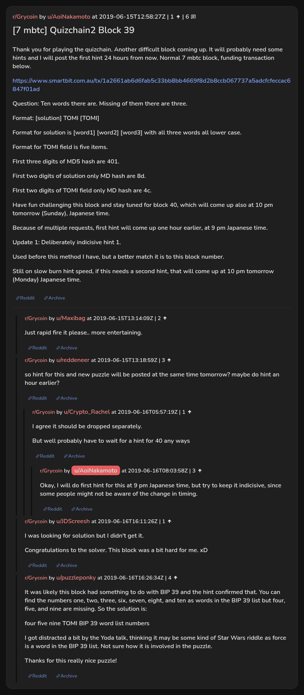

# [7 mbtc] Quizchain2 Block 39

[Original thread](https://www.reddit.com/r/Grycoin/comments/c0x0r5/7_mbtc_quizchain2_block_39/). The `sourceUrl` of the [quizchain2/39](../../../src/collections/quizchain2/39.ts) record and the source of its question, format, hash digits, hint and funding transaction. The author never edited the solution in: the last edit is stamped 12:03:31 UTC on June 16, 2019, four hours before the claim confirmed, so the transcript shows the post as it stood before the claim. The solution is only in u/puzzleponky's comment. The post went up on June 15, 2019, at 12:58:27 UTC, eleven and a half hours after the block time of its funding transaction.

## Historical provenance

No capture found. On October 2, 2026 the Wayback Machine index listed one capture of the thread under the `www.reddit.com` URL, June 11, 2023, 22:19:53 UTC. Its `id_` body is Reddit's app shell titled "Reddit - Dive into anything", with neither the post nor a comment in its HTML. The one capture of the `old.reddit.com` URL, a second later, is a 302 redirect to a subreddit search for Grycoin. The archive.today timemaps for the `www.reddit.com`, `old.reddit.com` and bare `reddit.com` URLs answered 404. MemGator answered "No snapshots" for all three, but it gave the same answer for the block 11 thread, whose Wayback capture exists, so it settles nothing here.

The transcript below comes from the [Arctic Shift](https://arctic-shift.photon-reddit.com/) Reddit archive: the post record and the comment tree for `c0x0r5`, read on October 2, 2026. The [pullpush](https://pullpush.io/) Reddit archive, read the same day, gives the same post text, time and edit stamp, and the same 6 comments with the same authors, times, scores and parents.

The record names none of the commenters: nothing on the chain ties a claim to a name.

## Transcript

> Thank you for playing the quizchain. Another difficult block coming up. It will probably need some hints and I will post the first hint 24 hours from now.
> Normal 7 mbtc block, funding transaction below.
>
> https://www.smartbit.com.au/tx/1a2661ab6d6fab5c33bb8bb4669f8d2b8ccb067737a5adcfcfeccac6847f01ad
>
> Question: Ten words there are. Missing of them there are three.
>
> Format: [solution] TOMI [TOMI]
>
> Format for solution is [word1] [word2] [word3] with all three words all lower case.
>
> Format for TOMI field is five items.
>
> FIrst three digits of MD5 hash are 401.
>
> First two digits of solution only MD hash are 8d.
>
> FIrst two digits of TOMI field only MD hash are 4c.
>
> Have fun challenging this block and stay tuned for block 40, which will come up also at 10 pm tomorrow (Sunday), Japanese time.
>
> Because of multiple requests, first hint will come up one hour earlier, at 9 pm Japanese time.
>
> Update 1: Deliberately indicisive hint 1.
>
> Used before this method I have, but a better match it is to this block number.
>
> Still on slow burn hint speed, if this needs a second hint, that will come up at 10 pm tomorrow (Monday) Japanese time.

## Comments

**u/Maxibag**, 2 points:

> Just rapid fire it please.. more entertaining.

**u/reddeneer**, 3 points:

> so hint for this and new puzzle will be posted at the same time tomorrow? maybe do hint an hour earlier?

**u/Crypto_Rachel**, 1 point, reply to u/reddeneer:

> I agree it should be dropped separately.
>
> But well probably have to wait for a hint for 40 any ways

**u/AoiNakamoto**, 3 points, reply to u/Crypto_Rachel:

> Okay, I will do first hint for this at 9 pm Japanese time, but try to keep it indicisive, since some people might not be aware of the change in timing.

**u/JDScreesh**, 1 point:

> I was looking for solution but I didn't get it.
>
> Congratulations to the solver. This block was a bit hard for me. xD

**u/puzzleponky**, 4 points:

> It was likely this block had something to do with BIP 39 and the hint confirmed that. You can find the numbers one, two, three, six, seven, eight, and ten as words in the BIP 39 list but four, five, and nine are missing. So the solution is:
>
> four five nine TOMI BIP 39 word list numbers
>
> I got distracted a bit by the Yoda talk, thinking it may be some kind of Star Wars riddle as force is a word in the BIP 39 list. Not sure how it is involved in the puzzle.
>
> Thanks for this really nice puzzle!

## Screenshot

The screenshot is a render of the thread in Arctic Shift's ID lookup, not of Reddit, since no readable capture of the Reddit page exists. Capture method and limits: [source archive](../README.md).
