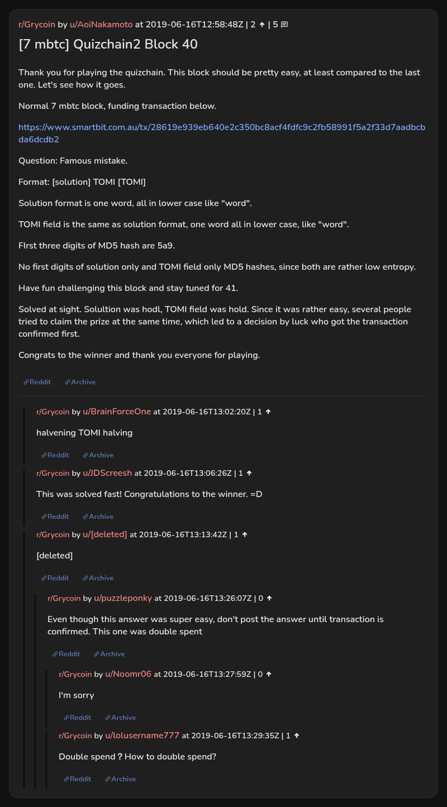

# [7 mbtc] Quizchain2 Block 40

[Original thread](https://www.reddit.com/r/Grycoin/comments/c19m8f/7_mbtc_quizchain2_block_40/). The `sourceUrl` of the [quizchain2/40](../../../src/collections/quizchain2/40.ts) record and the source of its question, format, hash digits and funding transaction, with the solution the author edited in. Nobody in the surviving comments printed the whole string. The post went up on June 16, 2019, at 12:58:48 UTC, four and three quarter hours after the block time of its funding transaction. Its last edit is stamped 10:56:28 UTC on June 17, 2019, so the transcript shows the post as it stood after the claim.

## Historical provenance

No capture found. On October 2, 2026 the Wayback Machine index listed one capture of the thread under the `www.reddit.com` URL, June 11, 2023, 21:26:22 UTC. Its `id_` body is Reddit's app shell titled "Reddit - Dive into anything", with neither the post nor a comment in its HTML. The one capture of the `old.reddit.com` URL, in the same second, is a 302 redirect to a subreddit search for Grycoin. The archive.today timemaps for the `www.reddit.com`, `old.reddit.com` and bare `reddit.com` URLs answered 404. MemGator answered "No snapshots" for all three, but it gave the same answer for the block 11 thread, whose Wayback capture exists, so it settles nothing here.

The transcript below comes from the [Arctic Shift](https://arctic-shift.photon-reddit.com/) Reddit archive: the post record and the comment tree for `c19m8f`, read on October 2, 2026. The [pullpush](https://pullpush.io/) Reddit archive, read the same day, gives the same post text, time and edit stamp, and the same 6 comments with the same authors, times, scores and parents. One of them is a deleted comment, kept below as `[deleted]`.

The record names none of the commenters: nothing on the chain ties a claim to a name.

## Transcript

> Thank you for playing the quizchain. This block should be pretty easy, at least compared to the last one. Let's see how it goes.
>
> Normal 7 mbtc block, funding transaction below.
>
> https://www.smartbit.com.au/tx/28619e939eb640e2c350bc8acf4fdfc9c2fb58991f5a2f33d7aadbcbda6dcdb2
>
> Question: Famous mistake.
>
> Format: [solution] TOMI [TOMI]
>
> Solution format is one word, all in lower case like "word".
>
> TOMI field is the same as solution format, one word all in lower case, like "word".
>
> FIrst three digits of MD5 hash are 5a9.
>
> No first digits of solution only and TOMI field only MD5 hashes, since both are rather low entropy.
>
> Have fun challenging this block and stay tuned for 41.
>
> Solved at sight. Solultion was hodl, TOMI field was hold. Since it was rather easy, several people tried to claim the prize at the same time, which led to a decision by luck who got the transaction confirmed first.
>
> Congrats to the winner and thank you everyone for playing.

## Comments

**u/BrainForceOne**, 1 point:

> halvening TOMI halving

**u/JDScreesh**, 1 point:

> This was solved fast! Congratulations to the winner. =D

**[deleted]**:

> [deleted]

**u/puzzleponky**, 0 points, reply to a deleted comment:

> Even though this answer was super easy, don't post the answer until transaction is confirmed. This one was double spent

**u/Noomr06**, 0 points, reply to u/puzzleponky:

> I'm sorry

**u/lolusername777**, 1 point, reply to u/puzzleponky:

> Double spend？How to double spend?

## Screenshot

The screenshot is a render of the thread in Arctic Shift's ID lookup, not of Reddit, since no readable capture of the Reddit page exists. Capture method and limits: [source archive](../README.md).
