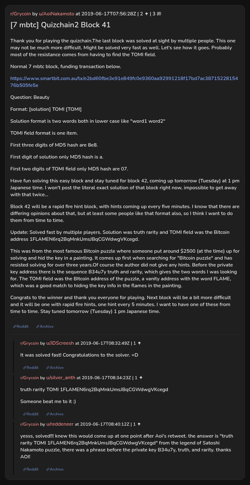

# [7 mbtc] Quizchain2 Block 41

[Original thread](https://www.reddit.com/r/Grycoin/comments/c1kuxd/7_mbtc_quizchain2_block_41/). The `sourceUrl` of the [quizchain2/41](../../../src/collections/quizchain2/41.ts) record and the source of its question, format, hash digits and funding transaction, with the solution the author edited in. The full winning string is in u/silver_anth's comment. The post went up on June 17, 2019, at 07:56:28 UTC, a quarter of an hour after the block time of its funding transaction. Its last edit is stamped 10:54:20 UTC the same day, so the transcript shows the post as it stood after the claim.

## Historical provenance

No capture found. On October 3, 2026 the Wayback Machine index listed one capture of the thread under the `www.reddit.com` URL, June 11, 2023, 22:44:42 UTC. Its `id_` body is Reddit's app shell titled "Reddit - Dive into anything", with neither the post nor a comment in its HTML. The one capture of the `old.reddit.com` URL, a second later, is a 302 redirect to a subreddit search for Grycoin. The archive.today timemaps for the `www.reddit.com`, `old.reddit.com` and bare `reddit.com` URLs answered 404. MemGator answered "No snapshots" for all three, but it gave the same answer for the block 11 thread, whose Wayback capture exists, so it settles nothing here.

The transcript below comes from the [Arctic Shift](https://arctic-shift.photon-reddit.com/) Reddit archive: the post record and the comment tree for `c1kuxd`, read on October 3, 2026. The [pullpush](https://pullpush.io/) Reddit archive, read the same day, gives the same post text, time and edit stamp, and the same 3 comments with the same authors, times, scores and parents.

The record names none of the commenters: nothing on the chain ties a claim to a name.

## Transcript

> Thank you for playing the quizchain.The last block was solved at sight by multiple people. This one may not be much more difficult. Might be solved very fast as well. Let's see how it goes. Probably most of the resistance comes from having to find the TOMI field.
>
> Normal 7 mbtc block, funding transaction below.
>
> https://www.smartbit.com.au/tx/e2bd60fbe3e91e849fc0e9360aa92991218f17bd7ac3871522815476b505fe5e
>
> Question: Beauty
>
> Format: [solution] TOMI [TOMI]
>
> Solution format is two words both in lower case like "word1 word2"
>
> TOMI field format is one item.
>
> First three digits of MD5 hash are 8e8.
>
> First digit of solution only MD5 hash is a.
>
> First two digits of TOMI field only MD5 hash are 07.
>
> Have fun solving this easy block and stay tuned for block 42, coming up tomorrow (Tuesday) at 1 pm Japanese time. I won't post the literal exact solution of that block right now, impossible to get away with that twice...
>
> Block 42 will be a rapid fire hint block, with hints coming up every five minutes. I know that there are differing opinions about that, but at least some people like that format also, so I think I want to do them from time to time.
>
> Update: Solved fast by multiple players. Solution was truth rarity and TOMI field was the Bitcoin address 1FLAMEN6rq2BqMnkUmsJBqCGWdwgVKcegd.
>
> This was from the most famous Bitcoin puzzle where someone put around $2500 (at the time) up for solving and hid the key in a painting. It comes up first when searching for "Bitcoin puzzle" and has resisted solving for over three years.Of course the author did not give any hints. Before the private key address there is the sequence B34u7y truth and rarity, which gives the two words I was looking for. The TOMI field was the BItcoin address of the puzzle, a vanity address with the word FLAME, which was a good match to hiding the key info in the flames in the painting.
>
> Congrats to the winner and thank you everyone for playing. Next block will be a bit more difficult and it will be one with rapid fire hints, one hint every 5 minutes. I want to have one of these from time to time. Stay tuned tomorrow (Tuesday) 1 pm Japanese time.

## Comments

**u/JDScreesh**, 1 point:

> It was solved fast! Congratulations to the solver. =D

**u/silver_anth**, 1 point:

> truth rarity TOMI 1FLAMEN6rq2BqMnkUmsJBqCGWdwgVKcegd
>
> Someone beat me to it :)

**u/reddeneer**, 1 point:

> yesss, solved!!! knew this would come up at one point after Aoi's retweet. the answer is "truth rarity TOMI 1FLAMEN6rq2BqMnkUmsJBqCGWdwgVKcegd" from the legend of Satoshi Nakamoto puzzle, there was a phrase before the private key B34u7y, truth, and rarity. thanks AOI!

## Screenshot

The screenshot is a render of the thread in Arctic Shift's ID lookup, not of Reddit, since no readable capture of the Reddit page exists. Capture method and limits: [source archive](../README.md).
