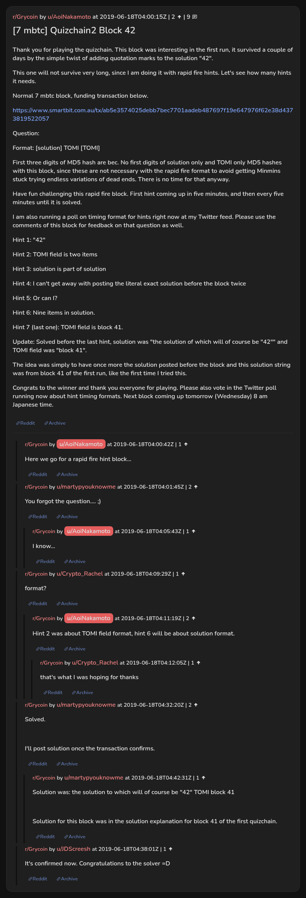

# [7 mbtc] Quizchain2 Block 42

[Original thread](https://www.reddit.com/r/Grycoin/comments/c1xhjo/7_mbtc_quizchain2_block_42/). The `sourceUrl` of the [quizchain2/42](../../../src/collections/quizchain2/42.ts) record and the source of its format, hash digits, seven hints and funding transaction, with the solution the author edited in. The post has no question. The author's update gives the solution as `the solution of which will of course be "42""`, with a stray quotation mark, while u/martypyouknowme's comment has `the solution to which`, the wording the posted hash digits and the claim's public key confirm. The post went up on June 18, 2019, at 04:00:15 UTC, four hours after the block time of its funding transaction. Its last edit is stamped 04:57:58 UTC the same day, so the transcript shows the post as it stood after the claim.

## Historical provenance

No capture found. On October 3, 2026 the Wayback Machine index listed one capture of the thread under the `www.reddit.com` URL, June 11, 2023, 19:31:43 UTC. Its `id_` body is Reddit's app shell titled "Reddit - Dive into anything", with neither the post nor a comment in its HTML. The one capture of the `old.reddit.com` URL, a second later, is a 302 redirect to a subreddit search for Grycoin. The archive.today timemaps for the `www.reddit.com`, `old.reddit.com` and bare `reddit.com` URLs answered 404. MemGator answered "No snapshots" for all three, but it gave the same answer for the block 11 thread, whose Wayback capture exists, so it settles nothing here.

The transcript below comes from the [Arctic Shift](https://arctic-shift.photon-reddit.com/) Reddit archive: the post record and the comment tree for `c1xhjo`, read on October 3, 2026. The [pullpush](https://pullpush.io/) Reddit archive, read the same day, gives the same post text, time and edit stamp, and the same 9 comments with the same authors, times, scores and parents. The raw texts differ only where pullpush writes `&`, `<` or `>` as an HTML entity, in two comments. Two comments have an empty `&#x200B;` paragraph, which the transcript leaves out.

The record names none of the commenters: nothing on the chain ties a claim to a name.

## Transcript

> Thank you for playing the quizchain. This block was interesting in the first run, it survived a couple of days by the simple twist of adding quotation marks to the solution "42".
>
> This one will not survive very long, since I am doing it with rapid fire hints. Let's see how many hints it needs.
>
> Normal 7 mbtc block, funding transaction below.
>
> https://www.smartbit.com.au/tx/ab5e3574025debb7bec7701aadeb487697f19e647976f62e38d4373819522057
>
> Question:
>
> Format: [solution] TOMI [TOMI]
>
> First three digits of MD5 hash are bec. No first digits of solution only and TOMI only MD5 hashes with this block, since these are not necessary with the rapid fire format to avoid getting Minmins stuck trying endless variations of dead ends. There is no time for that anyway.
>
> Have fun challenging this rapid fire block. First hint coming up in five minutes, and then every five minutes until it is solved.
>
> I am also running a poll on timing format for hints right now at my Twitter feed. Please use the comments of this block for feedback on that question as well.
>
> Hint 1: "42"
>
> Hint 2: TOMI field is two items
>
> Hint 3: solution is part of solution
>
> Hint 4: I can't get away with posting the literal exact solution before the block twice
>
> Hint 5: Or can I?
>
> Hint 6: Nine items in solution.
>
> Hint 7 (last one): TOMI field is block 41.
>
> Update: Solved before the last hint, solution was "the solution of which will of course be "42"" and TOMI field was "block 41".
>
> The idea was simply to have once more the solution posted before the block and this solution string was from block 41 of the first run, like the first time I tried this.
>
> Congrats to the winner and thank you everyone for playing. Please also vote in the Twitter poll running now about hint timing formats. Next block coming up tomorrow (Wednesday) 8 am Japanese time.

## Comments

**u/AoiNakamoto**, 1 point:

> Here we go for a rapid fire hint block...

**u/martypyouknowme**, 2 points:

> You forgot the question.... ;)

**u/AoiNakamoto**, 1 point, reply to u/martypyouknowme:

> I know...

**u/Crypto_Rachel**, 1 point:

> format?

**u/AoiNakamoto**, 2 points, reply to u/Crypto_Rachel:

> Hint 2 was about TOMI field format, hint 6 will be about solution format.

**u/Crypto_Rachel**, 1 point, reply to u/AoiNakamoto:

> that's what I was hoping for thanks

**u/martypyouknowme**, 2 points:

> Solved.
>
> I'll post solution once the transaction confirms.

**u/martypyouknowme**, 1 point, reply to u/martypyouknowme:

> Solution was: the solution to which will of course be "42" TOMI block 41
>
> Solution for this block was in the solution explanation for block 41 of the first quizchain.

**u/JDScreesh**, 1 point:

> It's confirmed now. Congratulations to the solver =D

## Screenshot

The screenshot is a render of the thread in Arctic Shift's ID lookup, not of Reddit, since no readable capture of the Reddit page exists. Capture method and limits: [source archive](../README.md).
