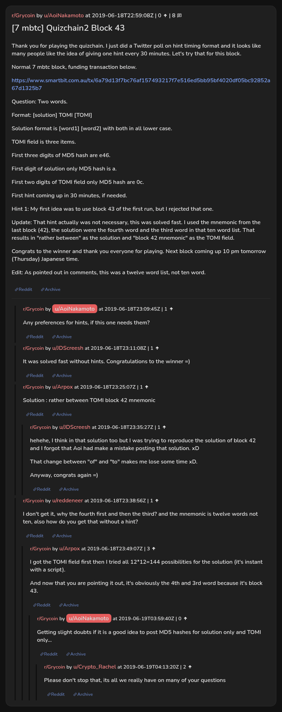

# [7 mbtc] Quizchain2 Block 43

[Original thread](https://www.reddit.com/r/Grycoin/comments/c297as/7_mbtc_quizchain2_block_43/). The `sourceUrl` of the [quizchain2/43](../../../src/collections/quizchain2/43.ts) record and the source of its question, format, hash digits, hint and funding transaction, with the solution the author edited in. The full winning string is in u/Arpox's comment. The post went up on June 18, 2019, at 22:59:08 UTC, twenty-two minutes after the block time of its funding transaction. Its last edit is stamped 03:58:48 UTC on June 19, 2019, so the transcript shows the post as it stood after the claim.

## Historical provenance

No capture found. On October 3, 2026 the Wayback Machine index listed one capture of the thread under the `www.reddit.com` URL, June 11, 2023, 20:42:20 UTC. Its `id_` body is Reddit's app shell titled "Reddit - Dive into anything", with neither the post nor a comment in its HTML. The one capture of the `old.reddit.com` URL, three seconds later, is indexed as a 302 redirect, and the Wayback Machine answers 404 when asked for its body. The archive.today timemaps for the `www.reddit.com`, `old.reddit.com` and bare `reddit.com` URLs answered 404. MemGator answered "No snapshots" for all three, but it gave the same answer for the block 11 thread, whose Wayback capture exists, so it settles nothing here.

The transcript below comes from the [Arctic Shift](https://arctic-shift.photon-reddit.com/) Reddit archive: the post record and the comment tree for `c297as`, read on October 3, 2026. The [pullpush](https://pullpush.io/) Reddit archive, read the same day, gives the same post text, time and edit stamp, and the same 8 comments with the same authors, times, scores and parents.

The record names none of the commenters: nothing on the chain ties a claim to a name.

## Transcript

> Thank you for playing the quizchain. I just did a Twitter poll on hint timing format and it looks like many people like the idea of giving one hint every 30 minutes. Let's try that for this block.
>
> Normal 7 mbtc block, funding transaction below.
>
> https://www.smartbit.com.au/tx/6a79d13f7bc76af157493217f7e516ed5bb95bf4020df05bc92852a67d1325b7
>
> Question: Two words.
>
> Format: [solution] TOMI [TOMI]
>
> Solution format is [word1] [word2] with both in all lower case.
>
> TOMI field is three items.
>
> First three digits of MD5 hash are e46.
>
> First digit of solution only MD5 hash is a.
>
> First two digits of TOMI field only MD5 hash are 0c.
>
> First hint coming up in 30 minutes, if needed.
>
> Hint 1: My first idea was to use block 43 of the first run, but I rejected that one.
>
> Update: That hint actually was not necessary, this was solved fast. I used the mnemonic from the last block (42), the solution were the fourth word and the third word in that ten word list. That results in "rather between" as the solution and "block 42 mnemonic" as the TOMI field.
>
> Congrats to the winner and thank you everyone for playing. Next block coming up 10 pm tomorrow (Thursday) Japanese time.
>
> Edit: As pointed out in comments, this was a twelve word list, not ten word.

## Comments

**u/AoiNakamoto**, 1 point:

> Any preferences for hints, if this one needs them?

**u/JDScreesh**, 1 point:

> It was solved fast without hints. Congratulations to the winner =)

**u/Arpox**, 1 point:

> Solution : rather between TOMI block 42 mnemonic

**u/JDScreesh**, 1 point, reply to u/Arpox:

> hehehe, I think in that solution too but I was trying to reproduce the solution of block 42 and I forgot that Aoi had make a mistake posting that solution. xD
>
> That change between "of" and "to" makes me lose some time xD.
>
> Anyway, congrats again =)

**u/reddeneer**, 1 point:

> I don't get it, why the fourth first and then the third? and the mnemonic is twelve words not ten, also how do you get that without a hint?

**u/Arpox**, 3 points, reply to u/reddeneer:

> I got the TOMI field first then I tried all 12*12=144 possibilities for the solution (it's instant with a script).
>
> And now that you are pointing it out, it's obviously the 4th and 3rd word because it's block 43.

**u/AoiNakamoto**, 0 points, reply to u/Arpox:

> Getting slight doubts if it is a good idea to post MD5 hashes for solution only and TOMI only...

**u/Crypto_Rachel**, 2 points, reply to u/AoiNakamoto:

> Please don't stop that, its all we really have on many of your questions

## Screenshot

The screenshot is a render of the thread in Arctic Shift's ID lookup, not of Reddit, since no readable capture of the Reddit page exists. Capture method and limits: [source archive](../README.md).
