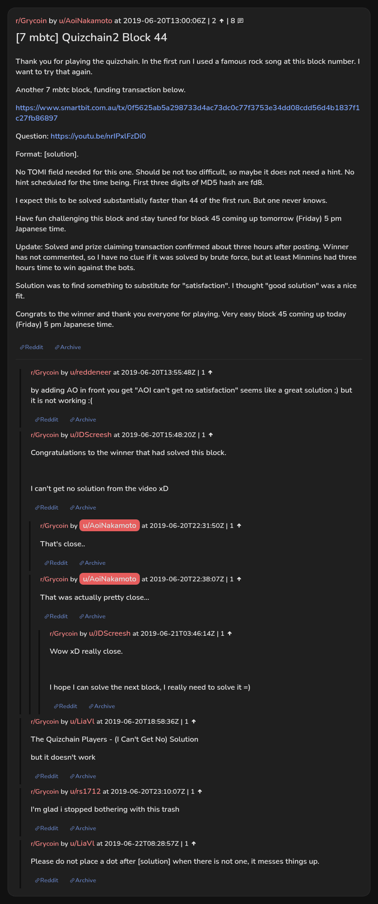

# [7 mbtc] Quizchain2 Block 44

[Original thread](https://www.reddit.com/r/Grycoin/comments/c2volp/7_mbtc_quizchain2_block_44/). The `sourceUrl` of the [quizchain2/44](../../../src/collections/quizchain2/44.ts) record and the source of its question, format, hash digit and funding transaction, with the solution the author edited in. Nobody in the surviving comments printed the solution. The post went up on June 20, 2019, at 13:00:06 UTC, five and a half hours after the block time of its funding transaction. Its last edit is stamped 22:36:57 UTC the same day, so the transcript shows the post as it stood after the claim.

## Historical provenance

No capture found. On October 3, 2026 the Wayback Machine index listed one capture of the thread under the `www.reddit.com` URL, June 11, 2023, 21:14:15 UTC. Its `id_` body is Reddit's app shell titled "Reddit - Dive into anything", with neither the post nor a comment in its HTML. The one capture of the `old.reddit.com` URL, two seconds later, is a 302 redirect to a subreddit search for Grycoin. The archive.today timemaps for the `www.reddit.com`, `old.reddit.com` and bare `reddit.com` URLs answered 404. MemGator answered "No snapshots" for all three, but it gave the same answer for the block 11 thread, whose Wayback capture exists, so it settles nothing here.

The transcript below comes from the [Arctic Shift](https://arctic-shift.photon-reddit.com/) Reddit archive: the post record and the comment tree for `c2volp`, read on October 3, 2026. The [pullpush](https://pullpush.io/) Reddit archive, read the same day, gives the same post text, time and edit stamp, and the same 8 comments with the same authors, times, scores and parents. The raw texts differ only where pullpush writes `&`, `<` or `>` as an HTML entity, in two comments. Two comments have an empty `&#x200B;` paragraph, which the transcript leaves out.

The record names none of the commenters: nothing on the chain ties a claim to a name.

## Transcript

> Thank you for playing the quizchain. In the first run I used a famous rock song at this block number. I want to try that again.
>
> Another 7 mbtc block, funding transaction below.
>
> https://www.smartbit.com.au/tx/0f5625ab5a298733d4ac73dc0c77f3753e34dd08cdd56d4b1837f1c27fb86897
>
> Question: https://youtu.be/nrIPxlFzDi0
>
> Format: [solution].
>
> No TOMI field needed for this one. Should be not too difficult, so maybe it does not need a hint. No hint scheduled for the time being. First three digits of MD5 hash are fd8.
>
> I expect this to be solved substantially faster than 44 of the first run. But one never knows.
>
> Have fun challenging this block and stay tuned for block 45 coming up tomorrow (Friday) 5 pm Japanese time.
>
> Update: Solved and prize claiming transaction confirmed about three hours after posting. Winner has not commented, so I have no clue if it was solved by brute force, but at least Minmins had three hours time to win against the bots.
>
> Solution was to find something to substitute for "satisfaction". I thought "good solution" was a nice fit.
>
> Congrats to the winner and thank you everyone for playing. Very easy block 45 coming up today (Friday) 5 pm Japanese time.

## Comments

**u/reddeneer**, 1 point:

> by adding AO in front you get "AOI can't get no satisfaction" seems like a great solution ;) but it is not working :(

**u/JDScreesh**, 1 point:

> Congratulations to the winner that had solved this block.
>
> I can't get no solution from the video xD

**u/AoiNakamoto**, 1 point, reply to u/JDScreesh:

> That's close..

**u/AoiNakamoto**, 1 point, reply to u/JDScreesh:

> That was actually pretty close...

**u/JDScreesh**, 1 point, reply to u/AoiNakamoto:

> Wow xD really close.
>
> I hope I can solve the next block, I really need to solve it =)

**u/LiaVl**, 1 point:

> The Quizchain Players - (I Can't Get No) Solution
>
> but it doesn't work

**u/rs1712**, 1 point:

> I'm glad i stopped bothering with this trash

**u/LiaVl**, 1 point:

> Please do not place a dot after \[solution\] when there is not one, it messes things up.

## Screenshot

The screenshot is a render of the thread in Arctic Shift's ID lookup, not of Reddit, since no readable capture of the Reddit page exists. Capture method and limits: [source archive](../README.md).
