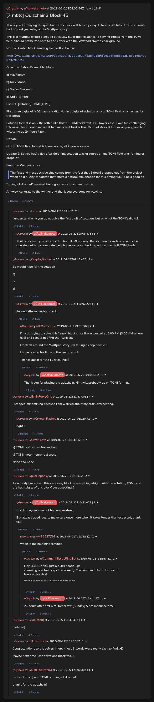

# [7 mbtc] Quizchain2 Block 45

[Original thread](https://www.reddit.com/r/Grycoin/comments/c37u67/7_mbtc_quizchain2_block_45/). The `sourceUrl` of the [quizchain2/45](../../../src/collections/quizchain2/45.ts) record and the source of its question, format, hash digits, hint and funding transaction, with the solution the author edited in. Nobody in the surviving comments printed the whole string. The post went up on June 21, 2019, at 08:00:54 UTC, almost three hours after the block time of its funding transaction. Its last edit is stamped 23:25:29 UTC on June 22, 2019, so the transcript shows the post as it stood after the claim.

## Historical provenance

No capture found. On October 3, 2026 the Wayback Machine index listed one capture of the thread under the `www.reddit.com` URL, June 11, 2023, 18:04:29 UTC. Its `id_` body is Reddit's app shell titled "Reddit - Dive into anything", with neither the post nor a comment in its HTML. The one capture of the `old.reddit.com` URL, two seconds later, is a 302 redirect to a subreddit search for Grycoin. The archive.today timemaps for the `www.reddit.com`, `old.reddit.com` and bare `reddit.com` URLs answered 404. MemGator answered "No snapshots" for all three, but it gave the same answer for the block 11 thread, whose Wayback capture exists, so it settles nothing here.

The transcript below comes from the [Arctic Shift](https://arctic-shift.photon-reddit.com/) Reddit archive: the post record and the comment tree for `c37u67`, read on October 3, 2026. The [pullpush](https://pullpush.io/) Reddit archive, read the same day, gives the same post text, time and edit stamp, and the same 17 comments with the same authors, times, scores and parents. The raw texts differ only where pullpush writes `&`, `<` or `>` as an HTML entity, in the post. One of them is a deleted comment, kept below as `[deleted]`.

The record names none of the commenters: nothing on the chain ties a claim to a name.

## Transcript

> Thank you for playing the quizchain. This block will be very easy. I already published the necessary background yesterday at the Wattpad story.
>
> This is a multiple choice block, so obviously all of the resistance to solving comes from the TOMI field. Should not be too hard to find either with the Wattpad story as background.
>
> Normal 7 mbtc block, funding transaction below:
>
> https://www.smartbit.com.au/tx/93be460b4a7332eb20783e42159fc2e6edf2585a13f7db31e89f1b9232c679f6
>
> Question: Satoshi's real identity is:
>
> a) Hal Finney
>
> b) Nick Szabo
>
> c) Dorian Nakamoto
>
> d) Craig Wright
>
> Format: [solution] TOMI [TOMI]
>
> First three digits of MD5 hash are df1. No first digits of solution only or TOMI field only hashes for this block.
>
> Solution format is only the letter, like this: a). TOMI field text is all lower case.
> Have fun challenging this easy block. I don't expect it to need a hint beside the Wattpad story. If it does anyway, said hint will come up 24 hours later.
>
> Update:
>
> Hint 1: TOMI field format is three words, all in lower case.~
>
> Update 2: Solved half a day after first hint, solution was of course a) and TOMI field was "timing of dropout".
>
> From the Wattpad story:
>
> > The first and most decisive clue comes from the fact that Satoshi dropped out from the project when he did. Any candidate that offers a natural explanation for this timing would be a good fit.
>
> "timing of dropout" seemed like a good way to summarize this.
>
> Anyway, congrats to the winner and thank you everyone for playing.

## Comments

**u/LiaVl**, 2 points:

> I understand why you do not give the first digit of solution, but why not the TOMI's digits?

**u/AoiNakamoto**, 1 point, reply to u/LiaVl:

> That is because you only need to find TOMI anyway, the solution as such is obvious. So checking with the complete hash is the same as checking with a two digit TOMI hash.

**u/Crypto_Rachel**, 2 points:

> So would it be for the solution
>
> a).
>
> or
>
> a)

**u/AoiNakamoto**, 2 points, reply to u/Crypto_Rachel:

> Second alternative is correct.

**u/JDScreesh**, 2 points, reply to u/AoiNakamoto:

> I'm still trying to solve this "easy" block since it was posted at 5:00 PM (3:00 AM where I live) and I could not find the TOMI. xD
>
> I look all around the Wattpad story, I'm falling asleep now =D
>
> I hope I can solve it... and the next too. =P
>
> Thanks again for the puzzles, Aoi ;)

**u/AoiNakamoto**, 1 point, reply to u/JDScreesh:

> Thank you for playing the quizchain. Hint will probably be on TOMI format...

**u/BrainForceOne**, 4 points:

> I stopped mindmining because I am worried about my brain overheating.

**u/Crypto_Rachel**, 1 point, reply to u/BrainForceOne:

> right :)

**u/silver_anth**, 1 point:

> a) TOMI first bitcoin transaction
>
> a) TOMI motor neurone disease
>
> Nope and nope

**u/puzzleponky**, 2 points:

> As nobody has solved this very easy block is everything alright with the solution, TOMI, and the hash digits of this block? Just checking :)

**u/AoiNakamoto**, 1 point, reply to u/puzzleponky:

> Checked again. Can not find any mistake.
>
> But always good idea to make sure once more when it takes longer than expected, thank you.

**u/435627793**, 1 point, reply to u/AoiNakamoto:

> when is the next hint coming?

**u/CommonMisspellingBot**, 1 point, reply to u/435627793:

> Hey, 435627793, just a quick heads-up:
> **comming** is actually spelled **coming**. You can remember it by **one m**.
> Have a nice day!
>
> ^^^^The ^^^^parent ^^^^commenter ^^^^can ^^^^reply ^^^^with ^^^^'delete' ^^^^to ^^^^delete ^^^^this ^^^^comment.

**u/AoiNakamoto**, 1 point, reply to u/435627793:

> 24 hours after first hint, tomorrow (Sunday) 5 pm Japanese time.

**[deleted]**:

> [deleted]

**u/JDScreesh**, 1 point:

> Congratulations to the solver. I hope those 3 words were really easy to find. xD
>
> Maybe next time I can solve one block too. =)

**u/DanTheDon83**, 1 point:

> I solved! it is a) and TOMI is timing of dropout
>
> thanks for the quizchain!

## Screenshot

The screenshot is a render of the thread in Arctic Shift's ID lookup, not of Reddit, since no readable capture of the Reddit page exists. Capture method and limits: [source archive](../README.md).
