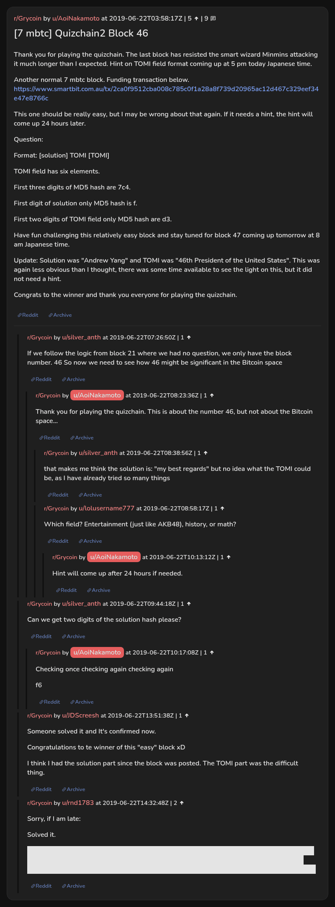

# [7 mbtc] Quizchain2 Block 46

[Original thread](https://www.reddit.com/r/Grycoin/comments/c3kyoe/7_mbtc_quizchain2_block_46/). The `sourceUrl` of the [quizchain2/46](../../../src/collections/quizchain2/46.ts) record and the source of its format, hash digits and funding transaction, with the solution the author edited in. The post has no question. Two of the author's replies in the comments add a hint and two digits of the solution hash, and u/rnd1783's comment explains the solve. The post went up on June 22, 2019, at 03:58:17 UTC, two and a half hours after the block time of its funding transaction. Its last edit is stamped 23:30:37 UTC the same day, so the transcript shows the post as it stood after the claim.

## Historical provenance

Provenance rests on a [www.reddit.com capture](https://web.archive.org/web/20190622040741/https://www.reddit.com/r/Grycoin/comments/c3kyoe/7_mbtc_quizchain2_block_46/?utm_source=ifttt) of the thread URL with an IFTTT tracking parameter, stamped June 22, 2019, 04:07:41 UTC, nine minutes after the post went up. The page state in its HTML carries the post with no edit and no comment, and its ten paragraphs match the first ten of the transcript below, the empty question line included. The update with the solution came later and is not in it. The capture was read on October 3, 2026. `archive_content: confirmed` on that basis, for the post as first published. The index also lists one capture of the plain thread URL under `www.reddit.com`, June 11, 2023, 20:04:03 UTC, whose `id_` body is Reddit's app shell titled "Reddit - Dive into anything", with neither the post nor a comment in its HTML. The one capture of the `old.reddit.com` URL, a second later, is a 302 redirect to a subreddit search for Grycoin. The archive.today timemaps for the `www.reddit.com`, `old.reddit.com` and bare `reddit.com` URLs answered 404. MemGator answered "No snapshots" for all three, but it gave the same answer for the block 11 thread, whose Wayback capture exists, so it settles nothing here.

The transcript takes the edited post and all 9 comments from the [Arctic Shift](https://arctic-shift.photon-reddit.com/) Reddit archive: the post record and the comment tree for `c3kyoe`, read on October 3, 2026. The [pullpush](https://pullpush.io/) Reddit archive, read the same day, gives the same post text, time and edit stamp, and the same 9 comments with the same authors, times, scores and parents. The raw texts differ only where pullpush writes `&`, `<` or `>` as an HTML entity, in one comment. u/rnd1783 typed their explanation as a Reddit spoiler, `>!...!<`. The transcript drops the two markers, because a leading `>!` reads as a nested quote in Markdown.

The record names none of the commenters: nothing on the chain ties a claim to a name.

## Transcript

> Thank you for playing the quizchain. The last block has resisted the smart wizard Minmins attacking it much longer than I expected. Hint on TOMI field format coming up at 5 pm today Japanese time.
>
> Another normal 7 mbtc block. Funding transaction below.
> https://www.smartbit.com.au/tx/2ca0f9512cba008c785c0f1a28a8f739d20965ac12d467c329eef34e47e8766c
>
> This one should be really easy, but I may be wrong about that again. If it needs a hint, the hint will come up 24 hours later.
>
> Question:
>
> Format: [solution] TOMI [TOMI]
>
> TOMI field has six elements.
>
> First three digits of MD5 hash are 7c4.
>
> First digit of solution only MD5 hash is f.
>
> First two digits of TOMI field only MD5 hash are d3.
>
> Have fun challenging this relatively easy block and stay tuned for block 47 coming up tomorrow at 8 am Japanese time.
>
> Update: Solution was "Andrew Yang" and TOMI was "46th President of the United States". This was again less obvious than I thought, there was some time available to see the light on this, but it did not need a hint.
>
> Congrats to the winner and thank you everyone for playing the quizchain.

## Comments

**u/silver_anth**, 1 point:

> If we follow the logic from block 21 where we had no question, we only have the block number. 46
> So now we need to see how 46 might be significant in the Bitcoin space

**u/AoiNakamoto**, 1 point, reply to u/silver_anth:

> Thank you for playing the quizchain. This is about the number 46, but not about the Bitcoin space...

**u/silver_anth**, 1 point, reply to u/AoiNakamoto:

> that makes me think the solution is: "my best regards" but no idea what the TOMI could be, as I have already tried so many things

**u/lolusername777**, 1 point, reply to u/AoiNakamoto:

> Which field? Entertainment (just like AKB48), history, or math?

**u/AoiNakamoto**, 1 point, reply to u/lolusername777:

> Hint will come up after 24 hours if needed.

**u/silver_anth**, 1 point:

> Can we get two digits of the solution hash please?

**u/AoiNakamoto**, 1 point, reply to u/silver_anth:

> Checking once
> checking again
> checking again
>
> f6

**u/JDScreesh**, 1 point:

> Someone solved it and It's confirmed now.
>
> Congratulations to te winner of this "easy" block xD
>
> I think I had the solution part since the block was posted. The TOMI part was the difficult thing.

**u/rnd1783**, 2 points:

> Sorry, if I am late:
>
> Solved it.
>
> As per 'hint', that the question refers to the block number (46) I quickly thought about the first blocks of the quizchain (vol. 1). He made clear, that he supports "Andrew Yang" in the next presidential elections. If Andrew is to win, he will be the "[46th](https://en.wikipedia.org/wiki/List_of_Presidents_of_the_United_States) President of the United States".

## Screenshot

The screenshot is a render of the thread in Arctic Shift's ID lookup, not of Reddit, since the one capture that holds the post shows neither its update nor its comments. Capture method and limits: [source archive](../README.md).
