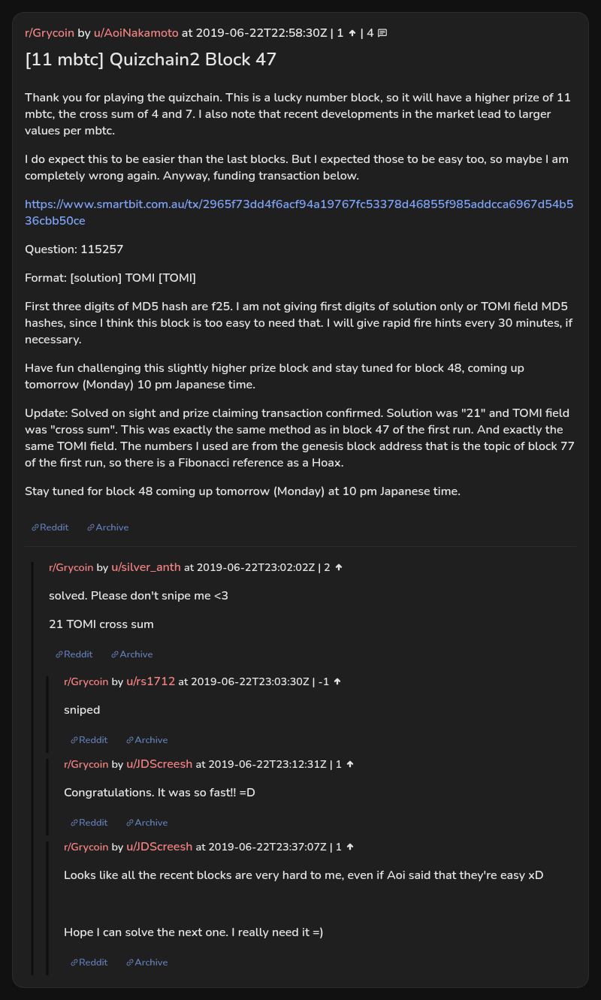

# [11 mbtc] Quizchain2 Block 47

[Original thread](https://www.reddit.com/r/Grycoin/comments/c3vye3/11_mbtc_quizchain2_block_47/). The `sourceUrl` of the [quizchain2/47](../../../src/collections/quizchain2/47.ts) record and the source of its question, format, hash digits and funding transaction, with the solution the author edited in. The full winning string is in u/silver_anth's comment. The post went up on June 22, 2019, at 22:58:30 UTC, ten hours after the block time of its funding transaction. Its last edit is stamped 00:40:19 UTC on June 23, 2019, so the transcript shows the post as it stood after the claim.

## Historical provenance

No capture found. On October 3, 2026 the Wayback Machine index listed one capture of the thread under the `www.reddit.com` URL, June 11, 2023, 20:36:39 UTC. Its `id_` body is Reddit's app shell titled "Reddit - Dive into anything", with neither the post nor a comment in its HTML. The one capture of the `old.reddit.com` URL, a second later, is a 302 redirect to a subreddit search for Grycoin. The archive.today timemaps for the `www.reddit.com`, `old.reddit.com` and bare `reddit.com` URLs answered 404. MemGator answered "No snapshots" for all three, but it gave the same answer for the block 11 thread, whose Wayback capture exists, so it settles nothing here.

The transcript below comes from the [Arctic Shift](https://arctic-shift.photon-reddit.com/) Reddit archive: the post record and the comment tree for `c3vye3`, read on October 3, 2026. The [pullpush](https://pullpush.io/) Reddit archive, read the same day, gives the same post text, time and edit stamp, and the same 4 comments with the same authors, times, scores and parents. The raw texts differ only where pullpush writes `&`, `<` or `>` as an HTML entity, in two comments. One comment has an empty `&#x200B;` paragraph, which the transcript leaves out.

The record names none of the commenters: nothing on the chain ties a claim to a name.

## Transcript

> Thank you for playing the quizchain. This is a lucky number block, so it will have a higher prize of 11 mbtc, the cross sum of 4 and 7. I also note that recent developments in the market lead to larger values per mbtc.
>
> I do expect this to be easier than the last blocks. But I expected those to be easy too, so maybe I am completely wrong again. Anyway, funding transaction below.
>
> https://www.smartbit.com.au/tx/2965f73dd4f6acf94a19767fc53378d46855f985addcca6967d54b536cbb50ce
>
> Question: 115257
>
> Format: [solution] TOMI [TOMI]
>
> First three digits of MD5 hash are f25. I am not giving first digits of solution only or TOMI field MD5 hashes, since I think this block is too easy to need that. I will give rapid fire hints every 30 minutes, if necessary.
>
> Have fun challenging this slightly higher prize block and stay tuned for block 48, coming up tomorrow (Monday) 10 pm Japanese time.
>
> Update: Solved on sight and prize claiming transaction confirmed. Solution was "21" and TOMI field was "cross sum". This was exactly the same method as in block 47 of the first run. And exactly the same TOMI field. The numbers I used are from the genesis block address that is the topic of block 77 of the first run, so there is a Fibonacci reference as a Hoax.
>
> Stay tuned for block 48 coming up tomorrow (Monday) at 10 pm Japanese time.

## Comments

**u/silver_anth**, 2 points:

> solved. Please don't snipe me <3
>
> 21 TOMI cross sum

**u/rs1712**, -1 point, reply to u/silver_anth:

> sniped

**u/JDScreesh**, 1 point, reply to u/silver_anth:

> Congratulations. It was so fast!! =D

**u/JDScreesh**, 1 point, reply to u/silver_anth:

> Looks like all the recent blocks are very hard to me, even if Aoi said that they're easy xD
>
> Hope I can solve the next one. I really need it =)

## Screenshot

The screenshot is a render of the thread in Arctic Shift's ID lookup, not of Reddit, since no readable capture of the Reddit page exists. Capture method and limits: [source archive](../README.md).
