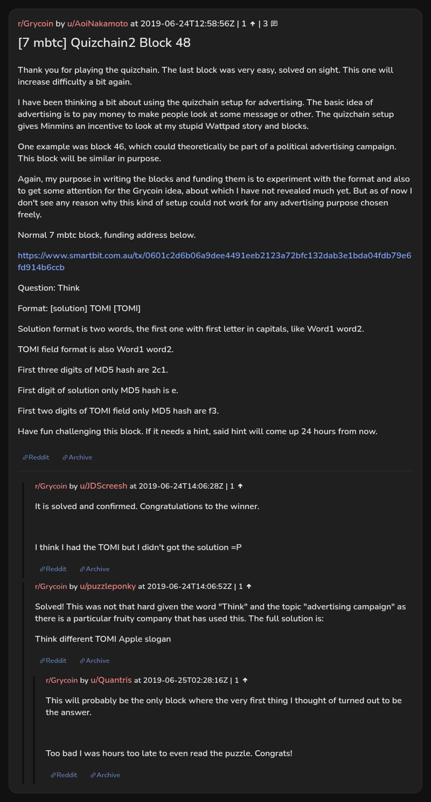

# [7 mbtc] Quizchain2 Block 48

[Original thread](https://www.reddit.com/r/Grycoin/comments/c4ndaa/7_mbtc_quizchain2_block_48/). The `sourceUrl` of the [quizchain2/48](../../../src/collections/quizchain2/48.ts) record and the source of its question, format, hash digits and funding transaction. The author never edited the solution in: the post carries no edit stamp, so the transcript shows it as it was posted. The solution is only in u/puzzleponky's comment. The post went up on June 24, 2019, at 12:58:56 UTC, almost seven hours after the block time of its funding transaction.

## Historical provenance

No capture found. On October 3, 2026 the Wayback Machine index listed one capture of the thread under the `www.reddit.com` URL, June 12, 2023, 00:01:50 UTC. Its `id_` body is Reddit's app shell titled "Reddit - Dive into anything", with neither the post nor a comment in its HTML. The one capture of the `old.reddit.com` URL, three seconds later, is a 302 redirect to a subreddit search for Grycoin. The archive.today timemaps for the `www.reddit.com`, `old.reddit.com` and bare `reddit.com` URLs answered 404. MemGator answered "No snapshots" for all three, but it gave the same answer for the block 11 thread, whose Wayback capture exists, so it settles nothing here.

The transcript below comes from the [Arctic Shift](https://arctic-shift.photon-reddit.com/) Reddit archive: the post record and the comment tree for `c4ndaa`, read on October 3, 2026. The [pullpush](https://pullpush.io/) Reddit archive, read the same day, gives the same post text, time and edit stamp, and the same 3 comments with the same authors, times, scores and parents. The raw texts differ only where pullpush writes `&`, `<` or `>` as an HTML entity, in two comments. Two comments have an empty `&#x200B;` paragraph, which the transcript leaves out.

The record names none of the commenters: nothing on the chain ties a claim to a name.

## Transcript

> Thank you for playing the quizchain. The last block was very easy, solved on sight. This one will increase difficulty a bit again.
>
> I have been thinking a bit about using the quizchain setup for advertising. The basic idea of advertising is to pay money to make people look at some message or other. The quizchain setup gives Minmins an incentive to look at my stupid Wattpad story and blocks.
>
> One example was block 46, which could theoretically be part of a political advertising campaign. This block will be similar in purpose.
>
> Again, my purpose in writing the blocks and funding them is to experiment with the format and also to get some attention for the Grycoin idea, about which I have not revealed much yet. But as of now I don't see any reason why this kind of setup could not work for any advertising purpose chosen freely.
>
> Normal 7 mbtc block, funding address below.
>
> https://www.smartbit.com.au/tx/0601c2d6b06a9dee4491eeb2123a72bfc132dab3e1bda04fdb79e6fd914b6ccb
>
> Question: Think
>
> Format: [solution] TOMI [TOMI]
>
> Solution format is two words, the first one with first letter in capitals, like Word1 word2.
>
> TOMI field format is also Word1 word2.
>
> First three digits of MD5 hash are 2c1.
>
> First digit of solution only MD5 hash is e.
>
> First two digits of TOMI field only MD5 hash are f3.
>
> Have fun challenging this block. If it needs a hint, said hint will come up 24 hours from now.

## Comments

**u/JDScreesh**, 1 point:

> It is solved and confirmed. Congratulations to the winner.
>
> I think I had the TOMI but I didn't got the solution =P

**u/puzzleponky**, 1 point:

> Solved! This was not that hard given the word "Think" and the topic "advertising campaign" as there is a particular fruity company that has used this. The full solution is:
>
> Think different TOMI Apple slogan

**u/Quantris**, 1 point, reply to u/puzzleponky:

> This will probably be the only block where the very first thing I thought of turned out to be the answer.
>
> Too bad I was hours too late to even read the puzzle. Congrats!

## Screenshot

The screenshot is a render of the thread in Arctic Shift's ID lookup, not of Reddit, since no readable capture of the Reddit page exists. Capture method and limits: [source archive](../README.md).
