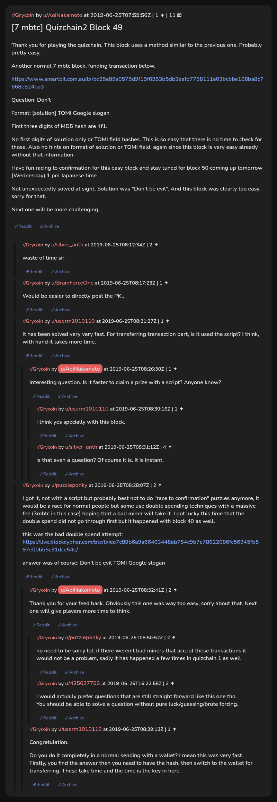

# [7 mbtc] Quizchain2 Block 49

[Original thread](https://www.reddit.com/r/Grycoin/comments/c54umz/7_mbtc_quizchain2_block_49/). The `sourceUrl` of the [quizchain2/49](../../../src/collections/quizchain2/49.ts) record and the source of its question, format, hash digits and funding transaction, with the solution the author edited in. The full winning string is in u/puzzleponky's comment, with the txid of a double spend attempt. The post went up on June 25, 2019, at 07:59:56 UTC, almost three hours after the block time of its funding transaction. Its last edit is stamped 08:33:40 UTC the same day, so the transcript shows the post as it stood after the claim.

## Historical provenance

No capture found. On October 3, 2026 the Wayback Machine index listed one capture of the thread under the `www.reddit.com` URL, June 11, 2023, 22:23:40 UTC. Its `id_` body is Reddit's app shell titled "Reddit - Dive into anything", with neither the post nor a comment in its HTML. The one capture of the `old.reddit.com` URL, a second later, is a 302 redirect to a subreddit search for Grycoin. The archive.today timemaps for the `www.reddit.com`, `old.reddit.com` and bare `reddit.com` URLs answered 404. MemGator answered "No snapshots" for all three, but it gave the same answer for the block 11 thread, whose Wayback capture exists, so it settles nothing here.

The transcript below comes from the [Arctic Shift](https://arctic-shift.photon-reddit.com/) Reddit archive: the post record and the comment tree for `c54umz`, read on October 3, 2026. The [pullpush](https://pullpush.io/) Reddit archive, read the same day, gives the same post text, time and edit stamp, and the same 11 comments with the same authors, times, scores and parents.

The record names none of the commenters: nothing on the chain ties a claim to a name.

## Transcript

> Thank you for playing the quizchain. This block uses a method similar to the previous one. Probably pretty easy.
>
> Another normal 7 mbtc block, funding transaction below.
>
> https://www.smartbit.com.au/tx/bc25a89a0575d9f19f6953b5db3eafd7758111a03bcbbe108ba8c7668e824ba3
>
> Question: Don't
>
> Format: [solution] TOMI Google slogan
>
> First three digits of MD5 hash are 4f1.
>
> No first digits of solution only or TOMI field hashes. This is so easy that there is no time to check for those. Also no hints on format of solution or TOMI field, again since this block is very easy already without that information.
>
> Have fun racing to confirmation for this easy block and stay tuned for block 50 coming up tomorrow (Wednesday) 1 pm Japanese time.
>
> Not unexpectedly solved at sight. Solution was "Don't be evil". And this block was clearly too easy, sorry for that.
>
> Next one will be more challenging...

## Comments

**u/silver_anth**, 2 points:

> waste of time sir

**u/BrainForceOne**, 1 point:

> Would be easier to directly post the PK..

**u/userm1010110**, 1 point:

> It has been solved very very fast. For transferring transaction part, is it used the script? I think, with hand it takes more time.

**u/AoiNakamoto**, 1 point, reply to u/userm1010110:

> Interesting question. Is it faster to claim a prize with a script? Anyone know?

**u/userm1010110**, 1 point, reply to u/AoiNakamoto:

> I think yes specially with this block.

**u/silver_anth**, 4 points, reply to u/AoiNakamoto:

> Is that even a question? Of course it is. It is instant.

**u/puzzleponky**, 2 points:

> I got it, not with a script but probably best not to do "race to confirmation" puzzles anymore, it would be a race for normal people but some use double spending techniques with a massive fee (3mbtc in this case) hoping that a bad miner will take it. I got lucky this time that the double spend did not go through first but it happened with block 40 as well.
>
> this was the bad double spend attempt: [https://live.blockcypher.com/btc/tx/ee7c89b6a9a66403448ab754c9b7e78622086fc56945fb597e00bb5c31dce54e/](https://live.blockcypher.com/btc/tx/ee7c89b6a9a66403448ab754c9b7e78622086fc56945fb597e00bb5c31dce54e/)
>
> answer was of course: Don't be evil TOMI Google slogan

**u/AoiNakamoto**, 2 points, reply to u/puzzleponky:

> Thank you for your feed back. Obviously this one was way too easy, sorry about that. Next one will give players more time to think.

**u/puzzleponky**, 2 points, reply to u/AoiNakamoto:

> no need to be sorry lol, if there weren't bad miners that accept these transactions it would not be a problem, sadly it has happened a few times in quizchain 1 as well

**u/435627793**, 2 points, reply to u/AoiNakamoto:

> I would actually prefer questions that are still straight forward like this one tho.
> You should be able to solve a question without pure luck/guessing/brute forcing.

**u/userm1010110**, 1 point, reply to u/puzzleponky:

> Congratulation.
>
> Do you do it completely in a normal sending with a wallet? I mean this was very fast. Firstly, you find the answer then you need to have the hash, then switch to the wallet for transferring. These take time and the time is the key in here.

## Screenshot

The screenshot is a render of the thread in Arctic Shift's ID lookup, not of Reddit, since no readable capture of the Reddit page exists. Capture method and limits: [source archive](../README.md).
