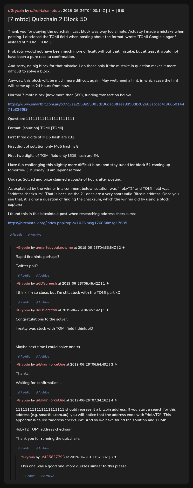

# [7 mbtc] Quizchain 2 Block 50

[Original thread](https://www.reddit.com/r/Grycoin/comments/c5kst3/7_mbtc_quizchain_2_block_50/). The `sourceUrl` of the [quizchain2/50](../../../src/collections/quizchain2/50.ts) record and the source of its question, format, hash digits and funding transaction, with the solution the author edited in. The full winning string is in u/BrainForceOne's comment, with how they found it. The post went up on June 26, 2019, at 04:00:14 UTC, four and a quarter hours after the block time of its funding transaction. Its last edit is stamped 23:11:52 UTC the same day, so the transcript shows the post as it stood after the claim.

## Historical provenance

No capture found. On October 3, 2026 the Wayback Machine index listed one capture of the thread under the `www.reddit.com` URL, June 11, 2023, 23:53:29 UTC. Its `id_` body is Reddit's app shell titled "Reddit - Dive into anything", with neither the post nor a comment in its HTML. The one capture of the `old.reddit.com` URL, a second later, is a 302 redirect to a subreddit search for Grycoin. The archive.today timemaps for the `www.reddit.com`, `old.reddit.com` and bare `reddit.com` URLs answered 404. MemGator answered "No snapshots" for all three, but it gave the same answer for the block 11 thread, whose Wayback capture exists, so it settles nothing here.

The transcript below comes from the [Arctic Shift](https://arctic-shift.photon-reddit.com/) Reddit archive: the post record and the comment tree for `c5kst3`, read on October 3, 2026. The [pullpush](https://pullpush.io/) Reddit archive, read the same day, gives the same post text, time and edit stamp, and the same 6 comments with the same authors, times, scores and parents. The raw texts differ only where pullpush writes `&`, `<` or `>` as an HTML entity, in one comment. One comment has an empty `&#x200B;` paragraph, which the transcript leaves out.

The record names none of the commenters: nothing on the chain ties a claim to a name.

## Transcript

> Thank you for playing the quizchain. Last block was way too simple. Actually I made a mistake when posting. I disclosed the TOMI field when posting about the format, wrote "TOMI Google slogan" instead of "TOMI [TOMI].
>
> Probably would not have been much more difficult without that mistake, but at least it would not have been a pure race to confirmation.
>
> And sorry, no big block for that mistake. I do those only if the mistake in question makes it more difficult to solve a block.
>
> Anyway, this block will be much more difficult again. May well need a hint, in which case the hint will come up in 24 hours from now.
>
> Normal 7 mbtc block (now more than $80), funding transaction below.
>
> https://www.smartbit.com.au/tx/7c3aa2558e55003dc96dec0ffaea8d90dbc02e63acdec4c3665014471e3266f9
>
> Question: 111111111111111111111
>
> Format: [solution] TOMI [TOMI]
>
> First three digits of MD5 hash are c32.
>
> First digit of solution only Md5 hash is 8.
>
> First two digits of TOMI field only MD5 hash are 64.
>
> Have fun challenging this slightly more difficult block and stay tuned for block
> 51 coming up tomorrow (Thursday) 8 am Japanese time.
>
> Update: Solved and prize claimed a couple of hours after posting.
>
> As explained by the winner in a comment below, solution was "4oLvT2" and TOMI field was "address checksum". That is because the 21 ones are a very short valid Bitcoin address. Once you see that, it is only a question of finding the checksum, which the winner did by using a block explorer.
>
> I found this in this bitcointalk post when researching address checksums:
>
> https://bitcointalk.org/index.php?topic=1026.msg17685#msg17685

## Comments

**u/martypyouknowme**, 2 points:

> Rapid fire hints perhaps?
>
> Twitter poll?

**u/JDScreesh**, 1 point:

> I think I'm so close, but I'm still stuck with the TOMI part xD

**u/JDScreesh**, 1 point:

> Congratulations to the solver.
>
> I really was stuck with TOMI field I think. xD
>
> Maybe next time I could solve one =)

**u/BrainForceOne**, 3 points:

> Thanks!
>
> Waiting for confirmation....

**u/BrainForceOne**, 4 points:

> 111111111111111111111 should represent a bitcoin address. If you start a search for this address (e.g. smartbit.com.au), you will notice that the address ends with "4oLvT2". This appendix is called "address checksum". And so we have found the solution and TOMI:
>
> 4oLvT2 TOMI address checksum
>
> Thank you for running the quizchain.

**u/435627793**, 3 points, reply to u/BrainForceOne:

> This one was a good one, more quizzes similar to this please.

## Screenshot

The screenshot is a render of the thread in Arctic Shift's ID lookup, not of Reddit, since no readable capture of the Reddit page exists. Capture method and limits: [source archive](../README.md).
