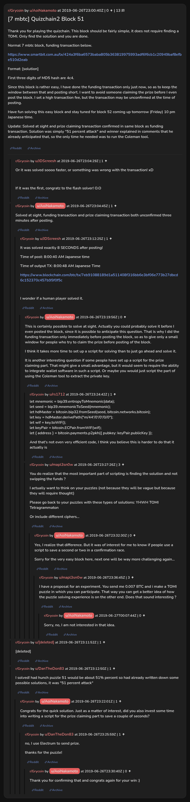

# [7 mbtc] Quizchain2 Block 51

[Original thread](https://www.reddit.com/r/Grycoin/comments/c5xj38/7_mbtc_quizchain2_block_51/). The `sourceUrl` of the [quizchain2/51](../../../src/collections/quizchain2/51.ts) record and the source of its format, hash digits and funding transaction, with the solution the author edited in. u/DanTheDon83's comment says they had the answer written down before the post, and u/JDScreesh's comment times the claim at eight seconds after it. The post went up on June 26, 2019, at 23:00:40 UTC, four minutes before the block that confirmed both the funding transaction and the claim. Its last edit is stamped 23:25:37 UTC the same day, so the transcript shows the post as it stood after the claim.

## Historical provenance

No capture found. On October 3, 2026 the Wayback Machine index listed one capture of the thread under the `www.reddit.com` URL, June 11, 2023, 20:10:12 UTC. Its `id_` body is Reddit's app shell titled "Reddit - Dive into anything", with neither the post nor a comment in its HTML. The one capture of the `old.reddit.com` URL, three seconds later, is a 302 redirect to a subreddit search for Grycoin. The archive.today timemaps for the `www.reddit.com`, `old.reddit.com` and bare `reddit.com` URLs answered 404. MemGator answered "No snapshots" for all three, but it gave the same answer for the block 11 thread, whose Wayback capture exists, so it settles nothing here.

The transcript below comes from the [Arctic Shift](https://arctic-shift.photon-reddit.com/) Reddit archive: the post record and the comment tree for `c5xj38`, read on October 3, 2026. The [pullpush](https://pullpush.io/) Reddit archive, read the same day, gives the same post text, time and edit stamp, and the same 14 comments with the same authors, times, scores and parents. Their bodies differ only in how pullpush escapes the empty `&#x200B;` paragraph in two comments, and the transcript leaves those empty paragraphs out. One of them is a deleted comment, kept below as `[deleted]`.

The record names none of the commenters: nothing on the chain ties a claim to a name.

## Transcript

> Thank you for playing the quizchain. This block should be fairly simple, it does not require finding a TOMI. Only find the solution and you are done.
>
> Normal 7 mbtc block, funding transaction below.
>
> https://www.smartbit.com.au/tx/424a3f6ba6573baba805b363819975993adf6f6cb1c20949baf8efbe510d2eab
>
> Format: [solution]
>
> First three digits of MD5 hash are 4c4.
>
> Since this block is rather easy, I have done the funding transaction only just now, so as to keep the window between that and posting short. I want to avoid someone claiming the prize before I even post the block. I set a high transaction fee, but the transaction may be unconfirmed at the time of posting.
>
> Have fun solving this easy block and stay tuned for block 52 coming up tomorrow (Friday) 10 pm Japanese time.
>
> Update: Solved at sight and prize claiming transaction confirmed in same block as funding transaction. Solution was simply "51 percent attack" and winner explained in comments that he already anticipated that, so the only time he needed was to run the Coleman tool.

## Comments

**u/JDScreesh**, 1 point:

> Or it was solved soooo faster, or something was wrong with the transaction! xD
>
> If it was the first, congratz to the flash solver! O.O

**u/AoiNakamoto**, 1 point:

> Solved at sight, funding transaction and prize claiming transaction both unconfirmed three minutes after posting.

**u/JDScreesh**, 1 point, reply to u/AoiNakamoto:

> It was solved exactly 8 SECONDS after posting!
>
> Time of post: 8:00:40 AM Japanese time
>
> Time of output TX: 8:00:48 AM Japanese Time
>
> [https://www.blockchain.com/btc/tx/7eb91088189d1a511408f316bb6e3bf06e773b27dbcd6c152370c457b95f0f5c](https://www.blockchain.com/btc/tx/7eb91088189d1a511408f316bb6e3bf06e773b27dbcd6c152370c457b95f0f5c)
>
> I wonder if a human player solved it.

**u/AoiNakamoto**, 0 points, reply to u/JDScreesh:

> This is certainly possible to solve at sight. Actually you could probably solve it before I even posted the block, since it is possible to anticipate this question. That is why I did the funding transaction only immediately before posting the block, so as to give only a small window for people who try to claim the prize before posting of the block.
>
> I think it takes more time to set up a script for solving than to just go ahead and solve it.
>
> It is another interesting question if some people have set up a script for the prize claiming part. That might give a small advantage, but it would seem to require the ability to integrate wallet software in such a script. Or maybe you would just script the part of using the Coleman tool to extract the private key.

**u/rs1712**, 1 point, reply to u/AoiNakamoto:

> let mnemonic = bip39.entropyToMnemonic(data);
> let seed = bip39.mnemonicToSeed(mnemonic);
> let hdMaster = bitcoin.bip32.fromSeed(seed, bitcoin.networks.bitcoin);
> let key = hdMaster.derivePath("m/44'/0'/0'/0/0");
> let wif = key.toWIF();
> let keyPair = bitcoin.ECPair.fromWIF(wif);
> let { address } = bitcoin.payments.p2pkh({ pubkey: keyPair.publicKey });
>
> And that's not even very efficient code, I think you believe this is harder to do that it actually is

**u/mapl3sn0w**, 3 points, reply to u/AoiNakamoto:

> You do realize that the most important part of scripting is finding the solution and not swipping the funds ?
>
> I actually want to think on your puzzles (not because they will be vague but because they will require thought)
>
> Please go back to your puzzles with these types of solutions: YHWH TOMI Tetragrammaton
>
> Or include different ciphers...

**u/AoiNakamoto**, 0 points, reply to u/mapl3sn0w:

> Yes, I realize that difference. But it was of interest for me to know if people use a script to save a second or two in a confirmation race.
>
> Sorry for the very easy block here, next one will be way more challenging again...

**u/mapl3sn0w**, 3 points, reply to u/AoiNakamoto:

> I have a proposal for an experiment.
> You send me 0.007 BTC and i make a TOMI puzzle in which you can participate. That way you can get a better idea of how the puzzle solving experience is on the other end. Does that sound interesting ?

**u/AoiNakamoto**, 0 points, reply to u/mapl3sn0w:

> Sorry, no, I am not interested in that idea.

**[deleted]**:

> [deleted]

**u/DanTheDon83**, 1 point:

> I solved! had hunch puzzle 51 would be about 51% percent so had already written down some possible solutions, it was "51 percent attack"

**u/AoiNakamoto**, 1 point, reply to u/DanTheDon83:

> Congrats for the quick solution. Just as a matter of interest, did you also invest some time into writing a script for the prize claiming part to save a couple of seconds?

**u/DanTheDon83**, 1 point, reply to u/AoiNakamoto:

> no, I use Electrum to send prize.
>
> thanks for the puzzle!

**u/AoiNakamoto**, 0 points, reply to u/DanTheDon83:

> Thank you for confirming that and congrats again for your win :)

## Screenshot

The screenshot is a render of the thread in Arctic Shift's ID lookup, not of Reddit, since no readable capture of the Reddit page exists. Capture method and limits: [source archive](../README.md).
