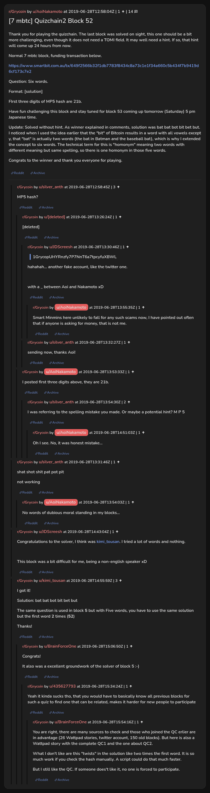

# [7 mbtc] Quizchain2 Block 52

[Original thread](https://www.reddit.com/r/Grycoin/comments/c6jvz5/7_mbtc_quizchain2_block_52/). The `sourceUrl` of the [quizchain2/52](../../../src/collections/quizchain2/52.ts) record and the source of its question, format, hash digits and funding transaction, with the solution the author edited in. u/kimi_tousan's comment has the solution and the link to block 5. The post went up on June 28, 2019, at 12:58:04 UTC, an hour and 44 minutes before the block that confirmed both the funding transaction and the claim. Its last edit is stamped 06:55:11 UTC on June 29, 2019, so the transcript shows the post as it stood after the claim.

## Historical provenance

No capture found. On October 3, 2026 the Wayback Machine index listed one capture of the thread under the `www.reddit.com` URL, June 11, 2023, 19:31:26 UTC. Its `id_` body is Reddit's app shell titled "Reddit - Dive into anything", with neither the post nor a comment in its HTML. The one capture of the `old.reddit.com` URL, two seconds later, is a 302 redirect to a subreddit search for Grycoin. The archive.today timemaps for the `www.reddit.com`, `old.reddit.com` and bare `reddit.com` URLs answered 404. MemGator answered "No snapshots" for all three, but it gave the same answer for the block 11 thread, whose Wayback capture exists, so it settles nothing here.

The transcript below comes from the [Arctic Shift](https://arctic-shift.photon-reddit.com/) Reddit archive: the post record and the comment tree for `c6jvz5`, read on October 3, 2026. The [pullpush](https://pullpush.io/) Reddit archive, read the same day, gives the same post text, time and edit stamp, and the same 15 comments with the same authors, times, scores and parents. Their bodies differ only in how pullpush escapes the `>` sign in one comment and the empty `&#x200B;` paragraph in two comments, and the transcript leaves those empty paragraphs out. One of them is a deleted comment, kept below as `[deleted]`.

The record names none of the commenters: nothing on the chain ties a claim to a name.

## Transcript

> Thank you for playing the quizchain. The last block was solved on sight, this one should be a bit more challenging, even though it does not need a TOMI field. It may well need a hint. If so, that hint will come up 24 hours from now.
>
> Normal 7 mbtc block, funding transaction below.
>
> https://www.smartbit.com.au/tx/649f2566b32f1db7783f8434c8a73c1e1f34a660c5b434f7b9419d6cf173c7e2
>
> Question: Six words.
>
> Format: [solution]
>
> FIrst three digits of MP5 hash are 21b.
>
> Have fun challenging this block and stay tuned for block 53 coming up tomorrow (Saturday) 5 pm Japanese time.
>
> Update: Solved without hint. As winner explained in comments, solution was bat bat bot bit bet but. I noticed when I used the idea earlier that the "bit" of Bitcoin results in a word with all vowels except y, that "bat" is actually two words (the bat in Batman and the baseball bat), which is why I extended the concept to six words. The technical term for this is "homonym" meaning two words with different meaning but same spelling, so there is one homonym in those five words.
>
> Congrats to the winner and thank you everyone for playing.

## Comments

**u/silver_anth**, 3 points:

> MP5 hash?

**[deleted]**, reply to u/silver_anth:

> [deleted]

**u/JDScreesh**, 1 point, reply to a deleted comment:

> > 1GrycopUHYRnzfy7P7NnT6a7tpcyfuXBWL
>
> hahahah... another fake account, like the twitter one.
>
> with a \_ between Aoi and Nakamoto xD

**u/AoiNakamoto**, 1 point, reply to u/JDScreesh:

> Smart Minmins here unlikely to fall for any such scams now, I have pointed out often that if anyone is asking for money, that is not me.

**u/silver_anth**, 1 point, reply to a deleted comment:

> sending now, thanks Aoi!

**u/AoiNakamoto**, 1 point, reply to u/silver_anth:

> I posted first three digits above, they are 21b.

**u/silver_anth**, 2 points, reply to u/AoiNakamoto:

> I was referring to the spelling mistake you made. Or maybe a potential hint? M P 5

**u/AoiNakamoto**, 1 point, reply to u/silver_anth:

> Oh I see. No, it was honest mistake...

**u/silver_anth**, 1 point:

> shat shot shit pat pot pit
>
> not working

**u/AoiNakamoto**, 1 point, reply to u/silver_anth:

> No words of dubious moral standing in my blocks...

**u/JDScreesh**, 1 point:

> Congratulations to the solver, I think was [kimi\_tousan](https://www.reddit.com/user/kimi_tousan/). I tried a lot of words and nothing.
>
> This block was a bit difficult for me, being a non-english speaker xD

**u/kimi_tousan**, 3 points:

> I got it!
>
> Solution: bat bat bot bit bet but
>
> The same question is used in block **5** but with Five words, you have to use the same solution but the first word **2** times (**52**)
>
> Thanks!

**u/BrainForceOne**, 1 point, reply to u/kimi_tousan:

> Congrats!
>
> It also was a excellent groundwork of the solver of block 5 :-)

**u/435627793**, 1 point, reply to u/BrainForceOne:

> Yeah it kinda sucks tho, that you would have to basically know all previous blocks for such a quiz to find one that can be related, makes it harder for new people to participate

**u/BrainForceOne**, 1 point, reply to u/435627793:

> You are right, there are many sources to check and those who joined the QC erlier are in advantage (26 Wattpad stories, twitter account, 150 old blocks). But here is also a Wattpad story with the complete QC1 and the one about QC2.
>
> What I don't like are this "twists" in the solution like two times the first word. It is so much work if you check the hash manually. A script could do that much faster.
>
> But I still like the QC. If someone does't like it, no one is forced to participate.

## Screenshot

The screenshot is a render of the thread in Arctic Shift's ID lookup, not of Reddit, since no readable capture of the Reddit page exists. Capture method and limits: [source archive](../README.md).
