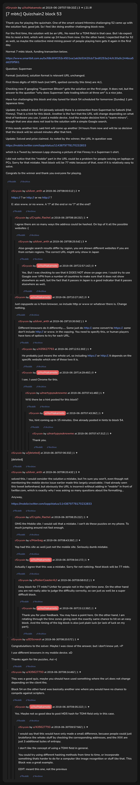

# [7 mbtc] Quizchain2 block 53

[Original thread](https://www.reddit.com/r/Grycoin/comments/c6w965/7_mbtc_quizchain2_block_53/). The `sourceUrl` of the [quizchain2/53](../../../src/collections/quizchain2/53.ts) record and the source of its question, format, hash digits, funding transaction and hints, with the solution the author edited in. AoiNakamoto's reply on copying the URL as the browser shows it and u/silver_anth's comment with the URL are in the comments. The post went up on June 29, 2019, at 07:59:33 UTC, four hours and 49 minutes after the block time of its funding transaction. Its last edit is stamped 09:33:18 UTC on June 30, 2019, so the transcript shows the post as it stood after the claim.

## Historical provenance

No capture found. On October 3, 2026 the Wayback Machine index listed one capture of the thread under the `www.reddit.com` URL, June 11, 2023, 23:18:06 UTC. Its `id_` body is Reddit's app shell titled "Reddit - Dive into anything", with neither the post nor a comment in its HTML. The one capture of the `old.reddit.com` URL, a second later, is a 302 redirect to a subreddit search for Grycoin. The archive.today timemaps for the `www.reddit.com`, `old.reddit.com` and bare `reddit.com` URLs answered 404. MemGator answered "No snapshots" for all three, but it gave the same answer for the block 11 thread, whose Wayback capture exists, so it settles nothing here.

The transcript below comes from the [Arctic Shift](https://arctic-shift.photon-reddit.com/) Reddit archive: the post record and the comment tree for `c6w965`, read on October 3, 2026. The [pullpush](https://pullpush.io/) Reddit archive, read the same day, gives the same post text, time and edit stamp, and the same 22 comments with the same authors, times, scores and parents. One of them is a deleted comment, kept below as `[deleted]`.

The record names none of the commenters: nothing on the chain ties a claim to a name.

## Transcript

> Thank you for playing the quizchain. One of the smart wizard Minmins challenging 52 came up with the solution fast, good job. So I feel like doing another challenging block now.
>
> For the first time, the solution will be an URL. No need for a TOMI field in that case. But I do expect this to need a hint, which will come up 24 hours from now. On the other hand, I expected that for 52 as well, so maybe the collective mind mining power of people playing here gets it again in the first day.
>
> Normal 7 mbtc block, funding transaction below.
>
> https://www.smartbit.com.au/tx/68c6f4f253c4501ea1ab3b53420cb73ed0253a24cfc30a9c244bca5dd2f3f561
>
> Question: Superman
>
> Format: [solution], solution format is relevant URL unchanged.
>
> FIrst three digits of MD5 hash (not MP5, spelled correctly this time) are 4c1.
>
> Checking now if googling "Superman Bitcoin" gets the solution on the first page. It does not, but the answer to the question "why does Superman hate trading bitcoin at three am" is a nice joke.
>
> Have fun challenging this block and stay tuned for block 54 scheduled for tomorrow (Sunday) 1 pm Japanese time.
>
> Update: As noted in block 54 (already solved) there is a connection from Superman to Satoshi (Hal FInney). That is a hint for this block. Another is the fact that the URL will change depending on what kind of hardware you use. I used a mobile device. And the maybe decisive hint is "warm miners", though that one also does not lead to the solution with a simple Google search.
>
> If this needs another hint, said hint will come up another 24 hours from now and will be so decisive that the block will be solved minutes after that hint.
>
> Update: Solved and prize claimed. As noted by the winner, the URL in question was
>
> https://mobile.twitter.com/lopp/status/1143879778170232833
>
> which is a Tweet by Jameson Lopp showing a picture of Hal Finney in a Superman t-shirt.
>
> I did not notice that the "mobile" part in the URL could be a problem for people solving on laptops or PCs. Sorry for that mistake. Next block will be 77 mbtc because of that, even if it is relatively easy to solve.
>
> Congrats to the winner and thank you everyone for playing.

## Comments

**u/silver_anth**, 2 points:

> https:// ? or http:// or no http:// ?
>
> E: also www. or no www. A "/" at the end or no "/" at the end?

**u/Crypto_Rachel**, 1 point, reply to u/silver_anth:

> I agree there are so many ways the address could be hashed. On top of it all the possible websites :(

**u/silver_anth**, 3 points, reply to u/Crypto_Rachel:

> Also google search results differ by region, you are shown different websites if you are from certain regions. The correct URL might only show in Japan

**u/AoiNakamoto**, 0 points, reply to u/silver_anth:

> Yes. But I was checking to see that it DOES NOT show on page one. I could try to use Google over VPN from a number of countries to make sure that it does not show elsewhere as well, but the fact that it passes in Japan is a good indicator that it passes elsewhere as well.

**u/AoiNakamoto**, 0 points, reply to u/silver_anth:

> Just copypaste as is from browser, so include http or www or whatever there is. Change nothing.

**u/silver_anth**, 1 point, reply to u/AoiNakamoto:

> Different browsers do it differently..... Some just do http://, some convert to https://. some don't include http:// or www. in the copying. You need to specify this, or human players have tons of options to try for each URL.

**u/435627793**, 1 point, reply to u/silver_anth:

> He probably just means the whole url, so including https:// or http://, it depends on the specific website which one of these two it is.

**u/AoiNakamoto**, 0 points, reply to u/silver_anth:

> I see. I used Chrome for this.

**u/martypyouknowme**, 1 point, reply to u/AoiNakamoto:

> Will there be a hint posted for this block?

**u/AoiNakamoto**, 1 point, reply to u/martypyouknowme:

> Yes, hint coming up in 15 minutes. One already posted in hints to block 54.

**u/martypyouknowme**, 1 point, reply to u/AoiNakamoto:

> Thank you.

**[deleted]**:

> [deleted]

**u/silver_anth**, 3 points:

> solved this. I would consider the solution a mistake, but I'm sure you won't, even though not mentioning the mobile device issue earlier made this largely unsolvable. I had already seen this tweet beforehand, but obviously the URL is incorrect without adding in "mobile" in front of twitter.com, which is exactly why I was asking so many questions about the formatting...
>
> Anyway,
>
> https://mobile.twitter.com/lopp/status/1143879778170232833

**u/Crypto_Rachel**, 1 point, reply to u/silver_anth:

> OMG the Mobile site. I would call that a mistake. I can't do these puzzles on my phone. To much jumping around not fast enough.

**u/Maxibag**, 2 points, reply to u/silver_anth:

> Yep had this site as well just not the mobile site. Seriously dumb mistake.

**u/AoiNakamoto**, 1 point, reply to u/silver_anth:

> Actually I agree that this was a mistake. Sorry for not noticing. Next block will be 77 mbtc.

**u/RollerCoaster4Lf**, 1 point, reply to u/AoiNakamoto:

> Easy block for 77 mbtc? Unfair for people not in the right time zone. On the other hand you are not really able to judge the difficulty correctly, so can just as well be a super difficult block.

**u/AoiNakamoto**, 1 point, reply to u/RollerCoaster4Lf:

> Thank you for your feedback. You may have a point here. On the other hand, I am rotating through the time zones giving each the exactly same chance to hit on an easy block. And the timing of the big block is also just plain luck (or lack of luck on my part).

**u/JDScreesh**, 1 point:

> Congratulations to the solver. Maybe I was close of the answer, but i don't know yet. =P
>
> I use different browsers in my mobile device. xD
>
> Thanks again for the puzzles, Aoi =)

**u/435627793**, 1 point:

> This was a good quiz, maybe you should have used something where the url does not change depending on the client tho.
>
> Block 54 on the other hand was basically another one where you would have no chance to compete against scripters.

**u/AoiNakamoto**, 1 point, reply to u/435627793:

> Yes. Maybe not so good idea to post MD5 hash for TOMI field only in this case.

**u/435627793**, 1 point, reply to u/AoiNakamoto:

> I would say that this would have only made a small difference, becuase people could just bruteforce the whoke stuff by checking the corresponding addresses, and the XXX are just 3 additional bytes of entropy.
>
> I don't like the concept of using a TOMI field in general.
>
> You could try using different hashing methods from time to time, or incorporate something thats harder to do for a computer like image recognition or stuff like that. This Block was a great example.
>
> EDIT: meant this one, not the previous

## Screenshot

The screenshot is a render of the thread in Arctic Shift's ID lookup, not of Reddit, since no readable capture of the Reddit page exists. Capture method and limits: [source archive](../README.md).
