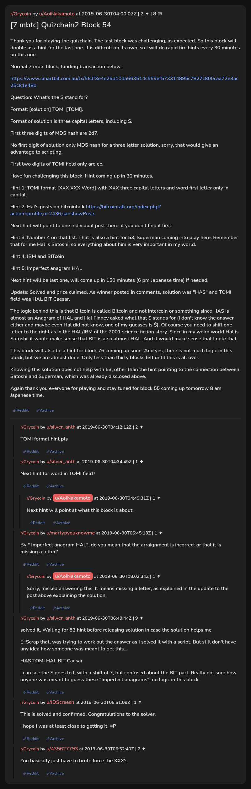

# [7 mbtc] Quizchain2 Block 54

[Original thread](https://www.reddit.com/r/Grycoin/comments/c78se0/7_mbtc_quizchain2_block_54/). The `sourceUrl` of the [quizchain2/54](../../../src/collections/quizchain2/54.ts) record and the source of its question, format, hash digits, funding transaction and five hints, with the solution the author edited in. The full winning string is in u/silver_anth's comment. The post went up on June 30, 2019, at 04:00:07 UTC, four and a half hours after the block time of its funding transaction. Its last edit is stamped 07:35:04 UTC the same day, so the transcript shows the post as it stood after the claim.

## Historical provenance

No capture found. On October 3, 2026 the Wayback Machine index listed one capture of the thread under the `www.reddit.com` URL, June 11, 2023, 21:06:06 UTC. Its `id_` body is Reddit's app shell titled "Reddit - Dive into anything", with neither the post nor a comment in its HTML. The one capture of the `old.reddit.com` URL, a second later, is a 302 redirect to a subreddit search for Grycoin. The archive.today timemaps for the `www.reddit.com`, `old.reddit.com` and bare `reddit.com` URLs answered 404. MemGator answered "No snapshots" for all three, but it gave the same answer for the block 11 thread, whose Wayback capture exists, so it settles nothing here.

The transcript below comes from the [Arctic Shift](https://arctic-shift.photon-reddit.com/) Reddit archive: the post record and the comment tree for `c78se0`, read on October 3, 2026. The [pullpush](https://pullpush.io/) Reddit archive, read the same day, gives the same post text, time and edit stamp, and the same 8 comments with the same authors, times, scores and parents.

The record names none of the commenters: nothing on the chain ties a claim to a name.

## Transcript

> Thank you for playing the quizchain. The last block was challenging, as expected. So this block will double as a hint for the last one. It is difficult on its own, so I will do rapid fire hints every 30 minutes on this one.
>
> Normal 7 mbtc block, funding transaction below.
>
> https://www.smartbit.com.au/tx/5fcff3e4e25d10da663514c559ef573314895c7827c800caa72e3ac25c81e48b
>
> Question: What's the S stand for?
>
> Format: [solution] TOMI [TOMI].
>
> Format of solution is three capital letters, including S.
>
> First three digits of MD5 hash are 2d7.
>
> No first digit of solution only MD5 hash for a three letter solution, sorry, that would give an advantage to scripting.
>
> First two digits of TOMI field only are ee.
>
> Have fun challenging this block. Hint coming up in 30 minutes.
>
> Hint 1: TOMI format [XXX XXX Word] with XXX three capital letters and word first letter only in capital.
>
> Hint 2: Hal's posts on bitcointalk https://bitcointalk.org/index.php?action=profile;u=2436;sa=showPosts
>
> Next hint will point to one individual post there, if you don't find it first.
>
> Hint 3: Number 4 on that list. That is also a hint for 53, Superman coming into play here. Remember that for me Hal is Satoshi, so everything about him is very important in my world.
>
> Hint 4: IBM and BITcoin
>
> Hint 5: Imperfect anagram HAL
>
> Next hint will be last one, will come up in 150 minutes (6 pm Japanese time) if needed.
>
> Update: Solved and prize claimed. As winner posted in comments, solution was "HAS" and TOMI field was HAL BIT Caesar.
>
> The logic behind this is that Bitcoin is called Bitcoin and not Intercoin or something since HAS is almost an Anagram of HAL and Hal Finney asked what that S stands for (I don't know the answer either and maybe even Hal did not know, one of my guesses is $). Of course you need to shift one letter to the right as in the HAL/IBM of the 2001 science fiction story. Since in my weird world Hal is Satoshi, it would make sense that BIT is also almost HAL. And it would make sense that I note that.
>
> This block will also be a hint for block 76 coming up soon. And yes, there is not much logic in this block, but we are almost done. Only less than thirty blocks left until this is all over.
>
> Knowing this solution does not help with 53, other than the hint pointing to the connection between Satoshi and Superman, which was already disclosed above.
>
> Again thank you everyone for playing and stay tuned for block 55 coming up tomorrow 8 am Japanese time.

## Comments

**u/silver_anth**, 2 points:

> TOMI format hint pls

**u/silver_anth**, 1 point:

> Next hint for word in TOMI field?

**u/AoiNakamoto**, 1 point, reply to u/silver_anth:

> Next hint will point at what this block is about.

**u/martypyouknowme**, 1 point:

> By " Imperfect anagram HAL", do you mean that the arraignment is incorrect or that it is missing a letter?

**u/AoiNakamoto**, 1 point, reply to u/martypyouknowme:

> Sorry, missed answering this. It means missing a letter, as explained in the update to the post above explaining the solution.

**u/silver_anth**, 9 points:

> solved it. Waiting for 53 hint before releasing solution in case the solution helps me
>
> E: Scrap that, was trying to work out the answer as I solved it with a script. But still don't have any idea how someone was meant to get this...
>
> HAS TOMI HAL BIT Caesar
>
> I can see the S goes to L with a shift of 7, but confused about the BIT part.
> Really not sure how anyone was meant to guess these "Imperfect anagrams", no logic in this block

**u/JDScreesh**, 1 point:

> This is solved and confirmed. Congratulations to the solver.
>
> I hope I was at least close to getting it. =P

**u/435627793**, 2 points:

> You basically just have to brute force the XXX's

## Screenshot

The screenshot is a render of the thread in Arctic Shift's ID lookup, not of Reddit, since no readable capture of the Reddit page exists. Capture method and limits: [source archive](../README.md).
