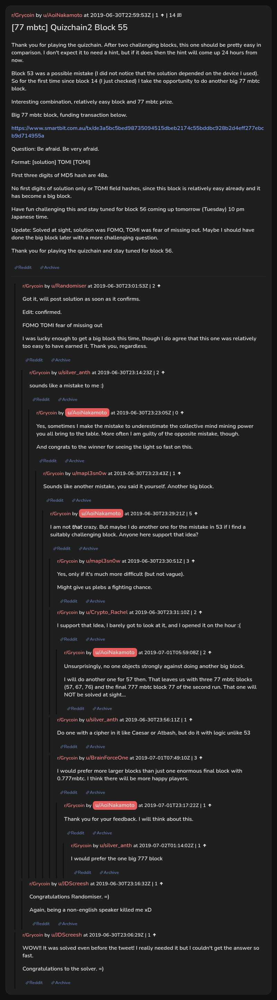

# [77 mbtc] Quizchain2 Block 55

[Original thread](https://www.reddit.com/r/Grycoin/comments/c7kv4m/77_mbtc_quizchain2_block_55/). The `sourceUrl` of the [quizchain2/55](../../../src/collections/quizchain2/55.ts) record and the source of its question, format, hash digits and funding transaction, with the solution the author edited in. The full winning string is in u/Randomiser's comment. The post went up on June 30, 2019, at 22:59:53 UTC, thirteen and a half hours after the block time of its funding transaction. Its last edit is stamped 23:16:36 UTC the same day, so the transcript shows the post as it stood after the claim.

## Historical provenance

No capture found. On October 3, 2026 the Wayback Machine index listed one capture of the thread under the `www.reddit.com` URL, June 11, 2023, 23:17:36 UTC. Its `id_` body is Reddit's app shell titled "Reddit - Dive into anything", with neither the post nor a comment in its HTML. The one capture of the `old.reddit.com` URL, three seconds later, is a 302 redirect to a subreddit search for Grycoin. The archive.today timemaps for the `www.reddit.com`, `old.reddit.com` and bare `reddit.com` URLs answered 404. MemGator answered "No snapshots" for all three, but it gave the same answer for the block 11 thread, whose Wayback capture exists, so it settles nothing here.

The transcript below comes from the [Arctic Shift](https://arctic-shift.photon-reddit.com/) Reddit archive: the post record and the comment tree for `c7kv4m`, read on October 3, 2026. The [pullpush](https://pullpush.io/) Reddit archive, read the same day, gives the same post text, time and edit stamp, and the same 14 comments with the same authors, times, scores and parents.

The record names none of the commenters: nothing on the chain ties a claim to a name.

## Transcript

> Thank you for playing the quizchain. After two challenging blocks, this one should be pretty easy in comparison. I don't expect it to need a hint, but if it does then the hint will come up 24 hours from now.
>
> Block 53 was a possible mistake (I did not notice that the solution depended on the device I used). So for the first time since block 14 (I just checked) I take the opportunity to do another big 77 mbtc block.
>
> Interesting combination, relatively easy block and 77 mbtc prize.
>
> Big 77 mbtc block, funding transaction below.
>
> https://www.smartbit.com.au/tx/de3a5bc5bed98735094515dbeb2174c55bddbc928b2d4eff277ebcb9d714955a
>
> Question: Be afraid. Be very afraid.
>
> Format: [solution] TOMI [TOMI]
>
> FIrst three digits of MD5 hash are 48a.
>
> No first digits of solution only or TOMI field hashes, since this block is relatively easy already and it has become a big block.
>
> Have fun challenging this and stay tuned for block 56 coming up tomorrow (Tuesday) 10 pm Japanese time.
>
> Update: Solved at sight, solution was FOMO, TOMI was fear of missing out. Maybe I should have done the big block later with a more challenging question.
>
> Thank you for playing the quizchain and stay tuned for block 56.

## Comments

**u/Randomiser**, 2 points:

> Got it, will post solution as soon as it confirms.
>
> Edit: confirmed.
>
> FOMO TOMI fear of missing out
>
> I was lucky enough to get a big block this time, though I do agree that this one was relatively too easy to have earned it. Thank you, regardless.

**u/silver_anth**, 2 points, reply to u/Randomiser:

> sounds like a mistake to me :)

**u/AoiNakamoto**, 0 points, reply to u/silver_anth:

> Yes, sometimes I make the mistake to underestimate the collective mind mining power you all bring to the table. More often I am guilty of the opposite mistake, though.
>
> And congrats to the winner for seeing the light so fast on this.

**u/mapl3sn0w**, 1 point, reply to u/AoiNakamoto:

> Sounds like another mistake, you said it yourself. Another big block.

**u/AoiNakamoto**, 5 points, reply to u/mapl3sn0w:

> I am not _that_ crazy. But maybe I do another one for the mistake in 53 if I find a suitably challenging block. Anyone here support that idea?

**u/mapl3sn0w**, 3 points, reply to u/AoiNakamoto:

> Yes, only if it's much more difficult (but not vague).
>
> Might give us plebs a fighting chance.

**u/Crypto_Rachel**, 2 points, reply to u/AoiNakamoto:

> I support that Idea, I barely got to look at it, and I opened it on the hour :(

**u/AoiNakamoto**, 2 points, reply to u/Crypto_Rachel:

> Unsurprisingly, no one objects strongly against doing another big block.
>
> I will do another one for 57 then. That leaves us with three 77 mbtc blocks (57, 67, 76) and the final 777 mbtc block 77 of the second run. That one will NOT be solved at sight...

**u/silver_anth**, 1 point, reply to u/AoiNakamoto:

> Do one with a cipher in it like Caesar or Atbash, but do it with logic unlike 53

**u/BrainForceOne**, 3 points, reply to u/AoiNakamoto:

> I would prefer more larger blocks than just one enormous final block with 0.777mbtc. I think there will be more happy players.

**u/AoiNakamoto**, 1 point, reply to u/BrainForceOne:

> Thank you for your feedback. I will think about this.

**u/silver_anth**, 1 point, reply to u/AoiNakamoto:

> I would prefer the one big 777 block

**u/JDScreesh**, 1 point, reply to u/Randomiser:

> Congratulations Randomiser. =)
>
> Again, being a non-english speaker killed me xD

**u/JDScreesh**, 1 point:

> WOW!! It was solved even before the tweet! I really needed it but I couldn't get the answer so fast.
>
> Congratulations to the solver. =)

## Screenshot

The screenshot is a render of the thread in Arctic Shift's ID lookup, not of Reddit, since no readable capture of the Reddit page exists. Capture method and limits: [source archive](../README.md).
