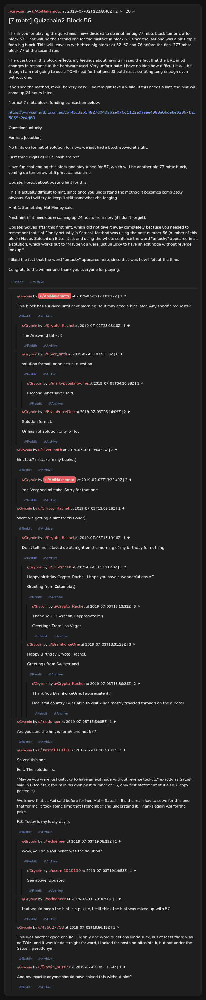

# [7 mbtc] Quizchain2 Block 56

[Original thread](https://www.reddit.com/r/Grycoin/comments/c88x4w/7_mbtc_quizchain2_block_56/). The `sourceUrl` of the [quizchain2/56](../../../src/collections/quizchain2/56.ts) record and the source of its question, format, hash digits, funding transaction and hint, with the solution the author edited in. u/userm1010110's comment has the sentence, copied from the Bitcointalk post. The post went up on July 2, 2019, at 12:58:40 UTC, an hour and 41 minutes after the block time of its funding transaction. Its last edit is stamped 22:58:48 UTC on July 3, 2019, so the transcript shows the post as it stood after the claim.

## Historical provenance

No capture found. On October 3, 2026 the Wayback Machine index listed one capture of the thread under the `www.reddit.com` URL, June 11, 2023, 20:46:52 UTC. Its `id_` body is Reddit's app shell titled "Reddit - Dive into anything", with neither the post nor a comment in its HTML. The one capture of the `old.reddit.com` URL, two seconds later, is a 302 redirect to a subreddit search for Grycoin. The archive.today timemaps for the `www.reddit.com`, `old.reddit.com` and bare `reddit.com` URLs answered 404. MemGator answered "No snapshots" for all three, but it gave the same answer for the block 11 thread, whose Wayback capture exists, so it settles nothing here.

The transcript below comes from the [Arctic Shift](https://arctic-shift.photon-reddit.com/) Reddit archive: the post record and the comment tree for `c88x4w`, read on October 3, 2026. The [pullpush](https://pullpush.io/) Reddit archive, read the same day, gives the same post text, time and edit stamp, and the same 20 comments with the same authors, times, scores and parents.

The record names none of the commenters: nothing on the chain ties a claim to a name.

## Transcript

> Thank you for playing the quizchain. I have decided to do another big 77 mbtc block tomorrow for block 57. That will be the second one for the mistake in block 53, since the last one was a bit simple for a big block. This will leave us with three big blocks at 57, 67 and 76 before the final 777 mbtc block 77 of the second run.
>
> The question in this block reflects my feelings about having missed the fact that the URL in 53 changes in response to the hardware used. Very unfortunate.
> I have no idea how difficult it will be, though I am not going to use a TOMI field for that one. Should resist scripting long enough even without one.
>
> If you see the method, it will be very easy. Else it might take a while. If this needs a hint, the hint will come up 24 hours later.
>
> Normal 7 mbtc block, funding transaction below.
>
> https://www.smartbit.com.au/tx/f4bcd3b94827d049362e075d1122a9aeae4983a66debe92957b2c5069a2c4d68
>
> Question: unlucky
>
> Format: [solution]
>
> No hints on format of solution for now, we just had a block solved at sight.
>
> First three digits of MD5 hash are b9f.
>
> Have fun challenging this block and stay tuned for 57, which will be another big 77 mbtc block, coming up tomorrow at 5 pm Japanese time.
>
> Update: Forgot about posting hint for this.
>
> This is actually difficult to hint, since once you understand the method it becomes completely obvious. So I will try to keep it still somewhat challenging.
>
> Hint 1: Something Hal Finney said.
>
> Next hint (if it needs one) coming up 24 hours from now (if I don't forget).
>
> Update: Solved after this first hint, which did not give it away completely because you needed to remember that Hal Finney actually is Satoshi. Method was using the post number 56 (number of this block) Hal as Satoshi on Bitcointalk and using the whole sentence the word "unlucky" appeared in as a solution, which works out to "Maybe you were just unlucky to have an exit node without reverse lookup."
>
> I liked the fact that the word "unlucky" appeared here, since that was how I felt at the time.
>
> Congrats to the winner and thank you everyone for playing.

## Comments

**u/AoiNakamoto**, 1 point:

> This block has survived until next morning, so it may need a hint later. Any specific requests?

**u/Crypto_Rachel**, 1 point, reply to u/AoiNakamoto:

> The Answer :) lol - JK

**u/silver_anth**, 6 points, reply to u/AoiNakamoto:

> solution format. or an actual question

**u/martypyouknowme**, 3 points, reply to u/silver_anth:

> I second what silver said.

**u/BrainForceOne**, 2 points, reply to u/AoiNakamoto:

> Solution format.
>
> Or hash of solution only. :-) lol

**u/silver_anth**, 2 points:

> hint late? mistake in my books ;)

**u/AoiNakamoto**, 2 points, reply to u/silver_anth:

> Yes. Very sad mistake. Sorry for that one.

**u/Crypto_Rachel**, 1 point:

> Were we getting a hint for this one :)

**u/Crypto_Rachel**, 1 point, reply to u/Crypto_Rachel:

> Don't tell me I stayed up all night on the morning of my birthday for nothing

**u/JDScreesh**, 3 points, reply to u/Crypto_Rachel:

> Happy birthday Crypto\_Rachel. I hope you have a wonderful day =D
>
> Greeting from Colombia ;)

**u/Crypto_Rachel**, 3 points, reply to u/JDScreesh:

> Thank You JDScreesh, I appreciate it :)
>
> Greetings From Las Vegas

**u/BrainForceOne**, 3 points, reply to u/Crypto_Rachel:

> Happy Birthday Crypto_Rachel.
>
> Greetings from Switzerland

**u/Crypto_Rachel**, 2 points, reply to u/BrainForceOne:

> Thank You BrainForceOne, I appreciate it :)
>
> Beautiful country I was able to visit kinda mostly traveled through on the eurorail

**u/reddeneer**, 1 point:

> Are you sure the hint is for 56 and not 57?

**u/userm1010110**, 1 point:

> Solved this one.
>
> Edit: The solution is:
>
> "Maybe you were just unlucky to have an exit node without reverse lookup." exactly as Satoshi said in Bitcointalk forum in his own post number of 56, only first statement of it also. (I copy pasted it)
>
> We know that as Aoi said before for her, Hal = Satoshi. It's the main kay to solve for this one that for me, it took some time that I remember and understand it. Thanks again Aoi for the prize.
>
> P.S. Today is my lucky day :).

**u/reddeneer**, 1 point, reply to u/userm1010110:

> wow, you on a roll, what was the solution?

**u/userm1010110**, 1 point, reply to u/reddeneer:

> See above. Updated.

**u/reddeneer**, 1 point, reply to u/userm1010110:

> that would mean the hint is a puzzle, I still think the hint was mixed up with 57

**u/435627793**, 1 point:

> This was another good one IMO, ik only one word questions kinda suck, but at least there was no TOMI and it was kinda straight forward, I looked for posts on bitcointalk, but not under the Satoshi pseudonym.

**u/Bitcoin_puzzler**, 1 point:

> And ow exactly anyone should have solved this without hint?

## Screenshot

The screenshot is a render of the thread in Arctic Shift's ID lookup, not of Reddit, since no readable capture of the Reddit page exists. Capture method and limits: [source archive](../README.md).
