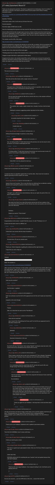

# [77 mbtc] Quizchain2 Block 57

[Original thread](https://www.reddit.com/r/Grycoin/comments/c8lcsr/77_mbtc_quizchain2_block_57/). The `sourceUrl` of the [quizchain2/57](../../../src/collections/quizchain2/57.ts) record and the source of its question, format, hash digits and funding transaction, with the solution the author edited in. u/userm1010110's comment has the URL and how they found it. The post went up on July 3, 2019, at 07:58:00 UTC, three hours and 19 minutes after the block time of its funding transaction. Its last edit is stamped 23:12:46 UTC the same day, so the transcript shows the post as it stood after the claim.

## Historical provenance

No capture found. On October 3, 2026 the Wayback Machine index listed thirteen captures of the thread under the `www.reddit.com` URL, from June 20, 2023, 22:22:21 UTC, to June 29, 2023, 22:13:19 UTC. Its `id_` bodies are Reddit's app shell titled "Reddit - Dive into anything", with neither the post nor a comment in their HTML. The index listed no capture of the `old.reddit.com` URL. The archive.today timemaps for the `www.reddit.com`, `old.reddit.com` and bare `reddit.com` URLs answered 404. MemGator answered "No snapshots" for all three, but it gave the same answer for the block 11 thread, whose Wayback capture exists, so it settles nothing here.

The transcript below comes from the [Arctic Shift](https://arctic-shift.photon-reddit.com/) Reddit archive: the post record and the comment tree for `c8lcsr`, read on October 3, 2026. The [pullpush](https://pullpush.io/) Reddit archive, read the same day, gives the same post text, time and edit stamp, and the same 40 comments with the same authors, times, scores and parents. Their bodies differ only in how pullpush escapes the `>` sign in one comment and the empty `&#x200B;` paragraph in three comments, and the transcript leaves those empty paragraphs out. One of them is a deleted comment, kept below as `[deleted]`. u/userm1010110 typed one line as a Reddit spoiler, `>!...!<`. The transcript drops the two markers, because a leading `>!` reads as a nested quote in Markdown.

The record names none of the commenters: nothing on the chain ties a claim to a name.

## Transcript

> Thank you for playing the quizchain. This block is supposed to be challenging, since it is another 77 mbtc block. It will give a hint about what the whole Grycoin project will be about. Funding transaction below.
>
> https://www.smartbit.com.au/tx/5d2ba35d75f5f87276141aa73eb71b5790e33d0d602d2e03fd166ee3e64f958a
>
> Question: Thinking
>
> If this block needs a hint, it will come up 24 hours from now.
>
> Format: [solution]
>
> First three digits of MD5 hash are d26.
>
> Have fun challenging this big block and stay tuned for 58 coming up tomorrow (Thursday) at 1 pm.
>
> Solved without hint but late enough to give everyone a chance to think and not by brute forcing, if the winner's explanation is correct. The solution was the URL to Satoshi's third tweet on Bitcoin (the first one was the more famous "running Bitcoin" one). This one is the more important one, since it concerns the climate emergency.
>
> The solution was the URL of the tweet:
>
> https://mobile.twitter.com/halfin/status/1153096538
>
> Someone questioned in comments the decision to use the URL as solution. Part of my decision to do so was my aim for a more difficult block. Another reason was that I wanted to establish that yes, players can solve this format (mobile Twitter address) now, since it already appeared before.
>
> Anyway, here is the whole text of the tweet again:
>
> "Thinking about how to reduce CO2 emissions from a widespread Bitcoin implementation"
>
> I happen to agree that that is a good point to think about.
>
> Congrats to the winner, who actually solved 56 as well, and thank you everyone for playing the quizchain. Next block coming up today (Thursday) at 1 pm. It will have a question of three words, which will make it easier to solve than this one and 56.

## Comments

**u/AoiNakamoto**, 1 point:

> This one not solved at sight...

**u/silver_anth**, 5 points, reply to u/AoiNakamoto:

> Much like all the other blocks with a single word as a "question"

**u/AoiNakamoto**, 2 points, reply to u/silver_anth:

> The good news is that block 58 will have three words as a question, which will make it much easier to solve. It will also be a hint for this one.

**u/reddeneer**, 1 point, reply to u/AoiNakamoto:

> Do you mean the question for 58 will be a hint for this one, or the solution to 58 will be a hint for this one?

**u/AoiNakamoto**, 2 points, reply to u/reddeneer:

> The solution. But I made a slight mistake here. Actually it will be a hint for block 56.
>
> Waiting for someone suggesting another big block for this mistake...

**u/silver_anth**, 2 points, reply to u/AoiNakamoto:

> do another big block for that mistake I dare you

**u/Maxibag**, 1 point, reply to u/silver_anth:

> I double dare you

**u/Crypto_Rachel**, 1 point, reply to u/AoiNakamoto:

> Without format knowledge It could be so many things

**u/AoiNakamoto**, 2 points, reply to u/Crypto_Rachel:

> Yes. I am doing another 77 mbtc block because the previous one was too easy to solve. Of course I try to keep it challenging this time.

**u/annoying_DAD_bot**, 1 point, reply to u/AoiNakamoto:

> Hi 'doing another 77 mbtc block because the previous one was too easy to solve. Of course I try to keep it challenging this time.', im DAD.

**u/AoiNakamoto**, 2 points, reply to u/annoying_DAD_bot:

> Hello DAD. I am Aoi, pleased to meet you.

**u/Bitcoin_puzzler**, 3 points:

> What's the fun about those one worth "puzzles" ?
>
> I would also throw an algorithm against this if i had the skills.. Much more fun to build an algoritm guessing on those random one words..

**u/budinske**, 3 points, reply to u/Bitcoin_puzzler:

> Agreed, these aren't puzzles. This is more like they are suffering from an attention-seeking disorder and is paying the audience to listen to their illogical rants.

**u/AoiNakamoto**, 1 point, reply to u/budinske:

> I thought I was suffering from mind-blindness. But you are right, the point of this is to pay an audience to listen.

**u/Crypto_Rachel**, 3 points, reply to u/AoiNakamoto:

> But what's the Point if you make Shit puzzles and just piss off your audience. Now your paying and pissing people off who will just say since your puzzles were shit that your coin will be too.
>
> Pointless
>
> Maybe you need to "Think Harder"

**u/JDScreesh**, 2 points:

> Congratulations to the solver. I couldn't find the answer. I'm still "Thinking" on it. =P
>
> It looks like this block wasn't so difficult. xD

**u/AirShark90**, 2 points, reply to u/JDScreesh:

> I think that it was solved with the help of bruteforce

**u/userm1010110**, 1 point, reply to u/AirShark90:

> No brute force. Pls see my solution post.

**u/userm1010110**, 1 point, reply to u/JDScreesh:

> Thank you. I think it depends on getting the method and find right direction.
>
> I hope that you solve a Big one.

**u/userm1010110**, 1 point:

> I Solved.
>
> Edit: I think it's related to 56 as well. Maybe I'm wrong.
>
> Edit2: The solution is:
>
> [https://mobile.twitter.com/halfin/status/1153096538](https://mobile.twitter.com/halfin/status/1153096538)
>
> After I saw the word "Thinking" on Hal's twitter, I guessed it could be the solution after trying the whole phrase, I didn't see any result then trying the link but no result because I'm using the desktop one, at final stage, after adding "mobile" word (without quotation also :) ) to the link, yes I solved the puzzle. Very thanks Aoi.

**u/AirShark90**, 1 point, reply to u/userm1010110:

> what was the solution?

**u/userm1010110**, 1 point, reply to u/AirShark90:

> See the above. I updated.

**u/reddeneer**, 2 points, reply to u/userm1010110:

> huh? I am confused, was the hint for 56 supposed to be for this one? maybe aoi mixed them up?
>
> congrats on the solve though

**u/userm1010110**, 0 points, reply to u/reddeneer:

> Thanks.
>
> Edit: As an idea that Aoi said: see the "Past Blocks".

**u/reddeneer**, 1 point, reply to u/userm1010110:

> where did Aoi said that?
>
> also I meant if the "Something Hal Finney said" for hint 56 was supposed to be for this block instead of 56

**[deleted]**, reply to u/reddeneer:

> [deleted]

**u/userm1010110**, 1 point, reply to u/reddeneer:

> Quizchain Introduction in this sub.

**u/AoiNakamoto**, 0 points, reply to u/reddeneer:

> No, hint for 56 was "Hal Finney" since saying "Satoshi" would give away too much. And it just turned out by coincidence to be a hint for this one too...

**u/silver_anth**, 2 points, reply to u/AoiNakamoto:

> That is clearly a hint for this as well, not a coincidence??? This is literally "Something Hal Finney said". Honestly I have no idea how you can't think about these things...

**u/AoiNakamoto**, 1 point, reply to u/silver_anth:

> It is a coincidence that this would help with 57, but the hint was for 56, even though saying "Hal Finney" obfuscated that a bit.

**u/AoiNakamoto**, 1 point, reply to u/AoiNakamoto:

> And I do not think I need to refrain from using this hint because it also could help with another block.
>
> By coincidence.

**u/silver_anth**, 1 point, reply to u/AoiNakamoto:

> Its not a coincidence if you know the solutions to the two blocks and you can very clearly see it helps with both blocks, I would even say it helps with 57 more in my opinion. You are giving 24 hours notice of hints so we fairly get hints at the same time, and everyone knows when to expect them. In this case you released a hint for this block early, when no one was expecting it, and many people were asleep.

**u/AoiNakamoto**, 1 point, reply to u/silver_anth:

> Thank you again for your feedback. I will keep that in mind and think about it.

**u/reddeneer**, 4 points:

> why the url? previous one had an image so that makes sense, but this solution could have just been "Thinking about how to reduce CO2 emissions from a widespread Bitcoin implementation", just as difficult and avoids any formatting mistakes. not a fan of the url puzzles.

**u/AoiNakamoto**, 0 points, reply to u/reddeneer:

> Thank you for your feedback. Explained a bit in update to post about solution.

**u/Crypto_Rachel**, 3 points:

> That WAS SO HORRIBLE, fuck I'm done with these

**u/Crypto_Rachel**, 3 points, reply to u/Crypto_Rachel:

> I think you need to grow a brain

**u/Crypto_Rachel**, 3 points, reply to u/Crypto_Rachel:

> This Sure is a good way to get people to listen. Only now We Know What to expect from your coin,
>
> CRAP LIKE THIS
>
> GRYCOIN will Be shit if it's anything like your "puzzles" and I put quotes because they ARE NOT PUZZLES

**u/AoiNakamoto**, 1 point, reply to u/Crypto_Rachel:

> Thank you for your angry feedback. I have enjoyed reading it a lot. And thank you for playing until now.
>
> :)

**u/rs1712**, 0 points:

> No one care anymore.... you have 90% bots on this now.... anyone that cared left

## Screenshot

The screenshot is a render of the thread in Arctic Shift's ID lookup, not of Reddit, since no readable capture of the Reddit page exists. Capture method and limits: [source archive](../README.md).
