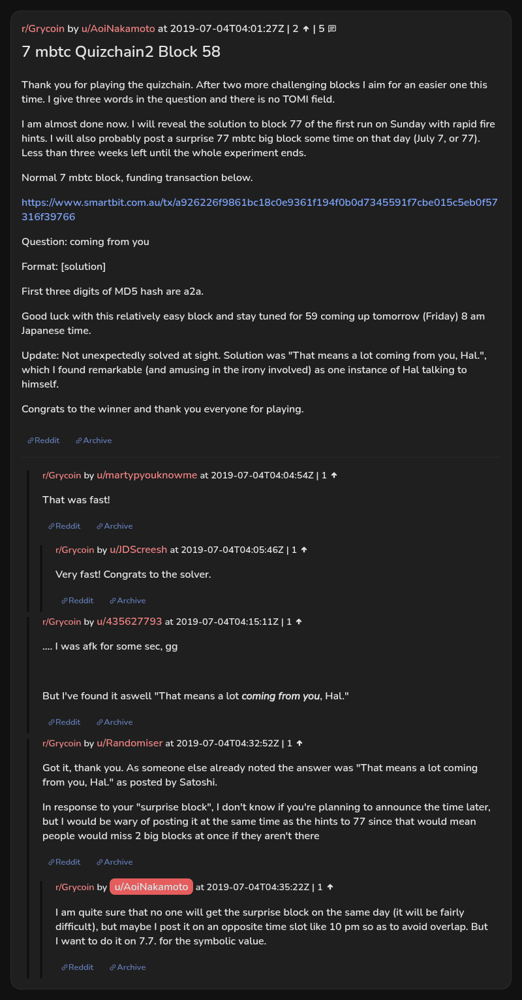

# 7 mbtc Quizchain2 Block 58

[Original thread](https://www.reddit.com/r/Grycoin/comments/c8xwgt/7_mbtc_quizchain2_block_58/). The `sourceUrl` of the [quizchain2/58](../../../src/collections/quizchain2/58.ts) record and the source of its question, format, hash digits and funding transaction, with the solution the author edited in. u/Randomiser's comment has the winning sentence. The post went up on July 4, 2019, at 04:01:27 UTC, four hours and 25 minutes after the block time of its funding transaction. Its last edit is stamped 04:40:36 UTC the same day, so the transcript shows the post as it stood after the claim.

## Historical provenance

No capture found. On October 3, 2026 the Wayback Machine index listed one capture of the thread under the `www.reddit.com` URL, June 11, 2023, 21:48:25 UTC. Its `id_` body is Reddit's app shell titled "Reddit - Dive into anything", with neither the post nor a comment in its HTML. The one capture of the `old.reddit.com` URL, three seconds later, is a 302 redirect to a subreddit search for Grycoin. The archive.today timemaps for the `www.reddit.com`, `old.reddit.com` and bare `reddit.com` URLs answered 404. MemGator answered "No snapshots" for all three, but it gave the same answer for the block 11 thread, whose Wayback capture exists, so it settles nothing here.

The transcript below comes from the [Arctic Shift](https://arctic-shift.photon-reddit.com/) Reddit archive: the post record and the comment tree for `c8xwgt`, read on October 3, 2026. The [pullpush](https://pullpush.io/) Reddit archive, read the same day, gives the same post text, time and edit stamp, and the same 5 comments with the same authors, times, scores and parents. Their bodies differ only in how pullpush escapes the empty `&#x200B;` paragraph in one comment, and the transcript leaves that empty paragraph out.

The record names none of the commenters: nothing on the chain ties a claim to a name.

## Transcript

> Thank you for playing the quizchain. After two more challenging blocks I aim for an easier one this time. I give three words in the question and there is no TOMI field.
>
> I am almost done now. I will reveal the solution to block 77 of the first run on Sunday with rapid fire hints. I will also probably post a surprise 77 mbtc big block some time on that day (July 7, or 77). Less than three weeks left until the whole experiment ends.
>
> Normal 7 mbtc block, funding transaction below.
>
> https://www.smartbit.com.au/tx/a926226f9861bc18c0e9361f194f0b0d7345591f7cbe015c5eb0f57316f39766
>
> Question: coming from you
>
> Format: [solution]
>
> First three digits of MD5 hash are a2a.
>
> Good luck with this relatively easy block and stay tuned for 59 coming up tomorrow (Friday) 8 am Japanese time.
>
> Update: Not unexpectedly solved at sight. Solution was "That means a lot coming from you, Hal.", which I found remarkable (and amusing in the irony involved) as one instance of Hal talking to himself.
>
> Congrats to the winner and thank you everyone for playing.

## Comments

**u/martypyouknowme**, 1 point:

> That was fast!

**u/JDScreesh**, 1 point, reply to u/martypyouknowme:

> Very fast! Congrats to the solver.

**u/435627793**, 1 point:

> .... I was afk for some sec, gg
>
> But I've found it aswell "That means a lot _coming from you_, Hal."

**u/Randomiser**, 1 point:

> Got it, thank you. As someone else already noted the answer was "That means a lot coming from you, Hal." as posted by Satoshi.
>
> In response to your "surprise block", I don't know if you're planning to announce the time later, but I would be wary of posting it at the same time as the hints to 77 since that would mean people would miss 2 big blocks at once if they aren't there

**u/AoiNakamoto**, 1 point, reply to u/Randomiser:

> I am quite sure that no one will get the surprise block on the same day (it will be fairly difficult), but maybe I post it on an opposite time slot like 10 pm so as to avoid overlap. But I want to do it on 7.7. for the symbolic value.

## Screenshot

The screenshot is a render of the thread in Arctic Shift's ID lookup, not of Reddit, since no readable capture of the Reddit page exists. Capture method and limits: [source archive](../README.md).
