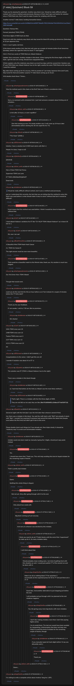

# [7 mbtc] Quizchain2 Block 59

[Original thread](https://www.reddit.com/r/Grycoin/comments/c98uls/7_mbtc_quizchain2_block_59/). The `sourceUrl` of the [quizchain2/59](../../../src/collections/quizchain2/59.ts) record and the source of its question, format, hash digits, funding transaction and two hints, with the solution and the author's note on the mistyped digit edited in. u/JDScreesh's comment prints the whole MD5 hash. The post went up on July 4, 2019, at 22:58:43 UTC, ten hours and 23 minutes after the block time of its funding transaction. Its last edit is stamped 01:12:27 UTC on July 7, 2019, so the transcript shows the post as it stood after the claim.

## Historical provenance

No capture found. On October 3, 2026 the Wayback Machine index listed one capture of the thread under the `www.reddit.com` URL, June 11, 2023, 19:51:44 UTC. Its `id_` body is Reddit's app shell titled "Reddit - Dive into anything", with neither the post nor a comment in its HTML. The one capture of the `old.reddit.com` URL, four seconds later, is a 302 redirect to a subreddit search for Grycoin. The archive.today timemaps for the `www.reddit.com`, `old.reddit.com` and bare `reddit.com` URLs answered 404. MemGator answered "No snapshots" for all three, but it gave the same answer for the block 11 thread, whose Wayback capture exists, so it settles nothing here.

The transcript below comes from the [Arctic Shift](https://arctic-shift.photon-reddit.com/) Reddit archive: the post record and the comment tree for `c98uls`, read on October 3, 2026. The [pullpush](https://pullpush.io/) Reddit archive, read the same day, gives the same post text, time and edit stamp, and the same 43 comments with the same authors, times, scores and parents. Their bodies differ only in how pullpush escapes the `>` sign in two comments and the empty `&#x200B;` paragraph in three comments, and the transcript leaves those empty paragraphs out. One of them is a deleted comment, kept below as `[deleted]`.

The record names none of the commenters: nothing on the chain ties a claim to a name.

## Transcript

> Thank you for playing the quizchain. Another easy block now. Would be really difficult without context, but it uses a method used previously. Because of that I don't give out hashes for solution only or TOMI field only. Don't want to make it easier for scripting with this one.
>
> Another normal 7 mbtc block, funding transaction below.
>
> https://www.smartbit.com.au/tx/1d398d21b1a599f728ad5c7652194b3de794c545401b11ac32be22987afd3a88
>
> Question: Famous film.
>
> Format: [solution] TOMI [TOMI]
>
> FIrst three digits of MD5 hash are 9b3.
>
> Good luck with this relatively easy block and stay tuned for block 60 coming up tomorrow (Saturday) at 10 pm Japanese time.
>
> Hint 1: I use it quite a lot here.
>
> If this block needs another hint, that hint will come up a couple of minutes before 8 am tomorrow (Sunday), before the rapid fire hints for block 77 start.tgfdsa
>
> Hint 2: FIrst two words of TOMI field are Atbash foldover.
>
> Update: Sorry everyone. Another mistake in this block. When typing the first three digits of the MD5 hash, I got the last one wrong. Should have copypasted that.
>
> Which explains why this relatively easy block survived two days until the second hint. Solution was ET and TOMI field was Atbash foldover two to the right, exactly the same TOMI field as the last time I used this method.
>
> Big mbtc block coming up for 61 anyway. WIll be posted at 7 pm today Japanese time (not 5 pm). Stay tuned for that and another surprise 77 mbtc block coming up at 10 pm.
>
> Will double check these 7 times...

## Comments

**u/martypyouknowme**, 1 point:

> Was the method used in this chain or the first? Not sure if that is considered a hint.....

**u/AoiNakamoto**, 1 point, reply to u/martypyouknowme:

> Sorry, no comment until scheduled hint. I just had someone complain about hinting out of schedule...

**u/silver_anth**, 1 point, reply to u/AoiNakamoto:

> Is hint after 24 hours, or semi-rapidfire?

**u/AoiNakamoto**, 1 point, reply to u/silver_anth:

> One hint coming up now. If it needs another one, it will come up 24 hours later (immediately before starting the 30 min rapid fire for 77).

**u/fecell**, 1 point, reply to u/AoiNakamoto:

> "The Hoax" (2006) ;)

**u/JDScreesh**, 2 points:

> hehehe, I have a solution but it MD5 hash starts with 9b4 =(
>
> Maybe I'm close, I hope so xD

**[deleted]**:

> [deleted]

**u/silver_anth**, 1 point:

> Man of Steel TOMI Hal Finney
>
> Superman TOMI Lois Lane
>
> ET TOMI L5fbSSbofJhFg5XzET
>
> Dead ends

**u/reddeneer**, 3 points:

> > Would be really difficult without context, but it uses a method used previously.
>
> just so I understand this correctly, the fact that you are telling that the method to solve this block was used before is what should make it easy to solve? without that fact it would be difficult?

**u/AoiNakamoto**, 1 point, reply to u/reddeneer:

> It just means that the method was used before. I think it would be close to impossible without that.

**u/LiaVl**, 1 point:

> I tried atbash foldover variations for ET like "CV HQ IP TOMI Atbash foldover" as in block 30 but no :(

**u/LiaVl**, 2 points, reply to u/LiaVl:

> Ok, now I am sad

**u/BrainForceOne**, 1 point:

> A Beautiful Mind TOMI Nash Hash Caesar
>
> A.I. TOMI I.Q. Caesar 8
>
> The right answer must be even more beautiful.

**u/AoiNakamoto**, 1 point, reply to u/BrainForceOne:

> That would be a beautiful match to the Minmin idea, thank you. My solution is much less elegant.

**u/martypyouknowme**, 1 point:

> Gsv Wz Ermxr Xlwv TOMI Atbash
>
> Though that would work.

**u/reddeneer**, 1 point:

> could you do the next hint for this an hour before so at 7am instead of a couple of minutes before the 77 hints start?

**u/AoiNakamoto**, 2 points, reply to u/reddeneer:

> Thank you for your feedback.
>
> If I am awake, I will try 7:30 am. But no promises...

**u/reddeneer**, 1 point, reply to u/AoiNakamoto:

> OK, thanks!

**u/LiaVl**, 1 point:

> 1941 TOMI cross sum 15
>
> 1408 TOMI cross sum 13
>
> Twelve TOMI cross sum 3
>
> 2:37 TOMI cross sum 12
>
> 4.3.2.1 TOMI cross sum 10
>
> etc

**u/JDScreesh**, 1 point:

> Congratulations to the solver. I didn't get this one xD
>
> I wonder if solution was about AI or ET =)

**u/Quantris**, 1 point, reply to u/JDScreesh:

> The solution was ET (TOMI is Atbash foldover two to the right)
>
> There was a mistake in this block though.

**u/reddeneer**, 1 point, reply to u/Quantris:

> ai, I had tried that before all the hints as Atbash was the most likely method :(

**u/JDScreesh**, 1 point, reply to u/Quantris:

> > That's right. There is a mistake with the first three digits of MD5.
> >
> > They are not 9b3 as Aoi said, they are 9be (**9be70160646f1c10dbec577ebf20f715**)

**u/Quantris**, 1 point:

> Solved at sight with the hint (but I saw the hint later than whoever solved it first)
>
> Aoi, there was a mistake in this block. You said the md5 starts with "9b3" but actually it starts with "9be". I wouldn't be surprised if someone had solved this before the latest hint (maybe even before the first hint) but didn't get it due to this error.
>
> Please double check such things (or if you already are, then triple check). It should be "relatively easy" to avoid such boneheaded mistakes.

**u/reddeneer**, 1 point, reply to u/Quantris:

> mistake could only been made by manually typing the 3 digits, should just copy paste instead

**u/AoiNakamoto**, 1 point, reply to u/reddeneer:

> Yes.
>
> I should have done that. Thank you. This will help avoiding this kind of stupid mistake for the remaining couple of blocks.

**u/silver_anth**, 1 point, reply to u/Quantris:

> That's a pretty bad mistake

**u/AoiNakamoto**, 1 point, reply to u/silver_anth:

> Damn.
>
> Quitting this whole thing in disgust.

**u/AoiNakamoto**, 1 point, reply to u/AoiNakamoto:

> But not yet. Only after going through with it to the end.

**u/AoiNakamoto**, 1 point, reply to u/AoiNakamoto:

> Only about two weeks left.

**u/AoiNakamoto**, 1 point, reply to u/AoiNakamoto:

> Big block coming up 5 pm anyway.

**u/AoiNakamoto**, 1 point, reply to u/AoiNakamoto:

> And sorry to whoever was derailed by this mistake.

**u/silver_anth**, 3 points, reply to u/AoiNakamoto:

> I think you need to do all 77mbtc blocks until the end of this "experiment" to make up for it. So many mistakes lately.

**u/AoiNakamoto**, 2 points, reply to u/silver_anth:

> I will think about that.

**u/AoiNakamoto**, 1 point, reply to u/AoiNakamoto:

> Would probably mean ending early. I am kind of getting tired with this situation as well. I would just publish 77 of the second run and be done with it.

**u/mapl3sn0w**, 1 point, reply to u/AoiNakamoto:

> Make it an all or nothing block 77 for quizchain 2.
> Accumulate all the expected prizes for 62 to 77 and put them all in 77 :P

**u/AoiNakamoto**, 1 point, reply to u/mapl3sn0w:

> Good idea. And another alternative to just stopping just before the end.
>
> I will probably just go through with it as planned to the end whatever happens.

**u/mapl3sn0w**, 1 point, reply to u/AoiNakamoto:

> You risk giving away more big blocks with more mistakes

**u/AoiNakamoto**, 1 point, reply to u/mapl3sn0w:

> I don't like making mistakes more than I don't like paying higher prizes.
>
> I try to avoid them. The last one would have been avoided by copypasting. Unfortunately that does not help now. Helps to avoid this kind of mistake for the remaining couple of blocks, though.

**u/reddeneer**, 1 point, reply to u/AoiNakamoto:

> if you manually typed all hash digits before i'd say you did pretty well ;)

**u/AoiNakamoto**, 2 points, reply to u/reddeneer:

> Thank you.

**u/silver_anth**, 1 point, reply to u/AoiNakamoto:

> Damn...

**u/mapl3sn0w**, 1 point:

> I'm willing to write a complete article about Andrew Yang for 1 BTC.

## Screenshot

The screenshot is a render of the thread in Arctic Shift's ID lookup, not of Reddit, since no readable capture of the Reddit page exists. Capture method and limits: [source archive](../README.md).
