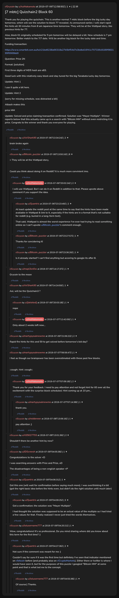

# [7 mbtc] Quizchain2 Block 60

[Original thread](https://www.reddit.com/r/Grycoin/comments/c9tbo0/7_mbtc_quizchain2_block_60/). The `sourceUrl` of the [quizchain2/60](../../../src/collections/quizchain2/60.ts) record and the source of its question, format, hash digits, funding transaction and two hints, with the solution the author edited in. u/Quantris's comment has the solution. The post went up on July 6, 2019, at 12:58:50 UTC, ten hours and 45 minutes after the block time of its funding transaction. Its last edit is stamped 05:02:04 UTC on July 9, 2019, so the transcript shows the post as it stood after the claim.

## Historical provenance

No capture found. On October 3, 2026 the Wayback Machine index listed one capture of the thread under the `www.reddit.com` URL, June 11, 2023, 21:30:40 UTC. Its `id_` body is Reddit's app shell titled "Reddit - Dive into anything", with neither the post nor a comment in its HTML. The one capture of the `old.reddit.com` URL, a second later, is a 302 redirect to a subreddit search for Grycoin. The archive.today timemaps for the `www.reddit.com`, `old.reddit.com` and bare `reddit.com` URLs answered 404. MemGator answered "No snapshots" for all three, but it gave the same answer for the block 11 thread, whose Wayback capture exists, so it settles nothing here.

The transcript below comes from the [Arctic Shift](https://arctic-shift.photon-reddit.com/) Reddit archive: the post record and the comment tree for `c9tbo0`, read on October 3, 2026. The [pullpush](https://pullpush.io/) Reddit archive, read the same day, gives the same post text, time and edit stamp, and the same 22 comments with the same authors, times, scores and parents. Their bodies differ only in how pullpush escapes the `&` and `>` signs in two comments and the empty `&#x200B;` paragraph in two comments, and the transcript leaves those empty paragraphs out. u/Bitcoin_puzzler opened a comment with an escaped `\>`, which the transcript writes as a nested quote.

The record names none of the commenters: nothing on the chain ties a claim to a name.

## Transcript

> Thank you for playing the quizchain. This is another normal 7 mbtc block before the big lucky day tomorrow, which will see the solution to block 77 revealed. As announced earlier, I will start rapid fire hints all 30 minutes from 8 am Japanese time tomorrow. They will be at the Wattpad story, like previous hints for 77.
>
> Also, block 61 originally scheduled for 5 pm tomorrow will be delayed a bit. New schedule is 7 pm tomorrow. Better match to the 7/7 date. Will be another big block for the lucky date and time.
>
> Funding transaction:
>
> https://www.smartbit.com.au/tx/c21bd6238a66318a27b5bf54d7e3bdbd16f41c707336c8189f983199f0069bb9
>
> Question: Price 2N
>
> Format: [solution]
>
> First three digits of MD5 hash are e83.
>
> Good luck with this relatively easy block and stay tuned for the big Tanabata lucky day tomorrow.
>
> Update: Hint 1
>
> I use it quite a bit here.
>
> Update: Hint 2
>
> (sorry for missing schedule, was distracted a bit)
>
> Atbash makes this
>
> price MM
>
> Update: Solved and prize claiming transaction confirmed. Solution was "Mayer Multiple". Winner reports below that this actually came up in a search with "Bitcoin MM" without even restricting it to price. Congrats to the winner and thank you everyone for playing.

## Comments

**u/AirShark90**, 2 points:

> brain broke again

**u/Bitcoin_puzzler**, 8 points:

> > They will be at the Wattpad story,
>
> Could you think about doing it on Reddit? It is much more convinient imo.

**u/AoiNakamoto**, 2 points, reply to u/Bitcoin_puzzler:

> l will use Wattpad. But I can do it on Reddit in addition to that. Please upvote above comment if you support the idea.

**u/Quantris**, 2 points, reply to u/AoiNakamoto:

> At least update the reddit post at the same time to say that the hints have been made available in Wattpad & link to it, especially if the hints are in a format that's not suitable for reddit (e.g. buried in a long-form text).
>
> That said, Wattpad is almost the worst experience I've ever had trying to read something online so I can't upvote u/Bitcoin_puzzler's comment enough.

**u/Bitcoin_puzzler**, 1 point, reply to u/AoiNakamoto:

> Thanks for concidering it!

**u/Bitcoin_puzzler**, 1 point, reply to u/AoiNakamoto:

> Is it already started? I can't find anything but accoring to google its after 8.

**u/mapl3sn0w**, 1 point:

> Grycoin to the moon

**u/AirShark90**, 1 point:

> Aoi, will be the Quizchain3 ?

**[deleted]**, reply to u/AirShark90:

> nope

**u/AoiNakamoto**, 1 point, reply to u/AirShark90:

> Only about 2 weeks left now...

**u/martypyouknowme**, 2 points:

> Rapid fire hints for this and 59 to get solved before tomorrow’s bid day?

**u/martypyouknowme**, 1 point:

> I feel as though our brainpower has been overestimated with these past few blocks.
>
> ::cough:: hint ::cough::

**u/AoiNakamoto**, 2 points, reply to u/martypyouknowme:

> Thank you for your feedback. I need to pay attention and not forget hint for 60 over all the excitement with the surprise block scheduled. Hint coming up at 10 pm...

**u/martypyouknowme**, 1 point, reply to u/AoiNakamoto:

> thank you.

**u/reddeneer**, 1 point, reply to u/AoiNakamoto:

> pay attention ;)

**u/435627793**, 2 points:

> Shouldn't there be another hint by now?

**u/JDScreesh**, 1 point:

> Congratulations to the solver =D
>
> I was searching answers with Price and Prize, xD
>
> The disadvantages of being a non-english speaker =P

**u/Quantris**, 1 point:

> Got this one (will wait for confirmation before saying much more). I was overthinking it a bit (got the right basic idea before the hints even, but didn't do the right solution until much later)

**u/Quantris**, 3 points, reply to u/Quantris:

> Got a confirmation; the solution was "Mayer Multiple".
>
> I had thought the solution was supposed to be an actual value of the multiple so I had tried a few values for that. Finally realized I never just tried the words themselves.

**u/lolusername777**, 1 point:

> Wow, congratulations! It's so professional. Do you mind sharing where did you know about this term for the first time? :)

**u/Quantris**, 2 points, reply to u/lolusername777:

> Not sure if the comment was meant for me :)
>
> Couldn't say for sure if it was the first time but definitely I've seen that indicator mentioned on r/bitcoin before (and probably also on r/CryptoMarkets). Either there or twitter is where I would have seen it, but for the purposes of this puzzle I googled "Bitcoin MM" at some point and that is what led me to the concept.

**u/lolusername777**, 1 point, reply to u/Quantris:

> Of course:) Thanks.

## Screenshot

The screenshot is a render of the thread in Arctic Shift's ID lookup, not of Reddit, since no readable capture of the Reddit page exists. Capture method and limits: [source archive](../README.md).
