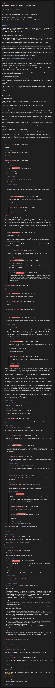

# [77 mbtc] Quizchain2 Block 77 (Stage One)

[Original thread](https://www.reddit.com/r/Grycoin/comments/ca6jxv/77_mbtc_quizchain2_block_77_stage_one/). The `sourceUrl` of the [quizchain2/77](../../../src/collections/quizchain2/77.ts) record and the source of its question, funding transaction, three hints and the format update. The author's reply with the first hash digits, `9dd`, is in the comments, and so is u/puzzleponky's note that it was solved, with the method kept back. Nobody ever published the solution. The post went up on July 7, 2019, at 12:58:15 UTC, three hours and 41 minutes after the block time of its funding transaction. Its last edit is stamped 23:24:16 UTC on August 3, 2019, so the transcript shows the post as it stood after the claim.

## Historical provenance

Provenance rests on a [www.reddit.com capture](https://web.archive.org/web/20200728154404/https://www.reddit.com/r/Grycoin/comments/ca6jxv/77_mbtc_quizchain2_block_77_stage_one/eu2tpxo/) of the permalink of u/LiaVl's comment, stamped July 28, 2020, 15:44:04 UTC. The page state in its HTML carries the whole post, which matches the transcript below paragraph by paragraph, all 34 of them, the three hints, the three comments and the format update included. It holds two comments, u/LiaVl's and the author's reply, both as in the transcript. The capture was read on October 5, 2026. `archive_content: confirmed` on that basis, for the post and those two comments. The `old.reddit.com` capture of the same permalink, five seconds later, leaves the post collapsed and shows u/LiaVl's comment with the replies under it. The Wayback Machine also holds one capture of the thread URL itself under `www.reddit.com`, June 11, 2023, 22:02:41 UTC, and its `id_` body is Reddit's app shell titled "Reddit - Dive into anything", with neither the post nor a comment in its HTML. The `old.reddit.com` capture of the thread URL two seconds later is a 302 redirect to a subreddit search for Grycoin. The archive.today timemaps for the `www.reddit.com`, `old.reddit.com` and bare `reddit.com` URLs answered 404.

The transcript takes the post and all 47 comments from the [Arctic Shift](https://arctic-shift.photon-reddit.com/) Reddit archive: the post record and the comment tree for `ca6jxv`, read on October 5, 2026. The [pullpush](https://pullpush.io/) Reddit archive, read the same day, gives the same post text, time and edit stamp, and 46 of the 47 comments with the same authors, times, bodies and parents. The 47th, posted on October 5, 2026, isn't in pullpush yet, and a September 2026 comment scores 2 there and 1 in Arctic Shift. Seven of the comments are from 2026, long after the claim. Four are deleted or removed, kept below as `[deleted]`.

The record names none of the commenters: nothing on the chain ties a claim to a name.

## Transcript

> Thank you for playing the quizchain.
>
> I publish this block out of schedule for two reasons.
>
> First is that I want to use the symbolic value of today's date (July 7th).
>
> Second is that this will be the first and only two stages block.
>
> The first stage is this one. I publish a question and post a prize of 77 mbtc.
> Funding transaction below:
>
> https://www.smartbit.com.au/tx/ccf5ad645f069dfe263e3df63c906ed6ce449813b968c12c0f862b475014b4bb
>
> I will give no information on solution format, no first digits of MD5 hash, nothing. I do disclose that this one has no TOMI field, but that is all. You are on your own completely. Satoshi did not give any hint either when he published this years ago.
>
> You do have about two weeks of time to think about it. It should be possible to solve, since someone as dumb as me solved it without any hint.
>
> This puzzle was definitely written freely by Satoshi, as opposed to the first block 77, which was only written within the limitations of letters he could force into the genesis block address.
>
> And I will publish the complete solution as the Second stage of this block. This solution will in turn be the question for the Second stage, which will have the final 777 mbtc prize.
>
> Either someone sees it completely without hint or it just becomes a race to confirmation once the Second stage is published. Part of the interest for me in doing this layered block is to see which of these alternatives happens.
>
> I will publish my solution and the Second stage of this block once block 76 is solved (even if this one is solved earlier). If it is not solved until then, I will publish it at a random unannounced time, since it will be a lottery anyway who gets to claim the prize for this block.
>
> Question: https://bitcointalk.org/index.php?topic=155054.0
>
> Format: [solution]
>
> Good luck with this one and stay tuned for the solution in about two weeks from now, which will double as the final Second stage of this block, with a 777 mbtc prize.
>
> Hint 1: I already knew that "Satoshi" was chosen as an anagram of "Thomas" when I solved this. That helps with the solution, though not very much.
>
> Comment 1 (no hint): One of my favorite lines in this outing post, which makes a very different kind of sense when knowing Satoshi wrote it:
>
> "I'm comfortable with my legacy."
>
> Hint two: Satoshi writes "Today, Satoshi's true identity has become a mystery. But at the time, I thought I was dealing with a young man of Japanese ancestry who was very smart and sincere. I've had the good fortune to know many brilliant people over the course of my life, so I recognize the signs."
>
> This is Satoshi's hint right in the post on how to decode it. After removing the misdirecting part, I will rearrange the first four and last four words a bit:
>
> Today
>
> I
>
> Satoshi's true identity
>
> recognize the signs.
>
> That in itself is a pretty clear message. To translate it for those who may not get it even in this format:
>
> Today I come out. If you want to know Satoshi's true identity, recognize the signs.
>
> Comment 2 (no hint): Another favorite line in this post:
>
> "But I came by my bitcoins through luck, with little credit to me. " That's Satoshi talking and while at first glance this is just self-deprecating irony, he's actually right. There was little credit to Hal Finney until now...
>
> Hint 3 (last hint): When solving the genesis block puzzle, I had the advantage of having solved this one already, so I knew what to look for. Was much easier to recognize the signs in the genesis block that way.
>
> Comment 3 (last comment and still not a hint to solve this block): Another favorite line in this post:
>
> "I had made an attempt to create my own proof of work based currency, called RPOW. So I found Bitcoin..."
>
> Remove a couple of words from that and you get:
>
> "I made an attempt to create my own proof of work based currency, called Bitcoin."
>
> Update: Now the solution to Satoshi's puzzle is published the remaining resistance to solving the block comes from having to find the format of the solution. The format was used in one previous block. The block I will publish tomorrow will give a further clue on what previous block that was.

## Comments

**[deleted]**:

> [deleted]

**[deleted]**:

> [removed]

**[deleted]**:

> [deleted]

**u/AoiNakamoto**, 2 points, reply to a deleted comment:

> You may well be right.
>
> Though I did solve it first myself...

**[deleted]**, reply to u/AoiNakamoto:

> [deleted]

**u/martypyouknowme**, 1 point, reply to u/AoiNakamoto:

> Maybe the first three digits on the MD5 hash since someone solved block 77? A bonus for us mind miners.

**u/AoiNakamoto**, 1 point, reply to u/martypyouknowme:

> Okay. I think solving 77 deserves a celebration of sorts. Here you are:
>
> 9dd (copypasted).

**u/mapl3sn0w**, 1 point, reply to u/AoiNakamoto:

> You didn’t put this in you main post above. Mistake.

**u/LiaVl**, 1 point:

> I think it's impossible for this to be solved without a hint. We couldn't guess your thoughts when we only had some characters (the address in first block 77), so it is countless times harder now with a huge text with unlimited possibilities. Maybe the logic seems obvious to you but for anyone else it does not; the truth is that we don't know where to look. Unless you don't want this to be solved until 76, which is fine. But if you want this to be solved, then you should consider giving hint(s) to help mind miners. Otherwise this will either remain unsolved or if it gets solved it would be by scripts.

**u/AoiNakamoto**, 1 point, reply to u/LiaVl:

> Thank you for your feedback.
>
> I am quite sure that it is impossible to write a script solving this block. Actually there is a hint on how to solve this right in the post by Hal. Much like the Aa in the genesis block address hinted at the solution.
>
> And maybe, if there is support for the idea, I do another rapid fire hint session on the last Sunday of this experiment...

**u/martypyouknowme**, 1 point, reply to u/AoiNakamoto:

> I would prefer the rapid fire hints instead of just giving out the answer and then it becoming a race to claim the prize.

**u/AoiNakamoto**, 1 point, reply to u/martypyouknowme:

> Thank you for your feedback.
>
> So I will do some hints tomorrow starting 8:30 am Japanese time, but not so many as for block 77 of the first run.

**u/AoiNakamoto**, 1 point, reply to u/AoiNakamoto:

> Three and only three hints coming up tomorrow (Sunday) at 8:30, 9:00 and 9:30 am, then you are really on your own until I publish my solution. May still take a bit of thought from that point on to find out the solution format from my solution of Satoshi's puzzle.

**u/silver_anth**, 2 points:

> Apophenia

**u/AoiNakamoto**, 1 point, reply to u/silver_anth:

> Difficult word meaning "decoding a hidden message".

**u/silver_anth**, 2 points, reply to u/AoiNakamoto:

> Delirium

**u/martypyouknowme**, 4 points:

> I think a format like in block 77 would help.

**u/AoiNakamoto**, 1 point, reply to u/martypyouknowme:

> Yes, but that will be exactly the remaining thing to figure out once I publish my solution of Satoshi's puzzle.

**u/martypyouknowme**, 2 points, reply to u/AoiNakamoto:

> I might be misunderstanding but the answer to this block is the question for block 77. When you publish block 77, it will be a race to claim the prize. That’s two days away. Why not provide some additional hints like the format of the answer for this block. It’s your puzzle so you have the right to do whatever but that might be better than simply waiting two days to give away the prize.

**u/AoiNakamoto**, 1 point, reply to u/martypyouknowme:

> Again, even if you see the solution to Satoshi's puzzle, there will still be some thinking required to apply it to this format.
>
> So I will leave it at these three hints.
>
> Again, thank you for playing.

**u/puzzleponky**, 1 point, reply to u/AoiNakamoto:

> As long as the format does not contain newline characters because some MD5 hashers mess that up :|

**u/AoiNakamoto**, 2 points:

> Someone asked over private message about how I think about the use of bots for grabbing the prize for this block and for block 74 once I release the second stage. Since I think the answer may be of interest to other mind miners as well, I answer here.
>
> I applaud the spirit of the question, which was that the player asking thought it is important from an ethical point of view what I as the sponsor think.
>
> My answer is: go ahead and use scripts in that phase. There are two reasons for this.
>
> One is that there is no way to prevent this anyway. Deciding this the other way round would give people with a functioning ethical compass a disadvantage.
>
> The other is that I will not just disclose a solution and TOMI string you could send to the BIP39 tool. What I will disclose is my solution to the puzzle written by Satoshi. Once you know that, you still need to translate it into the format of the quizchain puzzle to actually collect the prize. And as far as 74 is concerned, even knowing the second stage will be far from a complete giveaway.
>
> It is true that blocks 13 and 23 of the first run will be very close to a complete lottery race to confirmation, in which case using a bot to save a millisecond or two may give a decisive advantage, but those are only 7 mbtc blocks...

**u/mapl3sn0w**, 3 points, reply to u/AoiNakamoto:

> Yeah, just 100$ per block, jeez /s

**u/mapl3sn0w**, 3 points, reply to u/AoiNakamoto:

> functioning ethical compass on the internet, lulz

**u/silver_anth**, 2 points:

> waiting for Aoi to reboot when she realises no one is solving this even knowing the "answer" :D

**u/Agelais**, 2 points:

> Maybe at least clue about format? Text, cipher text, string, list of letters, etc?

**u/martypyouknowme**, 3 points, reply to u/Agelais:

> Yeah the "hints" don't do too much. They basically confirm that Aoi pulled pieces of the post to create a puzzle.

**u/AoiNakamoto**, 1 point, reply to u/martypyouknowme:

> I agree that the resistance left to solving is only finding how to adapt the solution explained already to the puzzle format. Once I disclose that, it really becomes only a race to confirmation.

**u/silver_anth**, 2 points, reply to u/AoiNakamoto:

> There is so much ramble its hard to tell what you even pulled from the post, and also how its even a "puzzle"

**u/Agelais**, 2 points, reply to u/AoiNakamoto:

> Try to give hint, that would help understand what we actually need to do, but not disclose the solution

**u/reddeneer**, 2 points, reply to u/AoiNakamoto:

> one thing that could help without giving it away completely is the number of items in the solution

**u/martypyouknowme**, 2 points, reply to u/AoiNakamoto:

> I don't think we know what the format is. I assume it would a sentence of some sort possibly. Maybe I'm dense but the hints explained nothing to me.

**u/AoiNakamoto**, 1 point, reply to u/martypyouknowme:

> This is the first day for quite some time that I post no new block and no hint.
>
> I think about posting a hint for the format of this block on Saturday at 5 pm Japanese time. Will do so if nobody objects.

**u/reddeneer**, 2 points, reply to u/AoiNakamoto:

> that's fine, I think we can all use a break :)

**u/AoiNakamoto**, 1 point, reply to u/AoiNakamoto:

> Scheduled hint for this now at that time and announced it in the posting schedule.

**u/JDScreesh**, 1 point:

> Wow, congratulations again to [puzzleponky](https://www.reddit.com/user/puzzleponky/) for solve this block =D
>
> You are the best solving this puzzles =)
>
> Greetings.

**u/puzzleponky**, 1 point:

> Solved! it was easy after solving block 2. There were some tricky bits though
>
> I will wait for now before revealing the full solution.
>
> Thanks

**u/JDScreesh**, 1 point, reply to u/puzzleponky:

> Congratulations again. =)
>
> I could not find the solution of either of the two blocks.

**u/AoiNakamoto**, 0 points, reply to u/puzzleponky:

> Congrats solving this big block and the "tricky bits" involved. Right now I don;t know what those were, so you are the only person knowing the full solution...

**u/Embarrassed_Chef_393**, 1 point, reply to u/puzzleponky:

> Is this long enough to reveal the solution? I am waiting 7 years already

**u/Embarrassed_Chef_393**, 1 point, reply to u/Embarrassed_Chef_393:

> another 7, might be a clue

**u/Sea_Ferret_9615**, 1 point, reply to u/puzzleponky:

> Hi puzzleponky,
>
> You're the only person who ever solved Aoi Nakamoto's cleczc block (the 7 mBTC "format example" from 3 Aug 2019) and Stage One of block 77. Aoi wrote afterwards that even he didn't know how you got from the capitalization to the prize ("you are the only person knowing the full solution"). Stage Two — 0.777 BTC at 14zMkTgaVXJcxdh4JdWi29MLRR44iUSG9W — is still unclaimed today.
>
> I've spent months on it and hit a wall that I think only you can explain:
>
> \- I reconstructed the cleczc question text exactly: its MD5 starts with 7759227, the same digits Aoi confirmed to you.
>
> \- I re-derived the Stage One address independently, so the basic method (MD5 -> BIP39 seed -> first addresses) is right.
>
> \- But for cleczc, flipping the capitalization of every combination of up to 4 letters in the whole text (and 1-5 letters at every sentence/paragraph boundary — well over 100 billion candidates on a GPU) never produces the cleczc address. So the "tricky bits" must be something other than plain capitalization changes on the copy-pasted text.
>
> I'm not asking about Stage Two itself — only three things:
>
> 1. What were the cleczc tricky bits? Ideallyr how it differed from the plain question(line breaks, quotes, spaces, a suffix, an extra step — whatever it was).
>
> 2. Was the same trick needed for Stage One?
>
> 3. Did you keep a copy of Aoi's Wattpad chapter "Second" from July 2019? The story has been edited since and the
>
> original bytes seem to be gone from every ar
>
> I'll gladly share everything I've found in rds to the prize I'd send you a share — yourcall on the amount. Thanks for reading, and for your 2019 write-ups that got me this far.

**u/Agelais**, 2 points:

> As always...

**u/JDScreesh**, 1 point:

> I still can't solve this block for my records. xD
>
> I hope Aoi or puzzleponky reveal the solution of this solved block for my records. =)

**u/bestcoderneeded**, 1 point, reply to u/JDScreesh:

> They will not there is nothing man i said before they both are same he only creates block he only solve the block all your people are jokers ha ha...

**u/OwnParfait3999**, 1 point:

> Hola, estás ahí?
>
> Me refiero a la persona que publicó esto. Vas a subir el acertijo n.º 78 después de resolver el n.º 77?🤔🤔🤔🤔

**u/BTCxanter**, 1 point:

> Is anyone there? Is anyone solving the riddle?

## Screenshot

The screenshot is a render of the thread in Arctic Shift's ID lookup, not of Reddit, since the one capture that holds the post shows only two of its comments. Capture method and limits: [source archive](../README.md).
