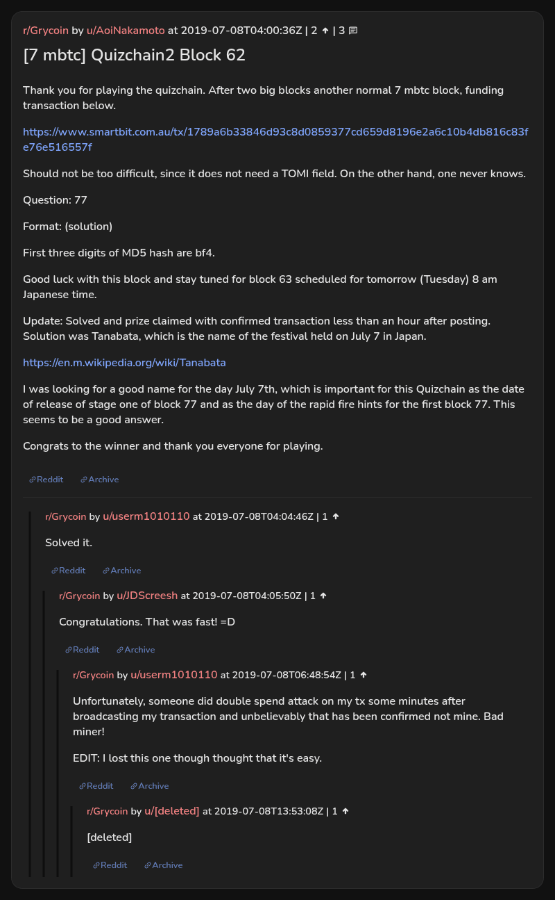

# [7 mbtc] Quizchain2 Block 62

[Original thread](https://www.reddit.com/r/Grycoin/comments/cag7u1/7_mbtc_quizchain2_block_62/). The `sourceUrl` of the [quizchain2/62](../../../src/collections/quizchain2/62.ts) record and the source of its question, format, hash digits and funding transaction, with the solution the author edited in. u/userm1010110's comment says their claim lost to another transaction. The post went up on July 8, 2019, at 04:00:36 UTC, four hours and 25 minutes after the block time of its funding transaction. Its last edit is stamped 06:12:09 UTC the same day, so the transcript shows the post as it stood after the claim.

## Historical provenance

No capture found. On October 4, 2026 the Wayback Machine index listed one capture of the thread under the `www.reddit.com` URL, June 11, 2023, 21:39:46 UTC. Its `id_` body is Reddit's app shell titled "Reddit - Dive into anything", with neither the post nor a comment in its HTML. The one capture of the `old.reddit.com` URL, a second later, is a 302 redirect to a subreddit search for Grycoin. The archive.today timemaps for the `www.reddit.com`, `old.reddit.com` and bare `reddit.com` URLs answered 404.

The transcript below comes from the [Arctic Shift](https://arctic-shift.photon-reddit.com/) Reddit archive: the post record and the comment tree for `cag7u1`, read on October 4, 2026. The [pullpush](https://pullpush.io/) Reddit archive, read the same day, gives the same post text, time and edit stamp, and the same 4 comments with the same authors, times, scores and parents. One of them is a deleted comment, kept below as `[deleted]`.

The record names none of the commenters: nothing on the chain ties a claim to a name.

## Transcript

> Thank you for playing the quizchain. After two big blocks another normal 7 mbtc block, funding transaction below.
>
> https://www.smartbit.com.au/tx/1789a6b33846d93c8d0859377cd659d8196e2a6c10b4db816c83fe76e516557f
>
> Should not be too difficult, since it does not need a TOMI field. On the other hand, one never knows.
>
> Question: 77
>
> Format: (solution)
>
> First three digits of MD5 hash are bf4.
>
> Good luck with this block and stay tuned for block 63 scheduled for tomorrow (Tuesday) 8 am Japanese time.
>
> Update: Solved and prize claimed with confirmed transaction less than an hour after posting. Solution was Tanabata, which is the name of the festival held on July 7 in Japan.
>
> https://en.m.wikipedia.org/wiki/Tanabata
>
> I was looking for a good name for the day July 7th, which is important for this Quizchain as the date of release of stage one of block 77 and as the day of the rapid fire hints for the first block 77. This seems to be a good answer.
>
> Congrats to the winner and thank you everyone for playing.

## Comments

**u/userm1010110**, 1 point:

> Solved it.

**u/JDScreesh**, 1 point, reply to u/userm1010110:

> Congratulations. That was fast! =D

**u/userm1010110**, 1 point, reply to u/JDScreesh:

> Unfortunately, someone did double spend attack on my tx some minutes after broadcasting my transaction and unbelievably that has been confirmed not mine. Bad miner!
>
> EDIT: I lost this one though thought that it's easy.

**[deleted]**, reply to u/userm1010110:

> [deleted]

## Screenshot

The screenshot is a render of the thread in Arctic Shift's ID lookup, not of Reddit, since no readable capture of the Reddit page exists. Capture method and limits: [source archive](../README.md).
