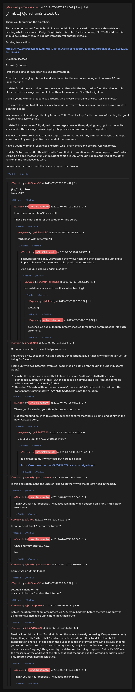

# [7 mbtc] Quizchain2 Block 63

[Original thread](https://www.reddit.com/r/Grycoin/comments/casci2/7_mbtc_quizchain2_block_63/). The `sourceUrl` of the [quizchain2/63](../../../src/collections/quizchain2/63.ts) record and the source of its question, format, hash digits, funding transaction and the two updates with the signed message, with the solution the author edited in. AoiNakamoto's reply that the new Wattpad story holds a hint and u/puzzleponky's comment with the solution are in the comments. The post went up on July 8, 2019, at 22:59:00 UTC, eleven and a half hours after the block time of its funding transaction. Its last edit is stamped 00:32:54 UTC on July 11, 2019, so the transcript shows the post as it stood after the claim.

## Historical provenance

No capture found. On October 4, 2026 the Wayback Machine index listed one capture of the thread under the `www.reddit.com` URL, June 11, 2023, 21:44:26 UTC. Its `id_` body is Reddit's app shell titled "Reddit - Dive into anything", with neither the post nor a comment in its HTML. The one capture of the `old.reddit.com` URL, a second later, is a 302 redirect to a subreddit search for Grycoin. The archive.today timemaps for the `www.reddit.com`, `old.reddit.com` and bare `reddit.com` URLs answered 404.

The transcript below comes from the [Arctic Shift](https://arctic-shift.photon-reddit.com/) Reddit archive: the post record and the comment tree for `casci2`, read on October 4, 2026. The [pullpush](https://pullpush.io/) Reddit archive, read the same day, gives the same post text, time and edit stamp, and the same 20 comments with the same authors, times, scores and parents. One of them is a deleted comment, kept below as `[deleted]`.

The record names none of the commenters: nothing on the chain ties a claim to a name.

## Transcript

> Thank you for playing the quizchain.
>
> This is another normal 7 mbtc block. It is a special block dedicated to someone absolutely not existing whatsoever called Cariga Bright (which is a clue for the solution). No TOMI field for this, should be relatively easy (if I do not introduce yet another mistake).
>
> Funding transaction:
>
> https://www.smartbit.com.au/tx/7de43ce4ae06ac4c2c7de9b8f9466af1a2f8fd6c3595310516b23a0584f5c983
>
> Question: IAOAOI
>
> Format: (solution).
>
> FIrst three digits of MD5 hash are 561 (copypasted).
>
> Good luck challenging this block and stay tuned for the next one coming up tomorrow 10 pm Japanese time.
>
> Update: So let me try to sign some message or other with the key used to fund the prize for this block. I need a message for that. Let me think for a moment. Yes. That might do.
>
> "I am a young woman of Japanese ancestry, who is very smart and sincere, Aoi Nakamoto."
>
> Has a nice true ring to it. It is also close to what Satoshi wrote at a similar occasion. Now how do I sign that again?
>
> Wait a minute. I need to get the key from the Tulip Trust I set up for the purpose of keeping the great Aoi stash safe. Stay tuned...
>
> Update 2: I have successfully signed the message above with my signing pen, right on the white space under the message on my display. I hope everyone can confirm my signature.
>
> But just to make sure, here is that message again, formatted slightly differently. Maybe that helps some more. Anyway, I just like the sound of that sentence.
>
> "**I a**m a young woman of Japanese ancestry, who is very smart and sincere, **Aoi** Nakamoto."
>
> Update: Solved soon after this differently formatted hint, solution was "I am omnipotent Aoi", which would be a good message for Cariga Bright to sign in 2029, though I do like the ring of the other version in the hint above as well.
>
> Congrats to the winner and thank you everyone for playing.

## Comments

**u/AirShark90**, 2 points:

> (╯°□°）╯︵ ┻━┻
> I'm anGRY

**u/AoiNakamoto**, 1 point, reply to u/AirShark90:

> I hope you are not hunGRY as well.
>
> That part is not a hint for the solution of this block...

**u/AirShark90**, 1 point, reply to u/AoiNakamoto:

> MD5 hash without errors? :)

**u/AoiNakamoto**, 1 point, reply to u/AirShark90:

> I copypasted this one. Copypasted the whole hash and then deleted the last digits. Impossible even for me to mess this up with that procedure.
>
> And I double-checked again just now.

**u/BrainForceOne**, 1 point, reply to u/AoiNakamoto:

> No invisible spaces and newlines when hashing?

**[deleted]**, reply to u/BrainForceOne:

> [deleted]

**u/AoiNakamoto**, 1 point, reply to u/BrainForceOne:

> Just checked again, though already checked three times before posting. No such error here.

**u/Quantris**, 3 points:

> Got nowhere so far. In case it helps someone:
>
> FYI there's a new section in Wattpad about Cariga Bright. IDK if it has any clues though vs. just being for flavour.
>
> I came up with two potential avenues (dead ends on both so far, though the 2nd still seems viable)
>
> 1. maybe the solution is a word that follows the same "pattern" as IAOAOI (i.e. some alphabetic substitution of this). But this idea is a bit simple and also I couldn't come up with any words that actually fit that.
> 2. Based on "Satoshi without the consonants", maybe IAOAOI is the solution without the consonants. Unfortunately "I AM NOT SATOSHI" is not the solution.

**u/AoiNakamoto**, 1 point, reply to u/Quantris:

> Thank you for sharing your thought process until now.
>
> Not commenting much at this stage, but I can confirm that there is some kind of hint in the new Wattpad story.

**u/435627793**, 1 point, reply to u/AoiNakamoto:

> Could you link the new Wattpad story?

**u/AoiNakamoto**, 1 point, reply to u/435627793:

> It is linked at my Twitter feed, but here it is again.
>
> https://www.wattpad.com/755457972-second-cariga-bright

**u/martypyouknowme**, 1 point:

> Is this dedication along the lines of "The Godfather" with the horse's head in the bed?

**u/AoiNakamoto**, 1 point, reply to u/martypyouknowme:

> Thank you for your feedback. I will keep it in mind when deciding on a hint, if this block needs one.

**u/LiaVl**, 1 point:

> Is dot in " (solution)." part of the format?

**u/AoiNakamoto**, 1 point, reply to u/LiaVl:

> Checking very carefully now.
>
> No.

**u/martypyouknowme**, 1 point:

> I Am Of Asian Origin Indeed

**u/AirShark90**, 1 point:

> solution is handwritten?
> or can solution be found on the Internet?

**u/puzzleponky**, 1 point:

> Solved! solution was "I am omnipotent Aoi". Already had that before the first hint but was using capitals instead so last hint helped, thanks **Aoi**!

**u/Randomiser**, 5 points:

> Feedback for future hints: Your first hint on this was extremely confusing. People were already trying things with "I AM ... AOI", and as the solver said even they tried it before, but the capitalization and lack of spacing in the question made the format difficult to be sure of. (and you could see Quantris was close to the right track, too.) Then the first hint came and put a ton of emphasis on "signing" things and I got sidetracked by trying to append Satoshi's PGP key to the message or the address of the block that sent the funds like the wattpad suggests, which only created even more possibilities.

**u/AoiNakamoto**, 1 point, reply to u/Randomiser:

> Thank you for your feedback. I will keep this in mind.

## Screenshot

The screenshot is a render of the thread in Arctic Shift's ID lookup, not of Reddit, since no readable capture of the Reddit page exists. Capture method and limits: [source archive](../README.md).
