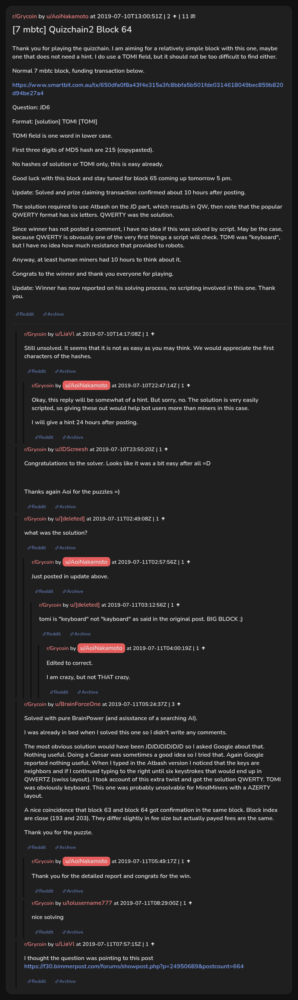

# [7 mbtc] Quizchain2 Block 64

[Original thread](https://www.reddit.com/r/Grycoin/comments/cbgf21/7_mbtc_quizchain2_block_64/). The `sourceUrl` of the [quizchain2/64](../../../src/collections/quizchain2/64.ts) record and the source of its question, format, hash digits and funding transaction, with the solution the author edited in. u/BrainForceOne's comment walks through the Atbash step and the keyboard row. The post went up on July 10, 2019, at 13:00:51 UTC, an hour and 56 minutes after the block time of its funding transaction. Its last edit is stamped 05:54:13 UTC on July 11, 2019, so the transcript shows the post as it stood after the claim.

## Historical provenance

No capture found. On October 4, 2026 the Wayback Machine index listed one capture of the thread under the `www.reddit.com` URL, June 11, 2023, 22:12:04 UTC. Its `id_` body is Reddit's app shell titled "Reddit - Dive into anything", with neither the post nor a comment in its HTML. The one capture of the `old.reddit.com` URL, two seconds later, is a 302 redirect to a subreddit search for Grycoin. The archive.today timemaps for the `www.reddit.com`, `old.reddit.com` and bare `reddit.com` URLs answered 404.

The transcript below comes from the [Arctic Shift](https://arctic-shift.photon-reddit.com/) Reddit archive: the post record and the comment tree for `cbgf21`, read on October 4, 2026. The [pullpush](https://pullpush.io/) Reddit archive, read the same day, gives the same post text, time and edit stamp, and the same 11 comments with the same authors, times, scores and parents. Their bodies differ only in how pullpush escapes the `&` sign in one comment and the empty `&#x200B;` paragraph in one comment, and the transcript leaves that empty paragraph out. Two of them are deleted comments, kept below as `[deleted]`.

The record names none of the commenters: nothing on the chain ties a claim to a name.

## Transcript

> Thank you for playing the quizchain. I am aiming for a relatively simple block with this one, maybe one that does not need a hint. I do use a TOMI field, but it should not be too difficult to find either.
>
> Normal 7 mbtc block, funding transaction below.
>
> https://www.smartbit.com.au/tx/650dfa0f8a43f4e315a3fc8bbfa5b501fde0314618049bec859b820d94be27a4
>
> Question: JD6
>
> Format: [solution] TOMI [TOMI]
>
> TOMI field is one word in lower case.
>
> First three digits of MD5 hash are 215 (copypasted).
>
> No hashes of solution or TOMI only, this is easy already.
>
> Good luck with this block and stay tuned for block 65 coming up tomorrow 5 pm.
>
> Update: Solved and prize claiming transaction confirmed about 10 hours after posting.
>
> The solution required to use Atbash on the JD part, which results in QW, then note that the popular QWERTY format has six letters. QWERTY was the solution.
>
> Since winner has not posted a comment, I have no idea if this was solved by script. May be the case, because QWERTY is obvously one of the very first things a script will check. TOMI was "keyboard", but I have no idea how much resistance that provided to robots.
>
> Anyway, at least human miners had 10 hours to think about it.
>
> Congrats to the winner and thank you everyone for playing.
>
> Update: Winner has now reported on his solving process, no scripting involved in this one. Thank you.

## Comments

**u/LiaVl**, 1 point:

> Still unsolved. It seems that it is not as easy as you may think. We would appreciate the first characters of the hashes.

**u/AoiNakamoto**, 1 point, reply to u/LiaVl:

> Okay, this reply will be somewhat of a hint. But sorry, no. The solution is very easily scripted, so giving these out would help bot users more than miners in this case.
>
> I will give a hint 24 hours after posting.

**u/JDScreesh**, 1 point:

> Congratulations to the solver. Looks like it was a bit easy after all =D
>
> Thanks again Aoi for the puzzles =)

**[deleted]**:

> what was the solution?

**u/AoiNakamoto**, 1 point, reply to a deleted comment:

> Just posted in update above.

**[deleted]**, reply to u/AoiNakamoto:

> tomi is "keyboard" not "kayboard" as said in the original post. BIG BLOCK ;)

**u/AoiNakamoto**, 1 point, reply to a deleted comment:

> Edited to correct.
>
> I am crazy, but not THAT crazy.

**u/BrainForceOne**, 3 points:

> Solved with pure BrainPower (and asisstance of a searching AI).
>
> I was already in bed when I solved this one so I didn't write any comments.
>
> The most obvious solution would have been JDJDJDJDJDJD so I asked Google about that. Nothing useful. Doing a Caesar was sometimes a good idea so I tried that. Again Google reported nothing useful. When I typed in the Atbash version I noticed that the keys are neighbors and if I continued typing to the right until six keystrokes that would end up in QWERTZ (swiss layout). I took account of this extra twist and got the solution QWERTY. TOMI was obviously keyboard. This one was probably unsolvable for MindMiners with a AZERTY layout.
>
> A nice coincidence that block 63 and block 64 got confirmation in the same block. Block index are close (193 and 203). They differ slightly in fee size but actually payed fees are the same.
>
> Thank you for the puzzle.

**u/AoiNakamoto**, 1 point, reply to u/BrainForceOne:

> Thank you for the detailed report and congrats for the win.

**u/lolusername777**, 1 point, reply to u/BrainForceOne:

> nice solving

**u/LiaVl**, 1 point:

> I thought the question was pointing to this post [https://f30.bimmerpost.com/forums/showpost.php?p=24950689&postcount=664](https://f30.bimmerpost.com/forums/showpost.php?p=24950689&postcount=664)

## Screenshot

The screenshot is a render of the thread in Arctic Shift's ID lookup, not of Reddit, since no readable capture of the Reddit page exists. Capture method and limits: [source archive](../README.md).
