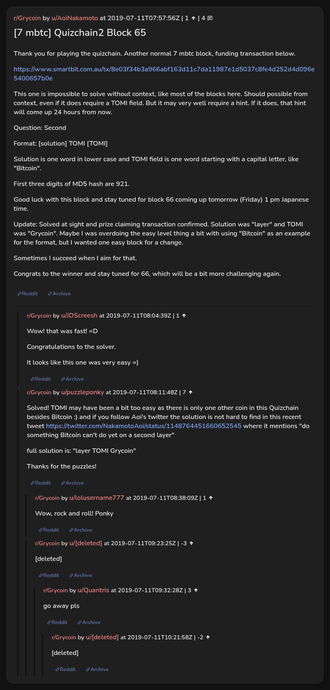

# [7 mbtc] Quizchain2 Block 65

[Original thread](https://www.reddit.com/r/Grycoin/comments/cbt0ej/7_mbtc_quizchain2_block_65/). The `sourceUrl` of the [quizchain2/65](../../../src/collections/quizchain2/65.ts) record and the source of its question, format, hash digits and funding transaction, with the solution the author edited in. u/puzzleponky's comment has the solution and the author's tweet it came from. The post went up on July 11, 2019, at 07:57:56 UTC, three hours and eleven minutes after the block time of its funding transaction. Its last edit is stamped 08:29:03 UTC the same day, so the transcript shows the post as it stood after the claim.

## Historical provenance

No capture found. On October 4, 2026 the Wayback Machine index listed one capture of the thread under the `www.reddit.com` URL, June 11, 2023, 22:32:43 UTC. Its `id_` body is Reddit's app shell titled "Reddit - Dive into anything", with neither the post nor a comment in its HTML. The one capture of the `old.reddit.com` URL, a second later, is a 302 redirect to a subreddit search for Grycoin. The archive.today timemaps for the `www.reddit.com`, `old.reddit.com` and bare `reddit.com` URLs answered 404.

The transcript below comes from the [Arctic Shift](https://arctic-shift.photon-reddit.com/) Reddit archive: the post record and the comment tree for `cbt0ej`, read on October 4, 2026. The [pullpush](https://pullpush.io/) Reddit archive, read the same day, gives the same post text, time and edit stamp, and the same 6 comments with the same authors, times, scores and parents. Two of them are deleted comments, kept below as `[deleted]`.

The record names none of the commenters: nothing on the chain ties a claim to a name.

## Transcript

> Thank you for playing the quizchain. Another normal 7 mbtc block, funding transaction below.
>
> https://www.smartbit.com.au/tx/8e03f34b3a966abf163d11c7da11987e1d5037c8fe4d252d4d096e5400657b0e
>
> This one is impossible to solve without context, like most of the blocks here. Should possible from context, even if it does require a TOMI field. But it may very well require a hint. If it does, that hint will come up 24 hours from now.
>
> Question: Second
>
> Format: [solution] TOMI [TOMI]
>
> Solution is one word in lower case and TOMI field is one word starting with a
> capital letter, like "Bitcoin".
>
> First three digits of MD5 hash are 921.
>
> Good luck with this block and stay tuned for block 66 coming up tomorrow (Friday) 1 pm Japanese time.
>
> Update: Solved at sight and prize claiming transaction confirmed. Solution was "layer" and TOMI was "Grycoin". Maybe I was overdoing the easy level thing a bit with using "Bitcoin" as an example for the format, but I wanted one easy block for a change.
>
> Sometimes I succeed when I aim for that.
>
> Congrats to the winner and stay tuned for 66, which will be a bit more challenging again.

## Comments

**u/JDScreesh**, 1 point:

> Wow! that was fast! =D
>
> Congratulations to the solver.
>
> It looks like this one was very easy =)

**u/puzzleponky**, 7 points:

> Solved! TOMI may have been a bit too easy as there is only one other coin in this Quizchain besides Bitcoin :) and if you follow Aoi's twitter the solution is not hard to find in this recent tweet [https://twitter.com/NakamotoAoi/status/1148764451660652545](https://twitter.com/NakamotoAoi/status/1148764451660652545) where it mentions "do something Bitcoin can't do yet on a second layer"
>
> full solution is: "layer TOMI Grycoin"
>
> Thanks for the puzzles!

**u/lolusername777**, 1 point, reply to u/puzzleponky:

> Wow, rock and roll! Ponky

**[deleted]**, reply to u/puzzleponky:

> [deleted]

**u/Quantris**, 3 points, reply to a deleted comment:

> go away pls

**[deleted]**, reply to u/Quantris:

> [deleted]

## Screenshot

The screenshot is a render of the thread in Arctic Shift's ID lookup, not of Reddit, since no readable capture of the Reddit page exists. Capture method and limits: [source archive](../README.md).
