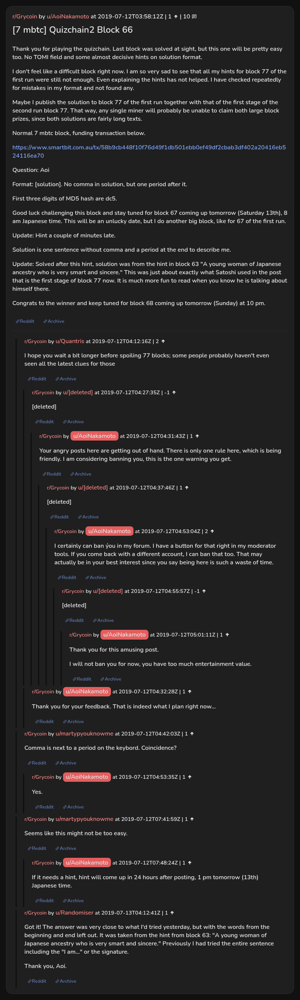

# [7 mbtc] Quizchain2 Block 66

[Original thread](https://www.reddit.com/r/Grycoin/comments/cc5uka/7_mbtc_quizchain2_block_66/). The `sourceUrl` of the [quizchain2/66](../../../src/collections/quizchain2/66.ts) record and the source of its question, format, hash digits, funding transaction and hint, with the solution the author edited in. u/Randomiser's comment has the solution and the block 63 hint it came from. The post went up on July 12, 2019, at 03:58:12 UTC, four hours and 44 minutes after the block time of its funding transaction. Its last edit is stamped 05:59:29 UTC on July 13, 2019, so the transcript shows the post as it stood after the claim.

## Historical provenance

No capture found. On October 4, 2026 the Wayback Machine index listed one capture of the thread under the `www.reddit.com` URL, June 11, 2023, 19:30:20 UTC. Its `id_` body is Reddit's app shell titled "Reddit - Dive into anything", with neither the post nor a comment in its HTML. The one capture of the `old.reddit.com` URL, four seconds later, is a 302 redirect to a subreddit search for Grycoin. The archive.today timemaps for the `www.reddit.com`, `old.reddit.com` and bare `reddit.com` URLs answered 404.

The transcript below comes from the [Arctic Shift](https://arctic-shift.photon-reddit.com/) Reddit archive: the post record and the comment tree for `cc5uka`, read on October 4, 2026. The [pullpush](https://pullpush.io/) Reddit archive, read the same day, gives the same post text, time and edit stamp, and the same 13 comments with the same authors, times, scores and parents. Three of them are deleted comments, kept below as `[deleted]`.

The record names none of the commenters: nothing on the chain ties a claim to a name.

## Transcript

> Thank you for playing the quizchain. Last block was solved at sight, but this one will be pretty easy too. No TOMI field and some almost decisive hints on solution format.
>
> I don't feel like a difficult block right now. I am so very sad to see that all my hints for block 77 of the first run were still not enough. Even explaining the hints has not helped. I have checked repeatedly for mistakes in my format and not found any.
>
> Maybe I publish the solution to block 77 of the first run together with that of the first stage of the second run block 77. That way, any single miner will probably be unable to claim both large block prizes, since both solutions are fairly long texts.
>
> Normal 7 mbtc block, funding transaction below.
>
> https://www.smartbit.com.au/tx/58b9cb448f10f76d49f1db501ebb0ef49df2cbab3df402a20416eb524116ea70
>
> Question: Aoi
>
> Format: [solution]. No comma in solution, but one period after it.
>
> First three digits of MD5 hash are dc5.
>
> Good luck challenging this block and stay tuned for block 67 coming up tomorrow (Saturday 13th), 8 am Japanese time. This will be an unlucky date, but I do another big block, like for 67 of the first run.
>
> Update: Hint a couple of minutes late.
>
> Solution is one sentence without comma and a period at the end to describe me.
>
> Update: Solved after this hint, solution was from the hint in block 63 "A young woman of Japanese ancestry who is very smart and sincere." This was just about exactly what Satoshi used in the post that is the first stage of block 77 now. It is much more fun to read when you know he is talking about himself there.
>
> Congrats to the winner and keep tuned for block 68 coming up tomorrow (Sunday) at 10 pm.

## Comments

**u/Quantris**, 2 points:

> I hope you wait a bit longer before spoiling 77 blocks; some people probably haven't even seen all the latest clues for those

**[deleted]**, reply to u/Quantris:

> [deleted]

**u/AoiNakamoto**, 1 point, reply to a deleted comment:

> Your angry posts here are getting out of hand. There is only one rule here, which is being friendly. I am considering banning you, this is the one warning you get.

**[deleted]**, reply to u/AoiNakamoto:

> [deleted]

**u/AoiNakamoto**, 2 points, reply to a deleted comment:

> I certainly can ban ýou in my forum. I have a button for that right in my moderator tools. If you come back with a different account, I can ban that too. That may actually be in your best interest since you say being here is such a waste of time.

**[deleted]**, reply to u/AoiNakamoto:

> [deleted]

**u/AoiNakamoto**, 1 point, reply to a deleted comment:

> Thank you for this amusing post.
>
> I will not ban you for now, you have too much entertainment value.

**u/AoiNakamoto**, 1 point, reply to u/Quantris:

> Thank you for your feedback. That is indeed what I plan right now...

**u/martypyouknowme**, 1 point:

> Comma is next to a period on the keybord. Coincidence?

**u/AoiNakamoto**, 1 point, reply to u/martypyouknowme:

> Yes.

**u/martypyouknowme**, 1 point:

> Seems like this might not be too easy.

**u/AoiNakamoto**, 1 point, reply to u/martypyouknowme:

> If it needs a hint, hint will come up in 24 hours after posting, 1 pm tomorrow (13th) Japanese time.

**u/Randomiser**, 1 point:

> Got it! The answer was very close to what I'd tried yesterday, but with the words from the beginning and end left out. It was taken from the hint from block 63: "A young woman of Japanese ancestry who is very smart and sincere." Previously I had tried the entire sentence including the "I am..." or the signature.
>
> Thank you, Aoi.

## Screenshot

The screenshot is a render of the thread in Arctic Shift's ID lookup, not of Reddit, since no readable capture of the Reddit page exists. Capture method and limits: [source archive](../README.md).
