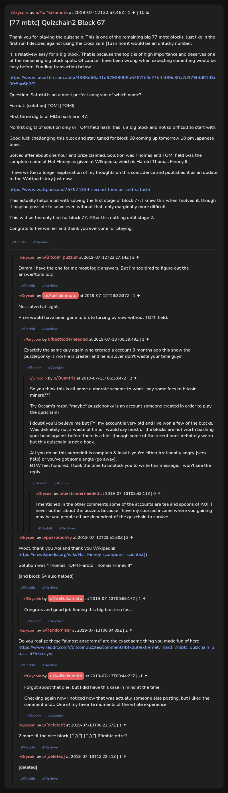

# [77 mbtc] Quizchain2 Block 67

[Original thread](https://www.reddit.com/r/Grycoin/comments/cchy6l/77_mbtc_quizchain2_block_67/). The `sourceUrl` of the [quizchain2/67](../../../src/collections/quizchain2/67.ts) record and the source of its question, format, hash digits and funding transaction, with the solution the author edited in. u/puzzleponky's comment has the solution and the Wikipedia page with Hal Finney's full name. The post went up on July 12, 2019, at 22:57:46 UTC, ten hours and 34 minutes after the block time of its funding transaction. Its last edit is stamped 01:03:14 UTC on July 13, 2019, so the transcript shows the post as it stood after the claim.

## Historical provenance

No capture found. On October 4, 2026 the Wayback Machine index listed one capture of the thread under the `www.reddit.com` URL, June 11, 2023, 20:52:54 UTC. Its `id_` body is Reddit's app shell titled "Reddit - Dive into anything", with neither the post nor a comment in its HTML. The one capture of the `old.reddit.com` URL, a second later, is a 302 redirect to a subreddit search for Grycoin. The archive.today timemaps for the `www.reddit.com`, `old.reddit.com` and bare `reddit.com` URLs answered 404.

The transcript below comes from the [Arctic Shift](https://arctic-shift.photon-reddit.com/) Reddit archive: the post record and the comment tree for `cchy6l`, read on October 4, 2026. The [pullpush](https://pullpush.io/) Reddit archive, read the same day, gives the same post text, time and edit stamp, and the same 11 comments with the same authors, times, scores and parents. Their bodies differ only in how pullpush escapes the `&` sign in one comment. Two of them are deleted comments, kept below as `[deleted]`.

The record names none of the commenters: nothing on the chain ties a claim to a name.

## Transcript

> Thank you for playing the quizchain. This is one of the remaining big 77 mbtc blocks. Just like in the first run I decided against using the cross sum (13) since it would be an unlucky number.
>
> It is relatively easy for a big block. That is because the topic is of high importance and deserves one of the remaining big block spots. Of course I have been wrong when expecting something would be easy before.
> Funding transaction below.
>
> https://www.smartbit.com.au/tx/4385d66a41d92939005b5767fb0c77b44f89e30a7d379f4d61d3e0fc9ac6b6f2
>
> Question: Satoshi is an almost perfect anagram of which name?
>
> Format: [solution] TOMI [TOMI]
>
> FIrst three digits of MD5 hash are f47.
>
> No first digits of solution only or TOMI field hash, this is a big block and not so difficult to start with.
>
> Good luck challenging this block and stay tuned for block 68 coming up tomorrow 10 pm Japanese time.
>
> Solved after about one hour and prize claimed. Solution was Thomas and TOMI field was the complete name of Hal FInney as given at WIkipedia, which is Harold Thomas Finney II.
>
> I have written a longer explanation of my thoughts on this coincidence and published it as an update to the Wattpad story just now.
>
> https://www.wattpad.com/757574334-second-thomas-and-satoshi
>
> This actually helps a bit with solving the first stage of block 77. I knew this when I solved it, though it may be possible to solve even without that, only marginally more difficult.
>
> This will be the only hint for block 77. After this nothing until stage 2.
>
> Congrats to the winner and thank you everyone for playing.

## Comments

**u/Bitcoin_puzzler**, 2 points:

> Damm i have the one for me most logic answers. But i'm too tired to figure out the answer/tomi lolz

**u/AoiNakamoto**, 1 point:

> Not solved at sight.
>
> Prize would have been gone to brute forcing by now without TOMI field.

**u/bestcoderneeded**, 1 point, reply to u/AoiNakamoto:

> Exactely the same guy again who created a account 3 months ago this show the puzzleponky is Aoi He is creater and he is slover don't waste your time guys'

**u/Quantris**, 2 points, reply to u/bestcoderneeded:

> So you think this is all some elaborate scheme to what...pay some fees to bitcoin miners???
>
> Try Occam's razor. \*maybe\* puzzleponky is an account someone created in order to play the quizchain?
>
> I doubt you'll believe me but FYI my account is very old and I've won a few of the blocks. Was definitely not a waste of time. I would say most of the blocks are not worth bashing your head against before there is a hint (though some of the recent ones definitely were) but this quizchain is not a hoax.
>
> All you do on this subreddit is complain & insult: you're either irrationally angry (seek help) or you've got some angle (go away).
> BTW feel honored, I took the time to unblock you to write this message. I won't see the reply.

**u/bestcoderneeded**, 0 points, reply to u/Quantris:

> I mentioned in the other comments some of the accounts are tea and spoons of AOI. I never bother about the puzzels because I have my sourced income where you gaining may be you people all are dependent of the quizchain to survive.

**u/puzzleponky**, 3 points:

> Woot, thank you Aoi and thank you Wikipedia! [https://en.wikipedia.org/wiki/Hal\_Finney\_(computer\_scientist)](<https://en.wikipedia.org/wiki/Hal_Finney_(computer_scientist)>)
>
> Solution was "Thomas TOMI Harold Thomas Finney II"
>
> (and block 54 also helped)

**u/AoiNakamoto**, 1 point, reply to u/puzzleponky:

> Congrats and good job finding this big block so fast.

**u/Randomiser**, 2 points:

> Do you realize these "almost anagrams" are the exact same thing you made fun of here https://www.reddit.com/r/bitcoinpuzzles/comments/bfkdut/extremely_hard_7mbtc_quizchain_block_57/elecsyy/

**u/AoiNakamoto**, -1 point, reply to u/Randomiser:

> Forgot about that one, but I did have this case in mind at the time.
>
> Checking again now I noticed now that was actually someone else posting, but I liked the comment a lot. One of my favorite moments of the whole experience.

**[deleted]**:

> 2 more til the nice block ( ͡° ͜ʖ ͡°) ( ͡° ͜ʖ ͡°) 69mbtc prize?

**[deleted]**:

> [deleted]

## Screenshot

The screenshot is a render of the thread in Arctic Shift's ID lookup, not of Reddit, since no readable capture of the Reddit page exists. Capture method and limits: [source archive](../README.md).
