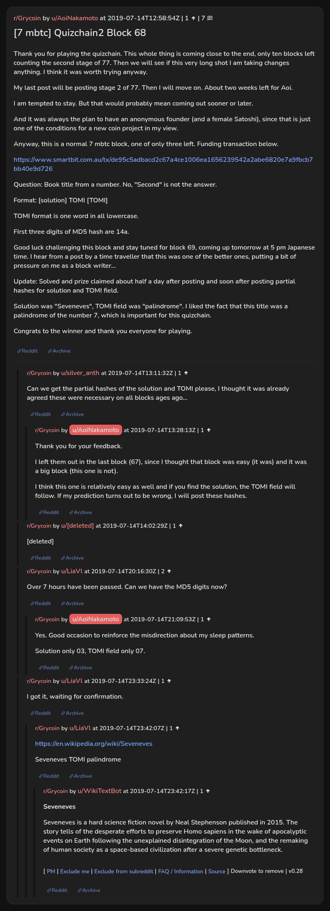

# [7 mbtc] Quizchain2 Block 68

[Original thread](https://www.reddit.com/r/Grycoin/comments/cd2qqx/7_mbtc_quizchain2_block_68/). The `sourceUrl` of the [quizchain2/68](../../../src/collections/quizchain2/68.ts) record and the source of its question, format, hash digits and funding transaction, with the solution the author edited in. AoiNakamoto's reply with the partial hashes and u/LiaVl's comment with the solution are in the comments. The post went up on July 14, 2019, at 12:58:54 UTC, three hours and one minute after the block time of its funding transaction. Its last edit is stamped 03:38:46 UTC on July 15, 2019, so the transcript shows the post as it stood after the claim.

## Historical provenance

No capture found. On October 4, 2026 the Wayback Machine index listed one capture of the thread under the `www.reddit.com` URL, June 11, 2023, 22:39:04 UTC. Its `id_` body is Reddit's app shell titled "Reddit - Dive into anything", with neither the post nor a comment in its HTML. The one capture of the `old.reddit.com` URL, two seconds later, is a 302 redirect to a subreddit search for Grycoin. The archive.today timemaps for the `www.reddit.com`, `old.reddit.com` and bare `reddit.com` URLs answered 404.

The transcript below comes from the [Arctic Shift](https://arctic-shift.photon-reddit.com/) Reddit archive: the post record and the comment tree for `cd2qqx`, read on October 4, 2026. The [pullpush](https://pullpush.io/) Reddit archive, read the same day, gives the same post text, time and edit stamp, and the same 8 comments with the same authors, times, scores and parents. Their bodies differ only in how pullpush escapes the `&` sign in one comment. One of them is a deleted comment, kept below as `[deleted]`.

The record names none of the commenters: nothing on the chain ties a claim to a name.

## Transcript

> Thank you for playing the quizchain. This whole thing is coming close to the end, only ten blocks left counting the second stage of 77. Then we will see if this very long shot I am taking changes anything. I think it was worth trying anyway.
>
> My last post will be posting stage 2 of 77. Then I will move on. About two weeks left for Aoi.
>
> I am tempted to stay. But that would probably mean coming out sooner or later.
>
> And it was always the plan to have an anonymous founder (and a female Satoshi), since that is just one of the conditions for a new coin project in my view.
>
> Anyway, this is a normal 7 mbtc block, one of only three left. Funding transaction below.
>
> https://www.smartbit.com.au/tx/de95c5adbacd2c67a4ce1006ea1656239542a2abe6820e7a9fbcb7bb40e9d726
>
> Question: Book title from a number. No, "Second" is not the answer.
>
> Format: [solution] TOMI [TOMI]
>
> TOMI format is one word in all lowercase.
>
> FIrst three digits of MD5 hash are 14a.
>
> Good luck challenging this block and stay tuned for block 69, coming up tomorrow at 5 pm Japanese time. I hear from a post by a time traveller that this was one of the better ones, putting a bit of pressure on me as a block writer...
>
> Update: Solved and prize claimed about half a day after posting and soon after posting partial hashes for solution and TOMI field.
>
> Solution was "Seveneves", TOMI field was "palindrome". I liked the fact that this title was a palindrome of the number 7, which is important for this quizchain.
>
> Congrats to the winner and thank you everyone for playing.

## Comments

**u/silver_anth**, 1 point:

> Can we get the partial hashes of the solution and TOMI please, I thought it was already agreed these were necessary on all blocks ages ago...

**u/AoiNakamoto**, 1 point, reply to u/silver_anth:

> Thank you for your feedback.
>
> I left them out in the last block (67), since I thought that block was easy (it was) and it was a big block (this one is not).
>
> I think this one is relatively easy as well and if you find the solution, the TOMI field will follow. If my prediction turns out to be wrong, I will post these hashes.

**[deleted]**:

> [deleted]

**u/LiaVl**, 2 points:

> Over 7 hours have been passed. Can we have the MD5 digits now?

**u/AoiNakamoto**, 1 point, reply to u/LiaVl:

> Yes. Good occasion to reinforce the misdirection about my sleep patterns.
>
> Solution only 03, TOMI field only 07.

**u/LiaVl**, 1 point:

> I got it, waiting for confirmation.

**u/LiaVl**, 1 point, reply to u/LiaVl:

> [https://en.wikipedia.org/wiki/Seveneves](https://en.wikipedia.org/wiki/Seveneves)
>
> Seveneves TOMI palindrome

**u/WikiTextBot**, 1 point, reply to u/LiaVl:

> **Seveneves**
>
> Seveneves is a hard science fiction novel by Neal Stephenson published in 2015. The story tells of the desperate efforts to preserve Homo sapiens in the wake of apocalyptic events on Earth following the unexplained disintegration of the Moon, and the remaking of human society as a space-based civilization after a severe genetic bottleneck.
>
> ---
>
> ^[ [^PM](https://www.reddit.com/message/compose?to=kittens_from_space) ^| [^Exclude ^me](https://reddit.com/message/compose?to=WikiTextBot&message=Excludeme&subject=Excludeme) ^| [^Exclude ^from ^subreddit](https://np.reddit.com/r/Grycoin/about/banned) ^| [^FAQ ^/ ^Information](https://np.reddit.com/r/WikiTextBot/wiki/index) ^| [^Source](https://github.com/kittenswolf/WikiTextBot) ^]
> ^Downvote ^to ^remove ^| ^v0.28

## Screenshot

The screenshot is a render of the thread in Arctic Shift's ID lookup, not of Reddit, since no readable capture of the Reddit page exists. Capture method and limits: [source archive](../README.md).
