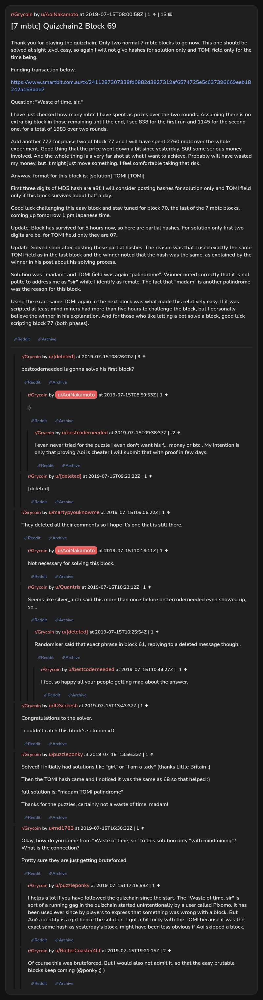

# [7 mbtc] Quizchain2 Block 69

[Original thread](https://www.reddit.com/r/Grycoin/comments/cdentq/7_mbtc_quizchain2_block_69/). The `sourceUrl` of the [quizchain2/69](../../../src/collections/quizchain2/69.ts) record and the source of its question, format, hash digits, funding transaction and partial hashes, with the solution the author edited in. u/puzzleponky's comment has the solution and notes the TOMI hash repeated from block 68. The post went up on July 15, 2019, at 08:00:58 UTC, three and a half hours after the block time of its funding transaction. Its last edit is stamped 23:07:23 UTC the same day, so the transcript shows the post as it stood after the claim.

## Historical provenance

No capture found. On October 4, 2026 the Wayback Machine index listed one capture of the thread under the `www.reddit.com` URL, June 11, 2023, 21:49:41 UTC. Its `id_` body is Reddit's app shell titled "Reddit - Dive into anything", with neither the post nor a comment in its HTML. The one capture of the `old.reddit.com` URL, a second later, is a 302 redirect to a subreddit search for Grycoin. The archive.today timemaps for the `www.reddit.com`, `old.reddit.com` and bare `reddit.com` URLs answered 404.

The transcript below comes from the [Arctic Shift](https://arctic-shift.photon-reddit.com/) Reddit archive: the post record and the comment tree for `cdentq`, read on October 4, 2026. The [pullpush](https://pullpush.io/) Reddit archive, read the same day, gives the same post text, time and edit stamp, and the same 14 comments with the same authors, times, scores and parents. Three of them are deleted comments, kept below as `[deleted]`.

The record names none of the commenters: nothing on the chain ties a claim to a name.

## Transcript

> Thank you for playing the quizchain. Only two normal 7 mbtc blocks to go now. This one should be solved at sight level easy, so again I will not give hashes for solution only and TOMI field only for the time being.
>
> Funding transaction below.
>
> https://www.smartbit.com.au/tx/2411287307338fd0882d3827319af6574725e5c637396669eeb18242a163add7
>
> Question: "Waste of time, sir."
>
> I have just checked how many mbtc I have spent as prizes over the two rounds. Assuming there is no extra big block in those remaining until the end, I see 838 for the first run and 1145 for the second one, for a total of 1983 over two rounds.
>
> Add another 777 for phase two of block 77 and I will have spent 2760 mbtc over the whole experiment. Good thing that the price went down a bit since yesterday. Still some serious money involved. And the whole thing is a very far shot at what I want to achieve. Probably will have wasted my money, but it might just move something. I feel comfortable taking that risk.
>
> Anyway, format for this block is: [solution] TOMI [TOMI]
>
> First three digits of MD5 hash are a8f. I will consider posting hashes for solution only and TOMI field only if this block survives about half a day.
>
> Good luck challenging this easy block and stay tuned for block 70, the last of the 7 mbtc blocks, coming up tomorrow 1 pm Japanese time.
>
> Update: Block has survived for 5 hours now, so here are partial hashes. For solution only first two digits are be, for TOMI field only they are 07.
>
> Update: Solved soon after posting these partial hashes. The reason was that I used exactly the same TOMI field as in the last block and the winner noted that the hash was the same, as explained by the winner in his post about his solving process.
>
> Solution was "madam" and TOMI field was again "palindrome". Winner noted correctly that it is not polite to address me as "sir" while I identify as female. The fact that "madam" is another palindrome was the reason for this block.
>
> Using the exact same TOMI again in the next block was what made this relatively easy. If it was scripted at least mind miners had more than five hours to challenge the block, but I personally believe the winner in his explanation. And for those who like letting a bot solve a block, good luck scripting block 77 (both phases).

## Comments

**[deleted]**:

> bestcoderneeded is gonna solve his first block?

**u/AoiNakamoto**, 1 point, reply to a deleted comment:

> :)

**u/bestcoderneeded**, -2 points, reply to u/AoiNakamoto:

> I even never tried for the puzzle I even don't want his f... money or btc . My intention is only that proving Aoi is cheater I will submit that with proof in few days.

**[deleted]**, reply to a deleted comment:

> [deleted]

**u/martypyouknowme**, 1 point:

> They deleted all their comments so I hope it’s one that is still there.

**u/AoiNakamoto**, 1 point, reply to u/martypyouknowme:

> Not necessary for solving this block.

**u/Quantris**, 1 point, reply to u/martypyouknowme:

> Seems like silver\_anth said this more than once before bettercoderneeded even showed up, so...

**[deleted]**, reply to u/Quantris:

> Randomiser said that exact phrase in block 61, replying to a deleted message though..

**u/bestcoderneeded**, -1 point, reply to a deleted comment:

> I feel so happy all your people getting mad about the answer.

**u/JDScreesh**, 1 point:

> Congratulations to the solver.
>
> I couldn't catch this block's solution xD

**u/puzzleponky**, 1 point:

> Solved! I initially had solutions like "girl" or "I am a lady" (thanks Little Britain ;)
>
> Then the TOMI hash came and I noticed it was the same as 68 so that helped :)
>
> full solution is: "madam TOMI palindrome"
>
> Thanks for the puzzles, certainly not a waste of time, madam!

**u/rnd1783**, 1 point:

> Okay, how do you come from "Waste of time, sir" to this solution only "with mindmining"?
> What is the connection?
>
> Pretty sure they are just getting bruteforced.

**u/puzzleponky**, 1 point, reply to u/rnd1783:

> I helps a lot if you have followed the quizchain since the start. The "Waste of time, sir" is sort of a running gag in the quizchain started unintentionally by a user called Pixomo. It has been used ever since by players to express that something was wrong with a block. But Aoi's identity is a girl hence the solution. I got a bit lucky with the TOMI because it was the exact same hash as yesterday's block, might have been less obvious if Aoi skipped a block.

**u/RollerCoaster4Lf**, 2 points, reply to u/rnd1783:

> Of course this was bruteforced. But I would also not admit it, so that the easy brutable blocks keep coming (@ponky ;) )

## Screenshot

The screenshot is a render of the thread in Arctic Shift's ID lookup, not of Reddit, since no readable capture of the Reddit page exists. Capture method and limits: [source archive](../README.md).
