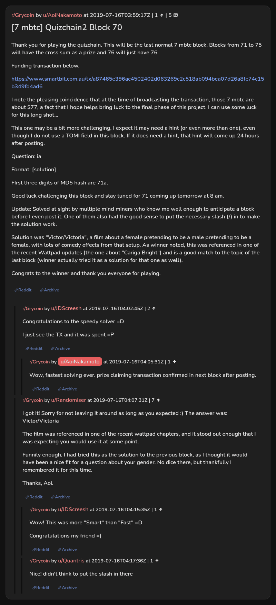

# [7 mbtc] Quizchain2 Block 70

[Original thread](https://www.reddit.com/r/Grycoin/comments/cds16v/7_mbtc_quizchain2_block_70/). The `sourceUrl` of the [quizchain2/70](../../../src/collections/quizchain2/70.ts) record and the source of its question, format, hash digits and funding transaction, with the solution the author edited in. u/Randomiser's comment has the solution and the Wattpad chapter it came from. The post went up on July 16, 2019, at 03:59:17 UTC, four hours and 34 minutes after the block time of its funding transaction and 88 seconds before the block time of the claim. Its last edit is stamped 05:40:56 UTC the same day, so the transcript shows the post as it stood after the claim.

## Historical provenance

No capture found. On October 4, 2026 the Wayback Machine index listed one capture of the thread under the `www.reddit.com` URL, June 11, 2023, 18:49:42 UTC. Its `id_` body is Reddit's app shell titled "Reddit - Dive into anything", with neither the post nor a comment in its HTML. The one capture of the `old.reddit.com` URL, a second later, is a 302 redirect to a subreddit search for Grycoin. The archive.today timemaps for the `www.reddit.com`, `old.reddit.com` and bare `reddit.com` URLs answered 404.

The transcript below comes from the [Arctic Shift](https://arctic-shift.photon-reddit.com/) Reddit archive: the post record and the comment tree for `cds16v`, read on October 4, 2026. The [pullpush](https://pullpush.io/) Reddit archive, read the same day, gives the same post text, time and edit stamp, and the same 5 comments with the same authors, times, scores and parents.

The record names none of the commenters: nothing on the chain ties a claim to a name.

## Transcript

> Thank you for playing the quizchain. This will be the last normal 7 mbtc block. Blocks from 71 to 75 will have the cross sum as a prize and 76 will just have 76.
>
> Funding transaction below.
>
> https://www.smartbit.com.au/tx/a87465e396ac4502402d063269c2c518ab094bea07d26a8fe74c15b349fd4ad6
>
> I note the pleasing coincidence that at the time of broadcasting the transaction, those 7 mbtc are about $77, a fact that I hope helps bring luck to the final phase of this project. I can use some luck for this long shot...
>
> This one may be a bit more challenging, I expect it may need a hint (or even more than one), even though I do not use a TOMI field in this block. If it does need a hint, that hint will come up 24 hours after posting.
>
> Question: ia
>
> Format: [solution]
>
> FIrst three digits of MD5 hash are 71a.
>
> Good luck challenging this block and stay tuned for 71 coming up tomorrow at 8 am.
>
> Update: Solved at sight by multiple mind miners who know me well enough to anticipate a block before I even post it. One of them also had the good sense to put the necessary slash (/) in to make the solution work.
>
> Solution was "Victor/Victoria", a film about a female pretending to be a male pretending to be a female, with lots of comedy effects from that setup. As winner noted, this was referenced in one of the recent Wattpad updates (the one about "Cariga Bright") and is a good match to the topic of the last block (winner actually tried it as a solution for that one as well).
>
> Congrats to the winner and thank you everyone for playing.

## Comments

**u/JDScreesh**, 2 points:

> Congratulations to the speedy solver =D
>
> I just see the TX and it was spent =P

**u/AoiNakamoto**, 1 point, reply to u/JDScreesh:

> Wow, fastest solving ever. prize claiming transaction confirmed in next block after posting.

**u/Randomiser**, 7 points:

> I got it! Sorry for not leaving it around as long as you expected :) The answer was: Victor/Victoria
>
> The film was referenced in one of the recent wattpad chapters, and it stood out enough that I was expecting you would use it at some point.
>
> Funnily enough, I had tried this as the solution to the previous block, as I thought it would have been a nice fit for a question about your gender. No dice there, but thankfully I remembered it for this time.
>
> Thanks, Aoi.

**u/JDScreesh**, 1 point, reply to u/Randomiser:

> Wow! This was more "Smart" than "Fast" =D
>
> Congratulations my friend =)

**u/Quantris**, 1 point, reply to u/Randomiser:

> Nice! didn't think to put the slash in there

## Screenshot

The screenshot is a render of the thread in Arctic Shift's ID lookup, not of Reddit, since no readable capture of the Reddit page exists. Capture method and limits: [source archive](../README.md).
