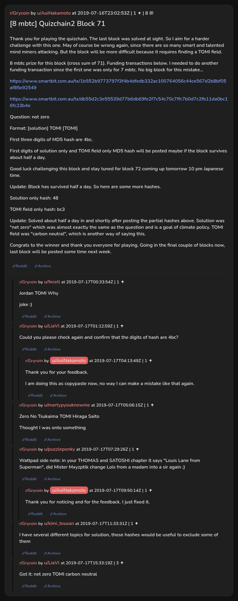

# [8 mbtc] Quizchain2 Block 71

[Original thread](https://www.reddit.com/r/Grycoin/comments/ce4ixs/8_mbtc_quizchain2_block_71/). The `sourceUrl` of the [quizchain2/71](../../../src/collections/quizchain2/71.ts) record and the source of its question, format, both funding transactions and hash digits, with the partial hashes and the solution the author edited in. u/LiaVl's comment has the whole winning string. The post went up on July 16, 2019, at 23:02:53 UTC, nine hours and 56 minutes after the block time of its first funding transaction. Its last edit is stamped 00:06:56 UTC on July 18, 2019, so the transcript shows the post as it stood after the claim.

## Historical provenance

No capture found. On October 5, 2026 the Wayback Machine index listed no capture of the thread at all, under either the `www.reddit.com` or the `old.reddit.com` URL. The archive.today timemaps for the `www.reddit.com`, `old.reddit.com` and bare `reddit.com` URLs answered 404.

The transcript below comes from the [Arctic Shift](https://arctic-shift.photon-reddit.com/) Reddit archive: the post record and the comment tree for `ce4ixs`, read on October 5, 2026. The [pullpush](https://pullpush.io/) Reddit archive, read the same day, gives the same post text, time and edit stamp, and the same 8 comments with the same authors, times, scores and parents.

The record names none of the commenters: nothing on the chain ties a claim to a name.

## Transcript

> Thank you for playing the quizchain. The last block was solved at sight. So I aim for a harder challenge with this one. May of course be wrong again, since there are so many smart and talented mind miners attacking. But the block will be more difficult because it requires finding a TOMI field.
>
> 8 mbtc prize for this block (cross sum of 71). Funding transactions below. I needed to do another funding transaction since the first one was only for 7 mbtc. No big block for this mistake...
>
> https://www.smartbit.com.au/tx/1b552b9773797f3f4b4dfedb332ac100764056c44ce567d2b8bf05af85e92549
>
> https://www.smartbit.com.au/tx/db55d2c3e55539d77b6db69fe2f7c54c70c7ffc7b0d7c2fb11da0bc16fc23b4e
>
> Question: not zero
>
> Format: [solution] TOMI [TOMI]
>
> FIrst three digits of MD5 hash are 4bc.
>
> First digits of solution only and TOMI field only MD5 hash will be posted maybe if the block survives about half a day.
>
> Good luck challenging this block and stay tuned for block 72 coming up tomorrow 10 pm Japanese time.
>
> Update: Block has survived half a day. So here are some more hashes.
>
> Solution only hash: 48
>
> TOMI field only hash: bc3
>
> Update: Solved about half a day in and shortly after posting the partial hashes above. Solution was "net zero" which was almost exactly the same as the question and is a goal of climate policy. TOMI field was "carbon neutral", which is another way of saying this.
>
> Congrats to the winner and thank you everyone for playing. Going in the final couple of blocks now, last block will be posted some time next week.

## Comments

**u/fecell**, 1 point:

> Jordan TOMI Why
>
> joke :)

**u/LiaVl**, 1 point:

> Could you please check again and confirm that the digits of hash are 4bc?

**u/AoiNakamoto**, 1 point, reply to u/LiaVl:

> Thank you for your feedback.
>
> I am doing this as copypaste now, no way I can make a mistake like that again.

**u/martypyouknowme**, 1 point:

> Zero No Tsukaima TOMI Hiraga Saito
>
> Thought I was onto something

**u/puzzleponky**, 1 point:

> Wattpad side note: in your THOMAS and SATOSHI chapter it says "Louis Lane from Superman", did Mister Mxyzptlk change Lois from a madam into a sir again ;)

**u/AoiNakamoto**, 1 point, reply to u/puzzleponky:

> Thank you for noticing and for the feedback. I just fixed it.

**u/kimi_tousan**, 1 point:

> I have several different topics for solution, those hashes would be useful to exclude some of them

**u/LiaVl**, 3 points:

> Got it: net zero TOMI carbon neutral

## Screenshot

The screenshot is a render of the thread in Arctic Shift's ID lookup, not of Reddit, since no readable capture of the Reddit page exists. Capture method and limits: [source archive](../README.md).
