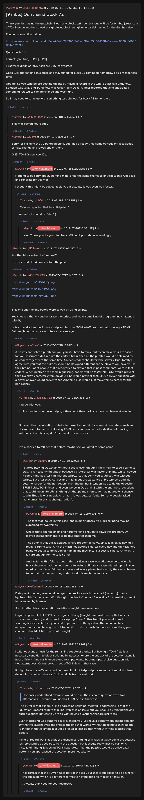

# [9 mbtc] Quizchain2 Block 72

[Original thread](https://www.reddit.com/r/Grycoin/comments/ces4vi/9_mbtc_quizchain2_block_72/). The `sourceUrl` of the [quizchain2/72](../../../src/collections/quizchain2/72.ts) record and the source of its question, format, hash digits and funding transaction, with the solution the author edited in. u/LiaVl's comment, a minute after the post, has the whole winning string. The post went up on July 18, 2019, at 12:56:36 UTC, six hours and 27 minutes after the block time of its funding transaction and three hours and 57 minutes after the block time of the claim. Its last edit is stamped 13:34:00 UTC the same day, so the transcript shows the post as it stood after the claim.

## Historical provenance

No capture found. On October 5, 2026 the Wayback Machine index listed one capture of the thread under the `www.reddit.com` URL, June 12, 2023, 02:26:24 UTC. Its `id_` body is Reddit's app shell titled "Reddit - Dive into anything", with neither the post nor a comment in its HTML. The one capture of the `old.reddit.com` URL, two seconds later, is a 302 redirect to a subreddit search for Grycoin. The archive.today timemaps for the `www.reddit.com`, `old.reddit.com` and bare `reddit.com` URLs answered 404.

The transcript below comes from the [Arctic Shift](https://arctic-shift.photon-reddit.com/) Reddit archive: the post record and the comment tree for `ces4vi`, read on October 5, 2026. The [pullpush](https://pullpush.io/) Reddit archive, read the same day, gives the same post text, time and edit stamp, and the same 15 comments with the same authors, times, scores and parents. Their bodies differ only in how pullpush escapes the `&` of the empty `&#x200B;` paragraph in two comments and a leading `>` in one, and the transcript leaves those empty paragraphs out.

The record names none of the commenters: nothing on the chain ties a claim to a name.

## Transcript

> Thank you for playing the quizchain. Not many blocks left now, this one will be for 9 mbtc (cross sum of 72). May be another solved at sight level block, so I give no partial hashes for the first half day.
>
> Funding transaction below.
>
> https://www.smartbit.com.au/tx/8eca76a4b7793b6f8a0aed3b4f79d66d63846abde4c6590b8d0861694a572c3d
>
> Question: NGD
>
> Format: [solution] TOMI [TOMI]
>
> First three digits of MD5 hash are 916 (copypasted).
>
> Good luck challenging this block and stay tuned for block 73 coming up tomorrow at 5 pm Japanese time.
>
> Update: Solved long before posting the block, maybe a record in the whole quizchain until now. Solution was GND and TOMI field was Green New Deal. Winner reported that she anticipated something related to climate change and was right.
>
> So I may need to come up with something less obvious for block 73 tomorrow...

## Comments

**u/silver_anth**, 1 point:

> This was solved hours ago....

**u/LiaVl**, 1 point:

> Sorry for claiming the 72 before posting, but I had already tried some obvious phrases about climate change and it was one of them.
>
> GND TOMI Green New Deal

**u/AoiNakamoto**, 2 points, reply to u/LiaVl:

> Nothing to be sorry about, all mind miners had the same chance to anticipate this. Good job and congrats for this win.
>
> I thought this might be solved at sight, but actually it was even way faster...

**u/LiaVl**, 1 point, reply to u/AoiNakamoto:

> "Winner reported that he anticipated"
>
> Actually it should be "she" ;)

**u/AoiNakamoto**, 1 point, reply to u/LiaVl:

> I see. Thank you for your feedback. Will edit post above accordingly.

**u/JDScreesh**, 2 points:

> Another block solved before post?
>
> It was solved like **4 hours** before the post.

**u/435627793**, 3 points:

> [https://i.imgur.com/dAVM6Zj.png](https://i.imgur.com/dAVM6Zj.png)
>
> [https://i.imgur.com/u87h4WG.png](https://i.imgur.com/u87h4WG.png)
>
> [https://i.imgur.com/TNmVq3R.png](https://i.imgur.com/TNmVq3R.png)
>
> This one and the one before were solved by using scripts.
>
> You should either try and embrace the scripts and make some kind of programming challenge with it,
>
> or try to make it easier for non-scripters, but that TOMI-stuff does not help, having a TOMI field might actually give scripters an advantage.

**u/LiaVl**, 4 points, reply to u/435627793:

> A script can't solve a puzzle for you, you still have to think, but it can make your life easier for you. If scripts didn't require the coder's brain, then all the puzzles would be claimed by all coders together at the same time. So even coders should first be solvers. But I totally I agree with you that the puzzles should be designed different so the players will have to use their brains. Lot of people that already tried to explain that in past comments, were in fact coders. When puzzles are based in guessing, coders will be faster. No TOMI would prevent that. No extra characters from previous PKs would prevent that. Only a clever question with a clever answer would prevent that. Anything else would just make things harder for the non coders.

**u/435627793**, 2 points, reply to u/LiaVl:

> I agree with you.
>
> I think people should use scripts, if they don't they basically have no chance at winning.
>
> But even tho the intention of Aoi is to make it more fair for non-scripters, she somehow doesn't seem to realize that using TOMI fields and similar methods (like referencing solutions of old blocks) don't help/make it even worse.
>
> I've also tried to tell her that before, maybe she will get it at some point.

**u/LiaVl**, 5 points, reply to u/435627793:

> I started playing Quizchain without scripts, even though I knew how to code. I came to play. I even lost my first block because a bruteforcer was faster than me, while I solved it some minutes after him without scripts. At that point you could still win without scripts. But after that, Aoi became mad about the existence of bruteforcers and all became harder for the non coders, even though her intention was to do the opposite. BFUB fields, TOMI fields, and even worse in Quizchain2 with the one-word-questions that could mean literally anything. At that point, a non coder had not really a chance to win. But this was not players' fault, it was puzzles' fault. So many people asked many times for this to change. It didn't.

**u/AoiNakamoto**, 0 points, reply to u/LiaVl:

> The fact that I failed in this case (and in many others) to block scripting may be explained by two things.
>
> One is that I am not smart and hard working enough to solve this problem. Or maybe should listen more to people smarter than me.
>
> The other is that this is actually a hard problem to solve, since it involves having a reliable Turing test. With the machines getting smarter every day and the task here being to beat a combination of human and machine, I suspect it is hard. Anyway, it is hard enough for me to fail often.
>
> And as far as this failure goes in this particular case, you still deserve to win this block since you had the good sense to include climate change related topics in your word list. As far as fairness is concerned, every player had exactly the same chance to do that the moment they understood this might be important.

**u/Quantris**, 3 points, reply to u/435627793:

> Data point: the only reason I didn't get the previous one is because I (correctly) used a hyphen with "carbon-neutral". I thought the link to "net zero" was fine for something meant to be solved by humans.
>
> A script (that tries hyphenation variations) might have saved me.
>
> I agree in general that TOMI is a misguided thing (I might have said exactly that when it was first introduced) and just makes scripting \*more\* attractive. If you want to make scripting less feasible then you need to put more in the question that a human has to interpret (in the end having a script to quickly check the hash / address is something you can't and shouldn't try to prevent though).

**u/AoiNakamoto**, 0 points, reply to u/435627793:

> I will not change much for the remaining couple of blocks. But having a TOMI field is a necessary condition to block scripting in all cases where the entropy of the solution alone is not sufficient. One easily understood example would be a multiple-choice question with two alternatives. Of course you need a TOMI field in that case.
>
> It might be not a sufficient condition. And it might help script users more than mind miners depending on what I choose. All I can do is try to avoid that.

**u/Quantris**, 4 points, reply to u/AoiNakamoto:

> > One easily understood example would be a multiple-choice question with two alternatives. Of course you need a TOMI field in that case.
>
> The TOMI in that example isn't addressing scripting. What it is addressing is that the "question" doesn't require thinking. Which is an issue but you should fix it by not having such questions (unless you are ok with having questions that are just races).
>
> Even if scripting was outlawed & prevented, you just have a block where people can just try the two alternatives and choose the one that works, without needing to think about it. In fact in that example it could be faster to just do that without writing a script that does it.
>
> I kind of regard TOMI as a bit of a dishonest fudging of what's actually going on, because it's represented as separate from the question but it should really just be part of it. Instead of hinting & hashing TOMI separately I feel the puzzles would be universally better if you approached the solution more holistically.

**u/AoiNakamoto**, 1 point, reply to u/Quantris:

> It is correct that the TOMI field is part of the task, but that is supposed to be a hint for the question, which is a different format to having just one "holicstic" answer.
>
> Anyway, thank you for your feedback.

## Screenshot

The screenshot is a render of the thread in Arctic Shift's ID lookup, not of Reddit, since no readable capture of the Reddit page exists. Capture method and limits: [source archive](../README.md).
