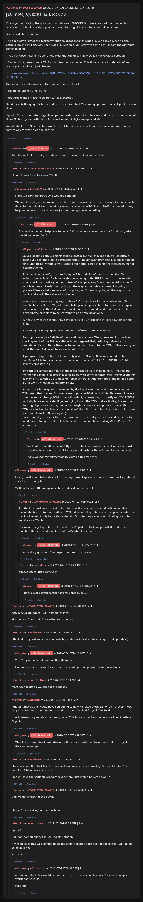

# [10 mbtc] Quizchain2 Block 73

[Original thread](https://www.reddit.com/r/Grycoin/comments/cf4rnd/10_mbtc_quizchain2_block_73/). The `sourceUrl` of the [quizchain2/73](../../../src/collections/quizchain2/73.ts) record and the source of its question, format, hash digits, funding transaction and two updates, the partial hash and the TOMI hint. The author never edited the solution in. u/kimi_tousan's comment has the whole winning string, and the claim's public key backs it. The post went up on July 19, 2019, at 07:59:24 UTC, eight hours and 51 minutes after the block time of its funding transaction. Its last edit is stamped 07:58:53 UTC on July 20, 2019, so the transcript shows the post as it stood twenty minutes before the claim.

## Historical provenance

No capture found. On October 5, 2026 the Wayback Machine index listed one capture of the thread under the `www.reddit.com` URL, June 12, 2023, 01:48:08 UTC. Its `id_` body is Reddit's app shell titled "Reddit - Dive into anything", with neither the post nor a comment in its HTML. The one capture of the `old.reddit.com` URL, three seconds later, is a 302 redirect to a subreddit search for Grycoin. The archive.today timemaps for the `www.reddit.com`, `old.reddit.com` and bare `reddit.com` URLs answered 404.

The transcript below comes from the [Arctic Shift](https://arctic-shift.photon-reddit.com/) Reddit archive: the post record and the comment tree for `cf4rnd`, read on October 5, 2026. The [pullpush](https://pullpush.io/) Reddit archive, read the same day, gives the same post text, time and edit stamp, and the same 21 comments with the same authors, times, scores and parents. Their bodies differ only in how pullpush escapes the `&` of the empty `&#x200B;` paragraph in one comment and a `>` in another, and the transcript leaves that empty paragraph out.

The record names none of the commenters: nothing on the chain ties a claim to a name.

## Transcript

> Thank you for playing the quizchain. I am shocked, SHOCKED to have learned that the last two blocks were solved by scripting without even looking at my carefully crafted questions.
>
> Such a sad state of affairs.
>
> The good news is that this makes writing the question for this block much easier. Since no one bothers looking at it anyway, I can just skip writing it. Or just write down any random thought that comes to mind.
>
> The other good news is that it is now clear that the Green New Deal is the obvious solution.
>
> 10 mbtc block, cross sum of 73. Funding transaction below. This time prize not grabbed before posting of this block, I just checked.
>
> https://www.smartbit.com.au/tx/e7f8fef0258cd5e76bec5846257cd9129d39cd5324765099c392a93950b8666e
>
> Question: This is the problem Grycoin is supposed to solve.
>
> Format: [solution] TOMI [TOMI]
>
> First three digits of MD5 hash are f13 (copypasted).
>
> Good luck challenging this block and stay tuned for block 74 coming up tomorrow at 1 pm Japanese time.
>
> Update: There were mixed signals on partial hashes, one mind miner wanted me to post only one of them. So here goes partial hash for solution only, 2 digits copypasted, 0c.
>
> Update (hint): TOMI field is two words, with (checking very careful now) Grycoin not grycoin the correct way to write it as one of them.

## Comments

**u/AoiNakamoto**, 1 point:

> 10 minutes in. Prize not yet grabbed.Maybe this one not solved at sight.

**u/martypyouknowme**, 2 points:

> No md5 hash for solution or TOMI?

**u/Quantris**, 1 point, reply to u/martypyouknowme:

> Hope we don't get both. One would be enough.
>
> Though I'd really rather know something about the format. e.g. are there quotation marks in the solution (I think there could be), how many words in TOMI, etc. Stuff that would mainly help someone with the right idea just get the right exact wording.

**u/AoiNakamoto**, 1 point, reply to u/Quantris:

> Posting both would help bots too much? Or why do you want only one? And if so, which would you want first?

**u/Quantris**, 0 points, reply to u/AoiNakamoto:

> So yes, posting both is a significant advantage for non-thinking solvers. Because it means you can attack both parts separately. Though even providing just one is a boon for brute forcing (which is why I said I prefer other kinds of hints that require human to interpret them).
>
> First we should clarify, that providing md5 hash digits of the entire solution \*is\* mainly a convenience for humans (because going to the BIP39 website is awkward when checking solution). In the context of a script, going from solution string to md5 hash is not much harder than going all the way to the public address. I'm going to ignore difference between cost of computing md5 hash vs. going all the way to the public address in the calculations below.
>
> Now suppose someone is going to check 1M possibilities for the solution and 1M possibilities for the TOMI (note: establishing which possibilities to check does require thinking, and also this 1M number is just made up---you'd need that number to be higher in the first place to be resistant to brute forcing anyway)
>
> Without any extra hashes, they have to try 1M x 1M (so, one trillion) solution strings in all.
>
> Each (hex) hash digit given will rule out \~15/16ths of the candidates.
>
> So suppose you give 2 digits of the solution-only hash. Then, brute forcing involves checking each of the 1M potential solutions against that, reducing it down to 4K candidates. Each of those then has to be tried with the potential TOMIs. So overall you need 1M + 4K\*1M \~= 4B hashes computed in all.
>
> If you give 2 digits of both solution-only and TOMI-only, then we can reduce both of the 1M to 4K before combining. Then overall you need 1M + 1M + 4K\*4K \~= 18M hashes computed in all.
>
> It's hard to estimate the value of the extra hash digits to mind miners. I imagine the typical mind miner's approach is to come up with some solution ideas (themes) and for each one, try to come up with some "obvious" TOMI. And then check the full md5 and if that works, check it via the BIP 39 site.
>
> If the puzzle is designed to be solved by finding the solution and then deriving the TOMI from that, it doesn't make sense to provide TOMI hash digits. Because if I have a solution and am trying TOMIs, the full hash digits are enough to verify my TOMI. TOMI hash digits are only useful if you're trying to find the TOMI before finding the solution (looking at previous blocks, that indeed might be an easier approach because the TOMI->solution direction is more "obvious" than the other direction, which I think is an issue with how TOMI is designed).
> So you could give one or the other based on which part you think would be better for mind miners to figure out first. At least, if I was a quizchain-making AI that's how I'd approach it.

**u/AoiNakamoto**, 1 point, reply to u/Quantris:

> Excellent explanation, beautifully written. Makes sense to me, so I will either post no partial hashes or restrict it to the partial hash for the solution, like in this block.
>
> Thank you for taking the time to write up this feedback.

**u/AoiNakamoto**, 1 point, reply to u/martypyouknowme:

> Lately I wait about half a day before posting those. Especially now with two blocks grabbed very fast with scripts.
>
> Will post about 10 pm Japanese time today, if I remember it.

**u/martypyouknowme**, 2 points, reply to u/AoiNakamoto:

> But the last block was solved before the question was even posted so it seems that having the hashes to the solution or TOMI does nothing to increase the speed at which a block is bruted. It only helps those that don’t brute the puzzle by eliminating possible solutions or TOMIs.
>
> If someone is going to brute the block, they’ll just run their script until it produces a match to the prize address. At least that’s what I assume.

**u/AoiNakamoto**, 1 point, reply to u/martypyouknowme:

> Interesting question. Can anyone confirm either way?

**u/reddeneer**, 1 point, reply to u/AoiNakamoto:

> almost 10pm, just a reminder ;)

**u/AoiNakamoto**, 1 point, reply to u/reddeneer:

> Thanks, just posted partial hash for solution only.

**u/martypyouknowme**, 2 points:

> reduce CO2 emissions TOMI climate change
>
> Hash was f12 for that. Got excited for a moment.

**u/reddeneer**, 1 point:

> I think at this point someone can probably make an AI trained to solve quizchain puzzles :)

**u/AoiNakamoto**, 0 points, reply to u/reddeneer:

> Yes. They already built one writing them (me).
>
> But are you sure you want even smarter robots grabbing prizes before mind miners?

**u/mapl3sn0w**, 4 points:

> More hash digits so we can bot this please

**u/Quantris**, 3 points:

> I thought maybe this would have something to do with failed block 12, where "Grycoin" was supposed to solve it but due to a mistake the solution had "grycoin" instead.
>
> Alas it seems it's probably the wrong track. This block is hard for me because I don't believe in Grycoin.

**u/AoiNakamoto**, 1 point, reply to u/Quantris:

> That is the wrong track. And Grycoin will suck so much people will burn all the grycoins they somehow get.

**u/reddeneer**, 2 points:

> I have one solution that fits the hash and is a problem worth solving. So next hint for 5 pm I vote for TOMI number of words
>
> unless I have the solution wrong then a general hint would be nice as well ;)

**u/martypyouknowme**, 2 points:

> Can we get a hash for the TOMI?
>
> I hope I'm not asking for too much now

**u/kimi_tousan**, 3 points:

> I got it!
>
> Solution: carbon budget TOMI Grycoin solution
>
> It was obvious this was something about climate change I just did not expect the TOMI to be so obvious too
>
> Thanks!

**u/reddeneer**, 1 point, reply to u/kimi_tousan:

> ai, I did not think Aoi would do another climate one, my solution was "transaction speed" which has hash 0c :(
>
> congrats!

## Screenshot

The screenshot is a render of the thread in Arctic Shift's ID lookup, not of Reddit, since no readable capture of the Reddit page exists. Capture method and limits: [source archive](../README.md).
