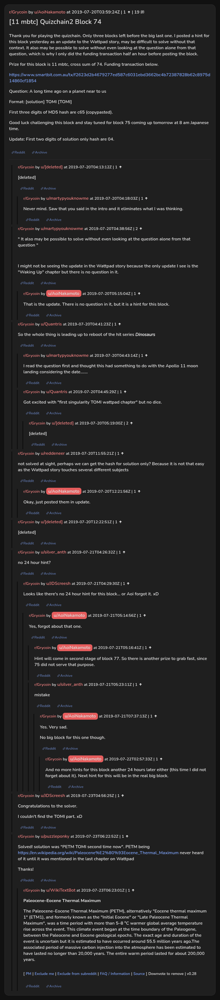

# [11 mbtc] Quizchain2 Block 74

[Original thread](https://www.reddit.com/r/Grycoin/comments/cfhi1e/11_mbtc_quizchain2_block_74/). The `sourceUrl` of the [quizchain2/74](../../../src/collections/quizchain2/74.ts) record and the source of its question, format, hash digits, funding transaction and the partial hash. The author never edited the solution in. u/puzzleponky's comment has the whole winning string, and the claim's public key backs it. The post went up on July 20, 2019, at 03:59:24 UTC, 16 minutes after the block time of its funding transaction. Its last edit is stamped 12:21:25 UTC the same day, so the transcript shows the post as it stood almost three days before the claim.

## Historical provenance

Provenance rests on a [www.reddit.com capture](https://web.archive.org/web/20200730020644/https://www.reddit.com/r/Grycoin/comments/cfhi1e/11_mbtc_quizchain2_block_74/eu9zuim/) of the permalink of a comment that is now deleted, stamped July 30, 2020, 02:06:44 UTC. The page state in its HTML carries the whole post, which matches the transcript below paragraph by paragraph, all 8 of them, the partial hash update included. It holds two comments, the deleted one and u/martypyouknowme's reply under it, both as in the transcript. The capture was read on October 5, 2026. `archive_content: confirmed` on that basis, for the post and those two comments. The `old.reddit.com` capture of the same permalink, six seconds later, leaves the post collapsed and shows the same two comments. The Wayback Machine also holds one capture of the thread URL itself under `www.reddit.com`, June 12, 2023, 08:03:01 UTC, and its `id_` body is Reddit's app shell titled "Reddit - Dive into anything", with neither the post nor a comment in its HTML. The `old.reddit.com` capture of the thread URL two seconds later is a 302 redirect to a subreddit search for Grycoin. The archive.today timemaps for the `www.reddit.com`, `old.reddit.com` and bare `reddit.com` URLs answered 404.

The transcript takes the post and all 21 comments from the [Arctic Shift](https://arctic-shift.photon-reddit.com/) Reddit archive: the post record and the comment tree for `cfhi1e`, read on October 5, 2026. The [pullpush](https://pullpush.io/) Reddit archive, read the same day, gives the same post text, time and edit stamp, and the same 21 comments with the same authors, times, scores and parents. Their bodies differ only in how pullpush escapes the `&` of the empty `&#x200B;` paragraph in one comment and an `&` in a bot's link, and the transcript leaves that empty paragraph out. Three of them are deleted comments, kept below as `[deleted]`.

The record names none of the commenters: nothing on the chain ties a claim to a name.

## Transcript

> Thank you for playing the quizchain. Only three blocks left before the big last one. I posted a hint for this block yesterday as an update to the Wattpad story, may be difficult to solve without that context. It also may be possible to solve without even looking at the question alone from that question, which is why I only did the funding transaction half an hour before posting the block.
>
> Prize for this block is 11 mbtc, cross sum of 74. Funding transaction below.
>
> https://www.smartbit.com.au/tx/f2623d2b4679277ed587c6031ebd3662bc4b72387828b62c8975d14860cf1854
>
> Question: A long time ago on a planet near to us
>
> Format: [solution] TOMI [TOMI]
>
> First three digits of MD5 hash are c65 (copypasted).
>
> Good luck challenging this block and stay tuned for block 75 coming up tomorrow at 8 am Japanese time.
>
> Update: First two digits of solution only hash are 04.

## Comments

**[deleted]**:

> [deleted]

**u/martypyouknowme**, 1 point, reply to a deleted comment:

> Never mind. Saw that you said in the intro and it eliminates what I was thinking.

**u/martypyouknowme**, 2 points:

> " It also may be possible to solve without even looking at the question alone from that question "
>
> I might not be seeing the update in the Wattpad story because the only update I see is the "Waking Up" chapter but there is no question in it.

**u/AoiNakamoto**, 1 point, reply to u/martypyouknowme:

> That is the update. There is no question in it, but it is a hint for this block.

**u/Quantris**, 1 point:

> So the whole thing is leading up to reboot of the hit series _Dinosaurs_

**u/martypyouknowme**, 1 point, reply to u/Quantris:

> I read the question first and thought this had something to do with the Apollo 11 moon landing considering the date.......

**u/Quantris**, 1 point, reply to u/Quantris:

> Got excited with "first singularity TOMI wattpad chapter" but no dice.

**[deleted]**, reply to u/Quantris:

> [deleted]

**u/reddeneer**, 1 point:

> not solved at sight, perhaps we can get the hash for solution only? Because it is not that easy as the Wattpad story touches several different subjects

**u/AoiNakamoto**, 1 point, reply to u/reddeneer:

> Okay, just posted them in update.

**[deleted]**:

> [deleted]

**u/silver_anth**, 1 point:

> no 24 hour hint?

**u/JDScreesh**, 1 point, reply to u/silver_anth:

> Looks like there's no 24 hour hint for this block... or Aoi forgot it. xD

**u/AoiNakamoto**, 1 point, reply to u/JDScreesh:

> Yes, forgot about that one.

**u/AoiNakamoto**, 1 point, reply to u/AoiNakamoto:

> Hint will come in second stage of block 77. So there is another prize to grab fast, since 75 did not serve that purpose.

**u/silver_anth**, 1 point, reply to u/AoiNakamoto:

> mistake

**u/AoiNakamoto**, 1 point, reply to u/silver_anth:

> Yes. Very sad.
>
> No big block for this one though.

**u/AoiNakamoto**, 1 point, reply to u/AoiNakamoto:

> And no more hints for this block another 24 hours later either (this time I did not forget about it). Next hint for this will be in the real big block.

**u/JDScreesh**, 1 point:

> Congratulations to the solver.
>
> I couldn't find the TOMI part. xD

**u/puzzleponky**, 1 point:

> Solved! solution was "PETM TOMI second time now". PETM being [https://en.wikipedia.org/wiki/Paleocene%E2%80%93Eocene\_Thermal\_Maximum](https://en.wikipedia.org/wiki/Paleocene%E2%80%93Eocene_Thermal_Maximum) never heard of it until it was mentioned in the last chapter on Wattpad
>
> Thanks!

**u/WikiTextBot**, 1 point, reply to u/puzzleponky:

> **Paleocene–Eocene Thermal Maximum**
>
> The Paleocene–Eocene Thermal Maximum (PETM), alternatively "Eocene thermal maximum 1" (ETM1), and formerly known as the "Initial Eocene" or "Late Paleocene Thermal Maximum", was a time period with more than 5–8 °C warmer global average temperature rise across the event. This climate event began at the time boundary of the Paleogene, between the Paleocene and Eocene geological epochs. The exact age and duration of the event is uncertain but it is estimated to have occurred around 55.5 million years ago.The associated period of massive carbon injection into the atmosphere has been estimated to have lasted no longer than 20,000 years. The entire warm period lasted for about 200,000 years.
>
> ---
>
> ^[ [^PM](https://www.reddit.com/message/compose?to=kittens_from_space) ^| [^Exclude ^me](https://reddit.com/message/compose?to=WikiTextBot&message=Excludeme&subject=Excludeme) ^| [^Exclude ^from ^subreddit](https://np.reddit.com/r/Grycoin/about/banned) ^| [^FAQ ^/ ^Information](https://np.reddit.com/r/WikiTextBot/wiki/index) ^| [^Source](https://github.com/kittenswolf/WikiTextBot) ^]
> ^Downvote ^to ^remove ^| ^v0.28

## Screenshot

The screenshot is a render of the thread in Arctic Shift's ID lookup, not of Reddit, since the one capture that holds the post shows only two of its comments. Capture method and limits: [source archive](../README.md).
