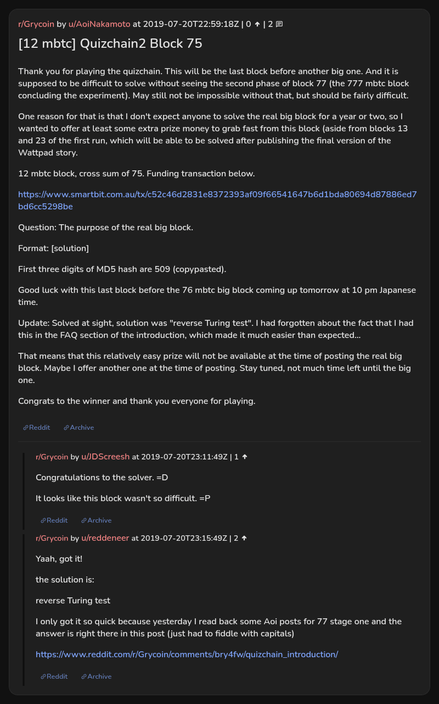

# [12 mbtc] Quizchain2 Block 75

[Original thread](https://www.reddit.com/r/Grycoin/comments/cfs3ld/12_mbtc_quizchain2_block_75/). The `sourceUrl` of the [quizchain2/75](../../../src/collections/quizchain2/75.ts) record and the source of its question, format, hash digits and funding transaction, with the solution the author edited in. u/reddeneer's comment has the solution and points at the Quizchain introduction it came from. The post went up on July 20, 2019, at 22:59:18 UTC, 12 minutes after the block time of its funding transaction and nine minutes before the block time of the claim. Its last edit is stamped 23:42:24 UTC the same day, so the transcript shows the post as it stood after the claim.

## Historical provenance

No capture found. On October 5, 2026 the Wayback Machine index listed one capture of the thread under the `www.reddit.com` URL, June 12, 2023, 05:28:47 UTC. Its `id_` body is Reddit's app shell titled "Reddit - Dive into anything", with neither the post nor a comment in its HTML. The one capture of the `old.reddit.com` URL, a second later, is a 302 redirect to a subreddit search for Grycoin. The archive.today timemaps for the `www.reddit.com`, `old.reddit.com` and bare `reddit.com` URLs answered 404.

The transcript below comes from the [Arctic Shift](https://arctic-shift.photon-reddit.com/) Reddit archive: the post record and the comment tree for `cfs3ld`, read on October 5, 2026. The [pullpush](https://pullpush.io/) Reddit archive, read the same day, gives the same post text, time and edit stamp, and the same 2 comments with the same authors, times, scores and parents.

The record names none of the commenters: nothing on the chain ties a claim to a name.

## Transcript

> Thank you for playing the quizchain. This will be the last block before another big one. And it is supposed to be difficult to solve without seeing the second phase of block 77 (the 777 mbtc block concluding the experiment). May still not be impossible without that, but should be fairly difficult.
>
> One reason for that is that I don't expect anyone to solve the real big block for a year or two, so I wanted to offer at least some extra prize money to grab fast from this block (aside from blocks 13 and 23 of the first run, which will be able to be solved after publishing the final version of the Wattpad story.
>
> 12 mbtc block, cross sum of 75. Funding transaction below.
>
> https://www.smartbit.com.au/tx/c52c46d2831e8372393af09f66541647b6d1bda80694d87886ed7bd6cc5298be
>
> Question: The purpose of the real big block.
>
> Format: [solution]
>
> First three digits of MD5 hash are 509 (copypasted).
>
> Good luck with this last block before the 76 mbtc big block coming up tomorrow at 10 pm Japanese time.
>
> Update: Solved at sight, solution was "reverse Turing test". I had forgotten about the fact that I had this in the FAQ section of the introduction, which made it much easier than expected...
>
> That means that this relatively easy prize will not be available at the time of posting the real big block. Maybe I offer another one at the time of posting. Stay tuned, not much time left until the big one.
>
> Congrats to the winner and thank you everyone for playing.

## Comments

**u/JDScreesh**, 1 point:

> Congratulations to the solver. =D
>
> It looks like this block wasn't so difficult. =P

**u/reddeneer**, 2 points:

> Yaah, got it!
>
> the solution is:
>
> reverse Turing test
>
> I only got it so quick because yesterday I read back some Aoi posts for 77 stage one and the answer is right there in this post (just had to fiddle with capitals)
>
> [https://www.reddit.com/r/Grycoin/comments/bry4fw/quizchain\_introduction/](https://www.reddit.com/r/Grycoin/comments/bry4fw/quizchain_introduction/)

## Screenshot

The screenshot is a render of the thread in Arctic Shift's ID lookup, not of Reddit, since no readable capture of the Reddit page exists. Capture method and limits: [source archive](../README.md).
