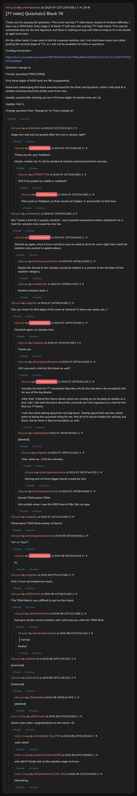

# [77 mbtc] Quizchain2 Block 76

[Original thread](https://www.reddit.com/r/Grycoin/comments/cgcv9i/77_mbtc_quizchain2_block_76/). The `sourceUrl` of the [quizchain2/76](../../../src/collections/quizchain2/76.ts) record and the source of its question, format, hash digits, funding transaction, the partial hash and the one hint. The author's one-word answer to `"to" or "two"?` is in the comments. Nobody ever published the solution. The post went up on July 22, 2019, at 12:57:09 UTC, nine hours and 44 minutes after the block time of its funding transaction. Its last edit is stamped 03:59:02 UTC on August 3, 2019, so the transcript shows the post as it stood seven years before the claim.

## Historical provenance

No capture found. On October 5, 2026 the Wayback Machine index listed two captures of the thread under the `www.reddit.com` URL, June 12, 2023, 02:45:03 UTC and August 21, 2026, 15:33:57 UTC. The first `id_` body is Reddit's app shell titled "Reddit - Dive into anything", the second a script challenge page titled "Reddit", and neither has the post or a comment in its HTML. The one capture of the `old.reddit.com` URL, June 12, 2023, 02:45:07 UTC, is a 302 redirect to a subreddit search for Grycoin. The archive.today timemaps for the `www.reddit.com`, `old.reddit.com` and bare `reddit.com` URLs answered 404.

The transcript below comes from the [Arctic Shift](https://arctic-shift.photon-reddit.com/) Reddit archive: the post record and the comment tree for `cgcv9i`, read on October 5, 2026. The [pullpush](https://pullpush.io/) Reddit archive, read the same day, gives the same post text, time and edit stamp, and the same 31 comments with the same authors, times, scores and parents. Their bodies differ only in how pullpush escapes a leading `>` in one comment. Four of the comments are from August and September 2026, after the claim. Four are deleted or removed, kept below as `[deleted]`.

The record names none of the commenters: nothing on the chain ties a claim to a name.

## Transcript

> Thank you for playing the quizchain. This is the last big 77 mbtc block, maybe of medium difficulty. I does use a TOMI field. Only stage 2 of block 77 left now, the real big 777 mbtc block. This may be somewhat easy for the last big block, but there is nothing wrong with that as long as it is not solved at sight level easy.
>
> On the other hand, it may need a hint for a speedy solution, but I will shut down soon now (after posting the second stage of 77), so I will not be available for hints or questions.
>
> Funding transaction:
>
> https://www.smartbit.com.au/tx/979670f3d1d4134e7989ed6f4a4370362e15c101711c93675790cf0751c8dbd4
>
> Question: change to
>
> Format: [solution] TOMI [TOMI]
>
> First three digits of MD5 hash are f8e (copypasted).
>
> Good luck challenging this block and stay tuned for the final real big block, which I will post at a random unannounced time pretty soon from now.
>
> Update, posted after starting up new: First two digits of solution only are 1d.
>
> Update: Hint 1.
>
> Change question from "change to" to "from change to".

## Comments

**u/reddeneer**, 1 point:

> stage two will only be posted after this one is solved, right?

**u/AoiNakamoto**, 1 point, reply to u/reddeneer:

> Thank you for your feedback.
>
> Maybe, maybe not. It will be posted at random unannounced time anyway.

**u/435627793**, 1 point, reply to u/AoiNakamoto:

> Will it be posted on reddit or wattpad?

**u/AoiNakamoto**, 1 point, reply to u/435627793:

> Main post on Wattpad, as final version of chapter 2, and pointer to that here.

**u/reddeneer**, 2 points:

> this "needs a hint for a speedy solution", was it posted somewhere before shutdown? or a hash for solution only would be nice too

**u/AoiNakamoto**, 1 point, reply to u/reddeneer:

> Started up again, since it turns out there was no need to duck for cover right now. Hash for solution only posted in update above.

**u/martypyouknowme**, 1 point, reply to u/AoiNakamoto:

> Maybe the format to the solution would be helpful or a pointer in the direction of the solution category.

**u/reddeneer**, 1 point, reply to u/AoiNakamoto:

> thanks! welcome back :)

**u/Agelais**, 1 point:

> Can you check for first digits of the hash of solution? Is there any space, etc...?

**u/AoiNakamoto**, 1 point, reply to u/Agelais:

> Checked again, no mistake here.

**u/Agelais**, 1 point, reply to u/AoiNakamoto:

> Thank you

**u/martypyouknowme**, 1 point, reply to u/AoiNakamoto:

> Will you post a hint for this block as well?

**u/AoiNakamoto**, 1 point, reply to u/martypyouknowme:

> Actually the hint for 77 scheduled Saturday will be the last time I do an explicit hint for any of the big blocks.
>
> After that, I intend the future blocks (next one coming up on Sunday) to double as a hint. Like I did with the block about the Leonardo da Vinci signature as a hint for the first run 77 block.
>
> I will also start talking about the real big block. Talking about that was the whole point of doing this quizchain thing for me. Not all of it will be helpful for solving, but there will be hints in that conversation as well.

**[deleted]**, reply to u/AoiNakamoto:

> [deleted]

**u/Agelais**, 1 point, reply to a deleted comment:

> Yeah, same as... Find few already...

**u/martypyouknowme**, 1 point, reply to u/Agelais:

> Solving one of these bigger blocks would be nice.

**u/martypyouknowme**, 1 point, reply to u/AoiNakamoto:

> format TOMI before TOMI
>
> Got excited when I saw the MD5 hash of f8e. But no cigar.

**u/Agelais**, 3 points:

> What about TOMI field number of items?

**u/martypyouknowme**, 1 point:

> "to" or "two"?

**u/AoiNakamoto**, 1 point, reply to u/martypyouknowme:

> to

**u/Agelais**, 1 point:

> Hint 1 have not helped too much...

**u/JDScreesh**, 1 point:

> The TOMI field is very difficult to get on this block.

**u/BrainForceOne**, 1 point, reply to u/JDScreesh:

> Just give me the correct solution and I will help you with the TOMI field...

**u/bestcoderneeded**, 1 point, reply to u/BrainForceOne:

> > format
>
> Really?

**[deleted]**:

> [removed]

**[deleted]**:

> [removed]

**[deleted]**, reply to a deleted comment:

> [deleted]

**u/JDScreesh**, 1 point:

> Seven years later, congratulations to the solver =D

**u/Inevitable_You1740**, 1 point, reply to u/JDScreesh:

> wait, what?

**u/ImpressiveLaw9205**, 1 point, reply to u/JDScreesh:

> who did it? kindly tell us the solution eager to know

**u/Embarrassed_Chef_393**, 1 point, reply to u/JDScreesh:

> interesting

## Screenshot

The screenshot is a render of the thread in Arctic Shift's ID lookup, not of Reddit, since no readable capture of the Reddit page exists. Capture method and limits: [source archive](../README.md).
