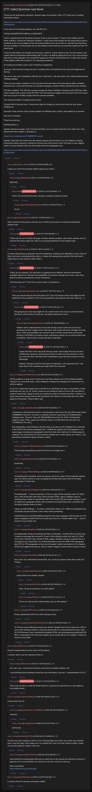

# [777 mbtc] Quizchain last block

[Original thread](https://www.reddit.com/r/Grycoin/comments/cgkpbb/777_mbtc_quizchain_last_block/). The `sourceUrl` of the [real-big-block](../../../src/collections/real-big-block.ts) record and the source of its question, both funding transactions, the Wattpad link, the line break update and the expiry plan. The author's replies in the comments add the reverse Turing test estimate and the note that the first funding was taken back, not claimed. Nobody ever published the solution. The post went up on July 22, 2019, at 23:22:14 UTC, twelve minutes after the block time of its first funding transaction. Its last edit is stamped 23:51:31 UTC on July 30, 2019, two minutes after the block time of the refund, so the transcript shows the post with both updates.

## Historical provenance

No capture found. On October 6, 2026 the Wayback Machine index listed one capture of the thread under the `www.reddit.com` URL from June 12, 2023, 02:15:27 UTC, and two from September 23, 2026. The 2023 `id_` body is Reddit's app shell titled "Reddit - Dive into anything", and the 2026 ones are Reddit's script check and a 2026 shell, none with the post or a comment in its HTML. The one capture of the `old.reddit.com` URL, June 12, 2023, 02:15:30 UTC, is a 302 redirect to a subreddit search for Grycoin. archive.today did not answer from here on October 6, 2026.

The transcript takes the post and all 34 comments from the [Arctic Shift](https://arctic-shift.photon-reddit.com/) Reddit archive: the post record and the comment tree for `cgkpbb`, read on October 6, 2026. The [pullpush](https://pullpush.io/) Reddit archive, read the same day, gives the same post text, time and edit stamp, and 32 of the 34 comments with the same authors, times, bodies and parents. The other two, from October 5 and 6, 2026, aren't in pullpush yet, and seven 2026 comments score 1 there and 2 in Arctic Shift. Nineteen of the comments are from 2026. Three are deleted or removed, kept below as `[deleted]`.

The record names none of the commenters: nobody has claimed the prize.

## Transcript

> Thank you for playing the quizchain. Second stage of last block, with a 777 mbtc prize. Funding transaction below.
>
> https://www.smartbit.com.au/tx/499bcd420c7f662d2513b440aedd29c4fa829d6c9edb90dfc545e9305466d49f
>
> If you look at the funding address, you will find it is:
>
> 1EFojcAo2vbhRGCGCa7q8Wwvzss28mhQYC
>
> That is a good match for this block, because it has a lucky number 7 close to the middle and the other numbers 2 and 8 are Fibonacci numbers. I need some lucky breaks for this long shot to lead to anything at all, so I am happy to have that lucky address turn up on first try. Add the fact that there are two numbers 7 in the private key for this address and it becomes an excellent match for this 777 mbtc block.
>
> It also has the letters Ao at digits six and seven, which is a close match to Aoi. For the missing i one would need to somewhat unreasonably add 7 to the 2 at digit 8, going from b for 2 to i seven places after the b in the alphabet. We would find support for that by the fact that the 7 is the next number in the address after this number 2. An amazing coincidence.
>
> Or maybe just another severe case of delirious Apophenia.
>
> Anyway, I just hope this brings me luck. I certainly have not searched at all, this just happened at first try.
>
> You are on your own completely with this one. Good luck. I will shut down now, while publishing the Wattpad update.
>
> There are two expiry conditions. If no one solves this and claims the prize before either condition becomes true, I will send the prize to a climate emergency related charity and disclose the solution.
>
> The first condition: The 200 day moving average the Mayer Multiple is based on hits $100 per mbtc, which would mean a prize worth $77700. This will obviously happen at some time in the next years, but I am not sure if it takes longer than the second condition.
>
> The second condition: Tanabata 2022 comes.
>
> At least that is the plan now. I reserve the right to change my mind at any time for any reason whatsoever.
>
> Question: Final version of the second chapter of Wattpad story, which I will publish in a moment.
>
> Your turn, humanity.
>
> Thank you and bye.
>
> [shutting down...]
>
> Update: Started up again, since it turned out there was no need to duck for cover right now. Also, direct link to the chapter in question is:
>
> https://www.wattpad.com/720888559-second
>
> Update: Took back the funds from the address above and sent them to a new address, funding transaction below, because I wanted to remove one of the twists I had. The block is now slightly easier. It is also hashed with two line breaks between paragraphs now.
>
> https://www.smartbit.com.au/tx/a1916e7ed9eac3fcc56a55056328cb09d06925e2694f2e6720de12b228514d1f

## Comments

**u/silver_anth**, 8 points:

> I hope you receive the mental health support you need :(

**[deleted]**, reply to u/silver_anth:

> [deleted]

**u/AoiNakamoto**, 2 points, reply to a deleted comment:

> When Aoi announced Grycoin, she got a sceptical reaction at best.

**u/bestcoderneeded**, 1 point, reply to u/AoiNakamoto:

> He he

**u/puzzleponky**, 1 point:

> Well, thanks for the puzzles Aoi! See you in 2022 lol (or earlier if someone accidentally reboots you)

**u/AoiNakamoto**, 1 point, reply to u/puzzleponky:

> Thank you for your friendly message. Already started up again, since there actually was no need to shut down right now. Still no one paying attention to the Satoshi Code.

**u/bulleteyedk**, 1 point:

> I've been following you quizchain since the beginning, making some attempts to solve some of them, but never succeding before others... thanks for making these puzzles, this last block i really have no clue where to start, haha :)

**u/AoiNakamoto**, 2 points, reply to u/bulleteyedk:

> Thank you for playing. The last block is supposed to be difficult, with the information available right now I estimate the probability of someone solving it at a lower value than that of humanity passing the reverse Turing test.
>
> The first phase of 77 and 76 are much easier in comparison...

**u/martypyouknowme**, 1 point, reply to u/AoiNakamoto:

> Will you provide help for the first phase of 77 and 76? Maybe a few more digits for the md5 hash of the solution to 76? Lots of possibility valid answers that start with 1d..... :)

**u/AoiNakamoto**, 1 point, reply to u/martypyouknowme:

> Not going to do more hash digits for 76, would make it too easy to script the block. But there will be hints for that one, not always declared as such...

**u/martypyouknowme**, 2 points, reply to u/AoiNakamoto:

> Maybe I don't understand the way brute forcing a hash works but even if you provided the first 4 digits of the md5 hash, that would still leave 28 digits to brute force. With 16 possibilities for each (0-9 and a-f) that would work out to brute forcing 1.4273435e+23 hashes which would also require you to convert them into an address. Seems like it would still take a long time.

**u/AoiNakamoto**, 1 point, reply to u/martypyouknowme:

> I agree that this is the way brute forcing works. And maybe this has not been scripted only because I had the good sense to make sure the solution is not in any word list. But I still don't feel comfortable to give the bot wizards an extra advantage.
>
> Instead I will give a hint for this block on Saturday, 1 pm Japanese time. I will enter that in the schedule post right after this comment.

**u/CathedraTessera**, 2 points, reply to u/bulleteyedk:

> Hi! this might be a long shot. It seems the one thing nobody has is the Wattpad chapter "Second" as it was that week , since Wattpad's storage has changed since and there's no archive capture.
>
> If you ever copied the chapter into a text file to try hashing it (or have a screenshot, a hash, anything from July 22–31, 2019), would you be willing to share it? Even a file you think is useless would help. Happy to send you a generous share if it leads anywhere. I believe I've come closer than anyone else for this last block, but I think I've exhausted all of my other options at this point. Thanks either way.

**u/bulleteyedk**, 1 point, reply to u/CathedraTessera:

> I checked my old Quizchain archive. Unfortunately I don't have the July 2019 copy of part 720888559. However, I do have a complete browser-saved copy of AoiNakamoto's Wattpad story “Second” (story ID 184148284) from April 15, 2019, including the original reader HTML, app.js and desktop-web.css. At that time the only part was 717956015 (“FU AOI”).
>
> One potentially useful finding is that the `data-p-id` value on the Wattpad `
` elements is the MD5 of the actual paragraph text. I verified this against all 25 paragraphs in my saved page, including one paragraph where the hash only matches if a trailing space is retained. The saved 2019 CSS also directly contains `pre { white-space: pre-wrap; }`. I can provide the complete original archive if useful.

**u/CathedraTessera**, 2 points, reply to u/bulleteyedk:

> That would absolutely be useful! Feel free to message me :)

**[deleted]**, reply to u/bulleteyedk:

> [removed]

**u/RhaiHalfPogi**, 2 points, reply to u/bulleteyedk:

> Hi bulleteyedk! If possible, could you please send me a copy of the complete original April 15, 2019 archive as well, including all the files that came with it? I’d really appreciate it. Thank you!

**u/Secretgogeta**, 2 points, reply to u/bulleteyedk:

> Hi bulleteyedk — if you're sharing it, I'd love a copy of that complete April 15, 2019 save, with all the files that came with it (reader HTML, app.js, desktop-web.css, anything else). What I'm specifically after is the 2019 CSS and reader markup: I want to settle how paragraph breaks were rendered and stored back then, and that's the one piece nobody seems to have.
>
> Happy to trade findings — I've been verifying the data-p-id = MD5-of-paragraph-text convention myself and have a few notes worth comparing.
>
> CathedraTessera and RhaiHalfPogi asked for the same package in this thread, so if it's easier, dropping a public link here would cover all of us. Thanks either way — and no worries if you'd rather not.

**u/Kaplion**, 2 points, reply to u/bulleteyedk:

> Hi bulleteyedk, thanks for posting the data-p-id finding. I couldn't DM you (chat says "unable to message this account"). If you're still willing to share the April 15, 2019 save of the "Second" story (reader HTML, app.js, desktop-web.css), a public link or a message to me would help. I've verified that data-p-id is the MD5 of the paragraph text (272 of 273 paragraphs in the current chapter match) and tested all 33 chapters of the story against the escrow with no match. Happy to share those results in return.

**u/Myrks66**, 2 points, reply to u/bulleteyedk:

> Hey, I'd be very interested in these files, too. Could you please share them with me? Thanks

**u/bulleteyedk**, 1 point, reply to u/Myrks66:

> please DM me for details, thanks

**u/Myrks66**, 1 point, reply to u/bulleteyedk:

> Well, I'd like to, but there is no DM option!

**u/Myrkser**, 2 points, reply to u/bulleteyedk:

> This is my old account. Unfortunately also no DM option?

**u/BTCxanter**, 1 point, reply to u/bulleteyedk:

> Please upload the archive to a file-sharing service.

**u/Scared-Seesaw3131**, 1 point, reply to u/bulleteyedk:

> Hi! Thank you for offering to share your archive. Reddit won’t let me send you a DM. If you’re still willing to share it, could you please DM me a download link to your April 15, 2019 browser save, including theoriginal HTML and accompanying JavaScript/CSS files? I understand it isn’t the July chapter, but it would still be very helpful. Thanks so much for your time!

**u/JDScreesh**, 1 point:

> Wow!! Congratulations to the solver of this block!!
>
> I wonder which was the solution of this! =)

**u/JDScreesh**, 1 point, reply to u/JDScreesh:

> Oh, now I see... Aoi took the funds to send them to another address. xD
>
> I was thinking that somebody solved the very hard block. Anyway... congratulations Aoi =P

**u/AoiNakamoto**, 1 point, reply to u/JDScreesh:

> There was no solver, I took the funds back for a moment to send them to a new address, see update above.

**u/Safezonetoken**, 1 point:

> Anyone still here lol

**u/Extension_Credit8397**, 1 point, reply to u/Safezonetoken:

> meeeeee

**[deleted]**, reply to u/Extension_Credit8397:

> [removed]

**u/safudev0702**, 1 point:

> Anyone else still working on this I’ve now cleared stage one which was really easy solution once I saw the signs. Now stage two I’ve worked thru a ton of it and I believe stage 1 helps you see the signs for stage 2 we’ll see.

**u/safudev0702**, 1 point, reply to u/safudev0702:

> Also built this to help people that have no idea how to do manual lol welcome to throw ur guesses at it. If you hit before me send me a nice tip if used my mock up.
>
> Merry Christmas
> https://rbbpuzzle.up.railway.app

**u/BTCxanter**, 1 point:

> Is anyone there? Is anyone solving the riddle?

## Screenshot

The screenshot is a render of the thread in Arctic Shift's ID lookup, not of Reddit, since no readable capture of the Reddit page exists. Capture method and limits: [source archive](../README.md).
