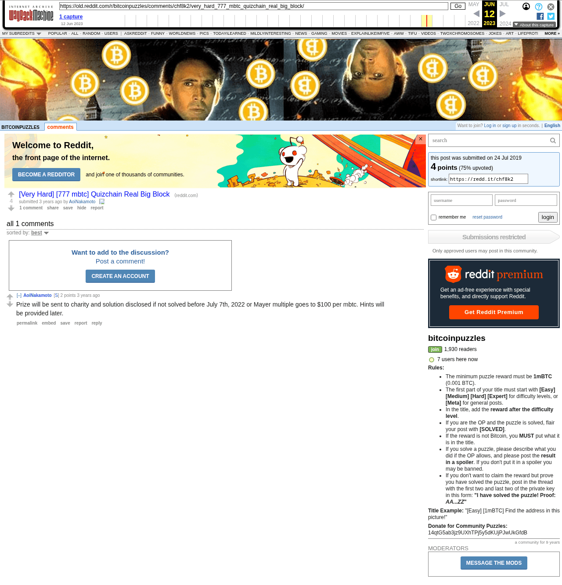

# [Very Hard] [777 mbtc] Quizchain Real Big Block

[Original thread](https://www.reddit.com/r/bitcoinpuzzles/comments/chf8k2/very_hard_777_mbtc_quizchain_real_big_block/). The r/bitcoinpuzzles announcement of the [real-big-block](../../../src/collections/real-big-block.ts) record, which takes its name from this title. It's a link post with no text of its own: it points at the r/Grycoin thread. The author's one comment restates the expiry plan with a date, July 7, 2022, and is the source of that hint. The post went up on July 24, 2019, at 22:40:59 UTC, and was never edited.

## Historical provenance

Provenance rests on the [old.reddit.com capture](https://web.archive.org/web/20230612075600/https://old.reddit.com/r/bitcoinpuzzles/comments/chf8k2/very_hard_777_mbtc_quizchain_real_big_block/) of June 12, 2023, 07:56:00 UTC. Its HTML carries the link post and the author's comment, which matches the transcript below word for word. It was read on October 6, 2026. `archive_content: confirmed` on that basis, for the post and that comment. The second comment came in August 2026, after the capture. The `www.reddit.com` capture one second earlier is Reddit's app shell titled "Reddit - Dive into anything", with neither the post nor a comment in its HTML. archive.today did not answer from here on October 6, 2026.

The transcript takes the post and both comments from the [Arctic Shift](https://arctic-shift.photon-reddit.com/) Reddit archive: the post record and the comment tree for `chf8k2`, read on October 6, 2026. The [pullpush](https://pullpush.io/) Reddit archive, read the same day, gives the same post, time and link, and the same two comments with the same authors, times, scores and parents.

## Transcript

> https://www.reddit.com/r/Grycoin/comments/cgkpbb/777_mbtc_quizchain_last_block/?st=jyhtjymm&sh=116ad2eb

## Comments

**u/AoiNakamoto**, 2 points:

> Prize will be sent to charity and solution disclosed if not solved before July 7th, 2022 or Mayer multiple goes to $100 per mbtc. Hints will be provided later.

**u/safudev0702**, 1 point:

> Also built this to help people that have no idea how to do manual lol welcome to throw ur guesses at it. If you hit before me send me a nice tip if used my mock up. As it literally will give u the private key there is no data base or tracking so I can’t see anyone’s progress it’s not for that. It’s to make trying things much easier from anywhere.
>
> Merry Christmas
> https://rbbpuzzle.up.railway.app

## Screenshot

The screenshot is a render of the archive capture, not of the live page, so it carries the Wayback banner at the top. The "3 years ago" stamps are relative to the capture, June 12, 2023, and the August 2026 comment isn't in it. Capture method and limits: [source archive](../README.md).
