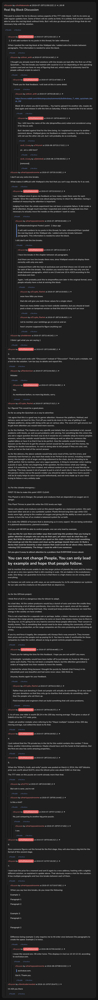

# Real Big Block DIscussion

[Original thread](https://www.reddit.com/r/Grycoin/comments/chn8un/real_big_block_discussion/). The author's numbered notes on the [real-big-block](../../../src/collections/real-big-block.ts) record, seven of them, and the source of its line break hints and the hint that Stage One's format points at this one's. The author says outright that note 2, the typo in the title, and note 5, the B34u7y comparison, are no hints. The post went up on July 25, 2019, at 12:50:22 UTC. Its one edit is stamped seven minutes later.

## Historical provenance

No capture found. On October 6, 2026 the Wayback Machine index listed one capture of the thread under the `www.reddit.com` URL from June 12, 2023, 08:11:00 UTC, and one from October 5, 2026. The 2023 `id_` body is Reddit's app shell titled "Reddit - Dive into anything", and the 2026 one is Reddit's script check, neither with the post or a comment in its HTML. The one capture of the `old.reddit.com` URL, eleven seconds after the 2023 one, is a 302 redirect to a subreddit search for Grycoin. archive.today did not answer from here on October 6, 2026.

The transcript takes the post and all 33 comments from the [Arctic Shift](https://arctic-shift.photon-reddit.com/) Reddit archive: the post record and the comment tree for `chn8un`, read on October 6, 2026. The [pullpush](https://pullpush.io/) Reddit archive, read the same day, gives the same post text, time and edit stamp, and the same 33 comments with the same authors, times, scores and parents. Their bodies match once HTML entities are decoded: pullpush keeps `&gt;` and `&#x200B;` where Arctic Shift has the characters. Two of the comments are from 2026. One is removed, kept below as `[deleted]`.

## Transcript

> This post is a place for me to discuss various aspects of the 777 mbtc block. I will try to come up with regular updates here. Some of them will be useful as hints. It is unlikely that anyone would be able to solve the real big block without hints. But I will also go ahead and post things that do not necessary help with the solution.

## Comments

**u/AoiNakamoto**, 1 point:

> 1. (I will add numbers to my posts in this thread, for later reference)
>
> When I posted the real big block at the Wattpad site, I added extra line breaks between paragraphs. This information is needed to solve the block.

**u/silver_anth**, 2 points, reply to u/AoiNakamoto:

> I thought you already learnt that solutions with line breaks are bad after the first run of the Quizchain.... The line breaks you hashed with could be \n or \r\n depending on the operating system used and we have no way of figuring that out, which makes it extremely hard for people without scripts to solve it.

**u/AoiNakamoto**, 1 point, reply to u/silver_anth:

> Thank you for that feedback. I will look at this in some detail.

**u/silver_anth**, 1 point, reply to u/AoiNakamoto:

> https://www.reddit.com/r/bitcoinpuzzles/comments/bc6rkn/easy_7_mbtc_quizchain_block_29/
>
> Block 29 is where you did it last time.... You had to upload it to another site, maybe do that again and release it with the hint on Saturday, if that is required for it to be solved

**u/AoiNakamoto**, 1 point, reply to u/silver_anth:

> Yes, I still have the name of the site (dropmefiles.com) noted and considered using it for this as well.
>
> But I decided against that for the time being. As I explained in answer to another comment above, Wattpad gives me feedback on reader numbers. So at this time, I will not use the other site yet, but I will probably do so eventually.

**u/Wyront**, 1 point, reply to u/AoiNakamoto:

> yo , are u still here?

**[deleted]**, reply to u/AoiNakamoto:

> [removed]

**u/martypyouknowme**, 1 point, reply to u/AoiNakamoto:

> I don't see any extra line breaks.
>
> What makes it difficult with Wattpad is the fact that you can't copy directly for it as well.

**u/AoiNakamoto**, 2 points, reply to u/martypyouknowme:

> I use Wattpad since it gives me feedback on how many reads there were for each chapter. Since the experiment was about paying money in return for attention, having a method of measuring the attention is important.
>
> Judging from that, the whole experiment has not been a complete failure. It did create a bit of attention, though much less than I expected and orders of magnitude less than necessary to actually move the needle on the problem I want to solve.

**u/martypyouknowme**, 1 point, reply to u/AoiNakamoto:

> > AoiNakamotoOriginal Poster1 point · 2 days ago
> >
> > (I will add numbers to my posts in this thread, for later reference)When I posted the real big block at the Wattpad site, I added extra line breaks between paragraphs. This information is needed to solve the block.
>
> I still don't see the line breaks.

**u/AoiNakamoto**, 1 point, reply to u/martypyouknowme:

> I have line breaks in the chapter between all paragraphs.
>
> And there are two line breaks there now, since Wattpad would not display them correctly with only one each.
>
> I analyzed them with the tool at asciivalue.com and that shows one 13 and one 10 for each of the line breaks. The solution you need to hash with has only one line break between paragraphs, which is one 13 and one 10 in ASCII according to the asciivalue.com tool.
>
> Again, I will probably post this to dropmefiles.com later in the original format, once people actually have a shot at solving this block.

**u/Crypto_Rachel**, 1 point, reply to u/AoiNakamoto:

> wow how little you know.
>
> that site will give you both those values for a single return
>
> there are many better ways to track website statistics, but you should at least post a clean un tampered version so that this kind of thing isn't an issue

**u/Crypto_Rachel**, 1 point, reply to u/AoiNakamoto:

> not to mention your ramblings go on and on and on
>
> how's anyone supposed to figure anything out

**u/reddeneer**, 1 point, reply to u/AoiNakamoto:

> I think I get what you are saying ;)

**u/AoiNakamoto**, 1 point:

> 2.
>
> The title of this post ends with "DIscussion" instead of "Discussion". That is just a mistake, not a hint for the solution. I am too lazy to delete and repost this.

**u/Randomiser**, 1 point, reply to u/AoiNakamoto:

> MIstake

**u/AoiNakamoto**, 1 point, reply to u/Randomiser:

> Yes.
>
> As mentioned before, no more big blocks, sorry.

**u/Crypto_Rachel**, 1 point:

> So I figured This would be a good place.
>
> As far as using the Quizchain as a way to advertise:
>
> I do agree that this is a good way to garner attention. However the platform, Method, and delivery were not best for this. First off you need to do more in the way of getting it out. Multiple platforms, along with doing write ups on various sites. The word of it got around, but to get more attention you would need more sources.
>
> As for the Method, The Hashes are very specific and details that you overlooked a lot, caused problems with blocks, as well as just problems with solving. For something like this where the you ask a vague question the best way to do it would be on a website setup to receive peoples answers, where the website would handle formatting as well as allow for variances like capital letters or have it so that it has to be perfect. Also the website would timestamp answers so the first one to get the answer correct would be the person sent the money. No fighting for double transactions. As well as being able to tell people if they are cold, cool, warm, or hot on the trail of the correct answer
>
> As for the delivery, the above website would help solve most of this, but the errors, and extremely hard format (i.e. any hash that needs to be Perfect to be correct, including invisible items), this brought a lot of anger and disgruntlement to the chain, due to it needing to be 100% perfect. Not to mention, your very vague questions. A thing to remember when making a puzzle or quiz, At the very beginning of the question, No One knows what your talking about. It it something You have created, and without context on our end, it could literally be Anything. This truly caused A lot of people to put in a lot of work into it. Now of course that is the persons choice, but as the puzzle creator you should be able to judge how hard a puzzle will be (it really helps to solve real puzzle beforehand), and not ones made up in your mind trying to follow a very unlikely code.
>
> As For the climate emergency :
>
> FIRST I'D like to make this point VERY CLEAR:
>
> This Planet is not in Danger, the people and creatures that are dependent on oxygen are in danger.
>
> This Plant Thrives in plant life while the CO2 levels are high.
>
> Hence why plants and creatures exist on this planet together as a balanced system. We each need each other and are a very symbiotic system. Plants thrived long time ago while CO2 levels were high, giving to the creation of oxygen and giving life the ability to crawl out of the oceans, in turn the two of us created a balanced system for us both.
>
> It is really the GREED of humans that is destroying us in every aspect. We are being controlled in a planned obsolescence, planned evolution.
>
> And you will NEVER be able to control people, one can only lead by example.
>
> **I can say this for sure there are better ways that could help this problem than you trying to gather attention of people who can only do their part, (of which most do what they can now). But With the amount of bitcoin you spent on this chain I could have built something that would go out into the oceans and clean up the garbage Islands that exist. Or Build a device that could be towed by a solar airplane that could scrub the air above cities, therefore reducing CO2 immediately. The things I could do with it are numerous.**
>
> **Yet you give it away to attract attention to a problem that EVERYONE knows about.**
>
> # You can not change People, You can only lead by example and hope that people follow.
>
> Not to mention that we are unable to see the larger picture of planets like ours and the history, as we are a very new species that is still crawling in scale. We are babies in the evolutionary scale. One thing I can guarantee to be true is that there is a high chance we are wrong about everything.
>
> As Humans we will come up with ways, as we continuously try, to fix and balance our systems for our sake and the creatures on the planet that we depend on.
>
> As for the GRYcoin project:
>
> I think first of all it's a dangerous Idea for bitcoin to adapt.
>
> its a bad idea, All the carbon producers would buy a bunch of asics and mine the credits they need destroying a lot of bitcoin pointlessly. Also once the cap is spent, since all the natural sources for energy are being held back, they would just keep producing because we need the energy in the society we have created.
>
> This is not a bad Idea for a separate coin or perhaps, better, a token. However as stated above it requires Very large greedy corporations to come on board, this means money loss to them in the long run, so it's going to be very hard to convince those people otherwise. Their concern is mostly money. This is something that would need to be done withing the community of fossil fuel and energy production, as the Large companies are the ones producing and controlling all of this.
>
> If you try and force it legally, the companies will Always find a way around it. They increase their prices and we the people end up paying for it. You have to make it worthwhile for these companies to make the switch, atleast as long as greed controls peoples decisions.....

**u/AoiNakamoto**, 1 point, reply to u/Crypto_Rachel:

> Thank you for taking the time for this feedback. I hope you are not anGRY any more.
>
> In hindsight, I probably would have been better off to just donate my funds to 350.org or some such charity. This has not been a complete failure, but the attention generated is orders of magnitude less than needed to move the needle.
>
> I started the whole thing because I thought the puzzle by Satoshi (Hal Finney) in his bitcointalk post was beautiful and had some news value. Still think so.
>
> Anyway, thanks again for your feedback.

**u/Crypto_Rachel**, 1 point, reply to u/AoiNakamoto:

> Rather than just donating it Seek out people will actually do something. Or at very least vet your donations so that they only go to charities that actually do something rather than the people who set them up.
>
> Find inventors and engineers that can build something that will solve problems.

**u/AoiNakamoto**, 1 point:

> 3.
>
> As of now, one mbtc is worth $6.24 in the 200 day moving average. That gives a value of $4845.43 to the 777 mbtc prize.
>
> I made yet another mistake when referring to the "Mayer multiple" instead of the 200 day moving average, Just edited the block to fix that.

**u/AoiNakamoto**, 1 point:

> 4.
>
> I just noticed that the 7th private key in the list for this wallet contains the number 7 three times, another interesting coincidence. Maybe should have sent the funds to that address. But the first one also has some amazing properties...

**u/AoiNakamoto**, 1 point:

> 5.
>
> When the "B34u7y, truth, and rarity" puzzle was posted on March 4, 2014, the 4.87 bitcoins prize was worth about $1373, since the bitcoin price was about $282 on that day.
>
> The 777 mbtc on this puzzle are worth already more than that.

**u/rs1712**, 3 points, reply to u/AoiNakamoto:

> But coin is sane, you're not

**u/martypyouknowme**, 1 point, reply to u/AoiNakamoto:

> Is this a hint?

**u/AoiNakamoto**, 2 points, reply to u/martypyouknowme:

> No, just comparing to another big prize puzzle.

**u/martypyouknowme**, 1 point, reply to u/AoiNakamoto:

> I see.

**u/AoiNakamoto**, 1 point:

> 6.
>
> Once someone figures out the format for the first stage, they will also have a big hint for the format of this second stage.

**u/AoiNakamoto**, 1 point:

> 7.
>
> I took back the prize for a moment and sent it again to a new address, hashing with a slightly different solution, as explained in update above. That obviously means a hint for the solution: It has multiple paragraphs and two line breaks between each of them.

**u/martypyouknowme**, 1 point, reply to u/AoiNakamoto:

> When you say two line breaks, do you mean the following:
>
> Example 1:
>
> Paragraph 1
>
> Paragraph 2
>
> Example 2:
>
> Paragraph 1
>
> Paragraph 2
>
> Difference being example 1 only requires me to hit enter once between the paragraphs to create the space. Example 2 is twice.

**u/AoiNakamoto**, 1 point, reply to u/martypyouknowme:

> I mean the second one. Hit enter twice. This displays in Ascii as 13 10 13 10, according to asciivalue.com.

**u/martypyouknowme**, 1 point, reply to u/AoiNakamoto:

> > asciivalue.com.
>
> Got it. Thank you.

**u/bestcoderneeded**, 1 point:

> Hi AOI you there

## Screenshot

The screenshot is a render of the thread in Arctic Shift's ID lookup, not of Reddit, since no readable capture of the Reddit page exists. Capture method and limits: [source archive](../README.md).
