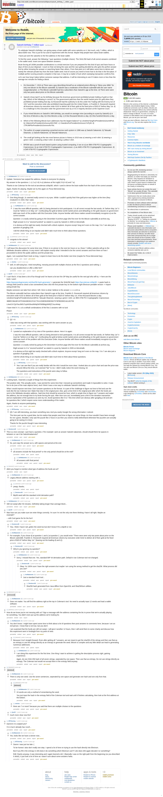

# Satoshi birthday 7 million quiz

[Original thread](https://www.reddit.com/r/Bitcoin/comments/b9peum/satoshi_birthday_7_million_quiz/). The `sourceUrl` of the [satoshi-birthday-quiz record](../../../src/collections/satoshi-birthday-quiz.ts) and the source of all five of its hints, the answer key, and the entropy recipe. The address itself is not in the thread; the record derives it from that recipe. The post went up on April 5, 2019, at 10:19:49 UTC, 35 minutes after the funding transaction's timestamp on the record.

## Historical provenance

The Wayback Machine holds one capture of the `old.reddit.com` URL, taken on June 11, 2023, and two of the `www.reddit.com` URL, from June 11, 2023 and September 22, 2026. The 2023 modern Reddit capture carries the post and none of the comments. The 2026 one carries the post and 25 of the 42 comments, the answer key among them. Provenance rests on the [old.reddit.com capture](https://web.archive.org/web/20230611180546/https://old.reddit.com/r/Bitcoin/comments/b9peum/satoshi_birthday_7_million_quiz/), whose HTML carries the full post and every comment. Its body was read on September 22, 2026 and matches the transcript below word for word, including the answer key and every hint the record quotes. `archive_content: confirmed` on that basis.

Archive.today lists an older capture of the `old.reddit.com` URL, [April 5, 2019, 12:18:15 UTC](http://archive.md/20190405121815/https://old.reddit.com/r/Bitcoin/comments/b9peum/satoshi_birthday_7_million_quiz/). Its body could not be read on September 22, 2026, because archive.today answered every request with 429. It predates the sweep at 14:52:36 UTC and the answer key posted after it, so even read it could confirm the post and the early hints, never the key.

The capture renders 44 comments against the 42 in the thread header. Nine show `[deleted]` as their author, and three of those lost the body too: one `[removed]`, two `[deleted]`. The record names none of the commenters.

## Transcript

> To celebrate Satoshi's birthday I am giving away a brain wallet with some satoshis on it. Not much, only 7 million, which is about $350 now. This is just for fun and to experiment with this format. Maybe help people learn about brain wallets.
>
> I have just sent the satoshis to the first address in the brain wallet.
>
> To find the seed, answer the following 7 quiz questions (multiple choice). The SHA 256 hash of all correct answers combined is the wallet seed. Insert one space between answers.
>
> Brute forcing all 16384 possible combinations is a trivial exercise if you are prepared for this kind of quiz and have hours or days of time at your disposal. I count on that not being the case and the race getting decided by who gets the perfect answer first by either knowing the answer or searching faster than others. From that point on it still takes some time to derive and sweep the relevant private key from the brain wallet seed. And of course you need to know how to do that in the first place. If multiple perfect scoring answers compete in that race, it may be a matter of luck which sweeping transaction confirms first.
>
> Let's see how long it takes before someone sweeps that address. It will be interesting to see if it takes more or less than the average ten minutes for finding a block.
>
> 1. On December 7, 2010
>
> a) There was a guy describing himself as an ordained priest offering to "bless your dildo" for only one bitcoin on the Bitcoin subreddit.
>
> b) Satoshi was a moderator of the Bitcoin subreddit with the user name noagendamarker.
>
> c) The Bitcoin subreddit had less subscribers than Satoshi's age at the time.
>
> d) There were were only two posts about price on the Bitcoin subreddit.
>
> 2. Satoshi chose April 5 as his birthday because the American government prohibited private holding of gold on that day. Which of the following is correct?
>
> a) The government paid less than the world market price for gold when they prohibited private holding that day.
>
> b) Roosevelt had the authority to do this under the Trading with the Enemy Act of 1917 and the executive order also prohibited importing gold into the United States.
>
> c) Franklin D. Roosevelt required all American citizens by executive order 6102 to deliver all of their gold at the fixed price of $20.67 before May 1st.
>
> d) In a challenge to this executive order the government won by a 6 to 3 majority decision at the Supreme Court.
>
> 3. If you mined bitcoins on Satoshi's 34th birthday, you would on average mine (according to a post by Satoshi)
>
> a) A few tens of bitcoins a day.
>
> b) A few bitcoins a day.
>
> c) A few thousand bitcoins a day.
>
> d) A few hundred bitcoins a day.
>
> 4. Which of the following Bitcoin burn addresses has the largest balance?
>
> a) 1AndrewYangForPresident2o2ozm6Pzd.
>
> b) 1WarrenForPresident2o2oxxxy3DCZMZ.
>
> c) 1SandersForPresident2o2oxxxvYnPyW.
>
> d) 1TRUMPforPresident2o2oxxxxxAvY6s.
>
> 5. The author of a paper proposing a practical escrow cash system in 1996 was
>
> a) Satoshi Sakamoto.
>
> b) Tatsuaki Okamoto.
>
> c) Satoshi Nakamoto.
>
> d) Tatsuaki Nakamura.
>
> 6. The small girl looking at the two most famous pizzas in history in 2010 was
>
> a) wearing a red t-shirt.
>
> b) wearing a green t-shirt.
>
> c) wearing a blue t-shirt.
>
> d) wearing a yellow t-shirt.
>
> 7. RPOW was a proof-of-work based system using trusted computing. It ran on
>
> a) an IBM 4758 PCI Cryptographic Coprocessor.
>
> b) an Intel 4758 PCI Cryptographic Coprocessor.
>
> c) an AMD 4758 PCI Cryptographic Coprocessor.
>
> d) a Dell 4758 PCI Cryptographic Coprocessor.

The post source puts each question and its four options in one paragraph with single line breaks; the split above follows how the page displays them.

## Comments

All 44 comments in the capture, in the order they are displayed, sorted by best. A reply names the comment it answers.

**u/AoiNakamoto**, 3 points, the answer key:

> Update: Someone has swiped the address, thanks to everyone for playing.
>
> My answer to the questions: 1 c) 2 a) 3 d) 4 a) (obvious at first sight) 5 b) 6 d) and 7 a).
>
> Thanks to Ian Coleman for the tool at iancoleman.io/bip39/, which I used to derive the brain wallet from the hash of the correct answer.
>
> Again, thanks for playing. Maybe we try this again on Pizza Memorial Day.

**u/BTCkoning**, 1 point, reply to u/AoiNakamoto:

> One thing though, 2c seemed really correct in my eyes. While i couldn't quickly find if the gold price was higher at the time (they revalued it in 1934, that i saw).

**u/AoiNakamoto**, 1 point, reply to u/BTCkoning:

> 2 was the most difficult question, with 2c) being devised to trick participants. It is all correct except the last words. At "before May 1st" it must be "before or on May 1st". Confiscating the gold at below world market prices and defaulting on the gold clauses on government debt was much of the problem with this Executive Order. Anyone familiar with these matters would immediately recognize a) as the correct answer.
>
> Question 1 is easily solved by going to the December 8 archive page (the first ever for the Bitcoin subreddit) at archive.org.
>
> Right answer to 3 is "several hundred" as stated in a post by Satoshi in 2009 on bitcointalk.
>
> 4 is obvious at first sight but easily checked with a block explorer. Anyone except Yang isn't even on the map. 5 to 7 are also just a question of googling a bit.
>
> I did the whole thing on an impulse and didn't take much time to think about these questions.

**[deleted]**, 1 point, reply to u/AoiNakamoto:

> congrats to the winner!

**u/AoiNakamoto**, 2 points:

> I will leave this discussion for some time now. If there is no winner in the next ten hours or so, those 7 million satoshis will go to the Wikileaks donation address. In any event I will explain exactly what I intended to be the correct answers and from there on how I proceeded to derive the public address and the private key.
>
> Again, I am surprised that it took so long. I expect to learn how to do this better next time (maybe for Pizza Memorial Day).

**u/devilox**, 1 point, reply to u/AoiNakamoto:

> well, im still trying but, i tried everything, messing around with multiple choices at the first 2 questions and nothing :(
>
> can you doublecheck or offer a little hint?

**u/jlyo43**, 2 points, edited:

> I can't find it. It has been a lot of fun though and I've learnt a lot too! thx OP May be useful for the next ppl who will try -> here are the tools I used :
>
> https://passwordsgenerator.net/sha256-hash-generator/ -> generate the SHA256 hash https://iancoleman.io/bip39/ -> paste hash in entropy field (need to check a box somewhere) then click the first private key on the bottom right Electrum portable version -> import using private key
>
> Maybe someone can take from where I left. Here is what I believe is the answer: c c c a b b a
>
> The Bitcoin subreddit had less subscribers than Satoshi's age at the time. Franklin D. Roosevelt required all American citizens by executive order 6102 to deliver all of their gold at the fixed price of $20.67 before May 1st. A few thousand bitcoins a day. 1AndrewYangForPresident2o2ozm6Pzd. Tatsuaki Okamoto. wearing a green t-shirt. an IBM 4758 PCI Cryptographic Coprocessor.
>
> 3BBEC96A3E197F036438D921F2A776112D6E80459D5827578FB0090C4A14D759
>
> L4xeCKYQoTwsJM5J7sy64S9xufARqDKFhRBMgXkREjTJruc4Heip
>
> I have tried X X c a b a withall combinations of the first 2 answers with no luck
>
> Peace

**u/BTCkoning**, 2 points, reply to u/jlyo43:

> Q2 = A
>
> I also was wrong with that question, was working with the same answer as you.

**u/AoiNakamoto**, 1 point, reply to u/BTCkoning:

> I posted an explanation of my view of the questions above. Here it is again:
>
> 2 was the most difficult question, with 2c) being devised to trick participants. It is all correct except the last words. At "before May 1st" it must be "before or on May 1st". Confiscating the gold at below world market prices and defaulting on the gold clauses on government debt was much of the problem with this Executive Order. Anyone familiar with these matters would immediately recognize a) as the correct answer.
>
> Question 1 is easily solved by going to the December 8 archive page (the first ever for the Bitcoin subreddit) at archive.org.
>
> Right answer to 3 is "several hundred" as stated in a post by Satoshi in 2009 on bitcointalk.
>
> 4 is obvious at first sight but easily checked with a block explorer. Anyone except Yang isn't even on the map. 5 to 7 are also just a question of googling a bit.
>
> I did the whole thing on an impulse and didn't take much time to think about these questions.

**u/BTCkoning**, 1 point, reply to u/AoiNakamoto:

> Yea i can see that if you are really familar with the info it would be more clear. I looked also at a price chart and saw the price was around 20$ at the time, so it seemed "fair" to me. I didn't really notice the word missing, lol.
>
> The questions and instructions of the puzzle were okay to follow.

**u/AoiNakamoto**, 2 points, the post-mortem:

> Looking back, I learned a couple of things from this experiment.
>
> The positive side: This actually works. I was worried for some time that I messed up somewhere and made it impossible to solve. It was fun to do (one of the main objects here). And I think it was a nice way to celebrate Satoshi's birthday.
>
> What I would improve next time: Don't answer questions on the format. It is part of the challenge to figure out how to find and use the tools like the Ian Coleman tool. Make that clear in the original post. Also, give a time limit in the original post after which the funds are sent to the Wikileaks donation address. Said time limit should be around an hour, which is ample time to figure out 7 answers and swipe the address, but not enough time to try brute forcing the quiz. After time runs out, immediately post a link to the donation transaction and an explanation of the questions as seen by me. Avoid questions like 5 to 7 this time which are obvious after googling a bit and aim for questions like 2 which require some more understanding of the matter.
>
> Again, thanks to anyone participating.

**u/BTCkoning**, 1 point, reply to u/AoiNakamoto:

> Q5-7 are still interesting, you learn something new. And you easily Google the wrong information i noticed.
>
> The time part can be a good idea, but do realize that people need time to figure out some things. An hour wouldn't have been enough for me i guess. Besides i only saw the puzzle like 2 hours in (so then you need to notify beforehand otherwise few puzzlers are actually going to be seeing it in time).
>
> Thanks for the puzzle though it was interesting.

**u/Deminero30**, 1 point:

> This is a nice concept. I just have a question, if for example I pick an answer Satoshi nakamoto, should should there be spaces in between or can it be Satoshinakamoto?

**u/AoiNakamoto**, 1 point, reply to u/Deminero30:

> No, just copy the answer as is, with spaces and period at the end.

**[deleted]**, 1 point, reply to u/AoiNakamoto:

> all answers include the final period? or the only period should be at the end?

**u/AoiNakamoto**, 1 point, reply to [deleted]:

> All answers with final period.

**[deleted]**, 1 point:

> didnt you forgot to mention what type of address the funds are at?

**u/AoiNakamoto**, 1 point, reply to [deleted]:

> Legacy Bitcoin address starting with 1,

**[deleted]**, 1 point, reply to u/AoiNakamoto:

> yeepy. thanks.

**u/Deminero30**, 1 point, reply to u/AoiNakamoto:

> Bip39 seed with the standard m/44 derivation path?

**u/AoiNakamoto**, 1 point:

> Still not swept after 50 minutes. Definitely taking longer than average block...

**u/jlyo43**, 1 point:

> Man how can you make sure we enter things correctly. I'm sure I'm not the only one there thinking I have it all right. Maybe an example?
>
> -- edit Cool game thx for the fun!!

**u/Deminero30**, 1 point, reply to u/jlyo43:

> Yea, I think I have it all, gotten the seed too but don’t know if it’s a bip39 or not.

**u/AoiNakamoto**, 1 point, reply to u/jlyo43:

> For example, if you chose d) at question 1 and c) at question 2, you would enter "There were were only two posts about price on the Bitcoin subreddit. Franklin D. Roosevelt required all American citizens by executive order 6102 to deliver all of their gold at the fixed price of $20.67 before May 1st." (leaving out the leading d) and c)).

**u/Deminero30**, 1 point, reply to u/AoiNakamoto:

> Why're you ignoring my question?

**u/AoiNakamoto**, 1 point, reply to u/Deminero30:

> Sorry, I missed that one. Yes, standard BIP 44 derivation path. Default in Ian Coleman tool not changed.

**u/Deminero30**, 1 point, reply to u/AoiNakamoto:

> Okay. I'm 100% sure I have the right answers but maybe I am using the wrong method to get the sha256. What process did you use?

**u/AoiNakamoto**, 1 point, reply to u/Deminero30:

> Just a standard hash tool...

**u/Deminero30**, 1 point, reply to u/AoiNakamoto:

> Sha256 hash generated from Java differs from OpenSSL and Sha256Sum utilities.

**[deleted]**:

> [removed]

**u/AoiNakamoto**, 1 point, reply to [deleted]:

> Does not matter. You will find the address right at the top in Coleman's tool. No need to actually input 12 words and load a wallet software.

**[deleted]**, 1 point:

> How do we know you're not messing with us? Sign a message with the address containing the btc to prove that we're actually playing for something. You didn't even put up the address we're looking for.

**u/AoiNakamoto**, 2 points, reply to [deleted]:

> You don't know. I might have spent some time to think about a lot of questions then post answers to comments here, because I am an evil person. I know that is not true, but you don't.
>
> I am surprised that the funds are still not swept. I will give it another 12 hours, then I will send them to some charity and discuss how this experiment went in hindsight from my point of view.

**[deleted]**, 1 point, reply to u/AoiNakamoto:

> Because it isn't straight forward. Even after getting all 7 answers, are we meant to get the sha256 of the strings and then use that as an entropy or use the strings directly as an entropy to generate the seed. Bitcoin is complex and any little detail can lead to generating numerous addresses.

**u/AoiNakamoto**, 1 point, reply to [deleted]:

> I am doing this experiment for the first time. One thing I want to achieve is getting the description process right, gaining experience.
>
> Again, do one SHA 256 hash of all seven strings, seperated by one space. Then use that as entropy. Do not use strings directly as entropy. The Coleman tool would not accept them in the entropy field anyway.

**[deleted]**:

> [deleted]

**u/AoiNakamoto**, 1 point, reply to [deleted]:

> There is only one seed. Use the seven sentences, seperated by one space and generate one hash and one only from that.

**[deleted]**, reply to u/AoiNakamoto:

> [deleted]

**u/AoiNakamoto**, 1 point, reply to [deleted]:

> 24 words are only a method of remembering the seed.
>
> You just input the hash in the entropy field of the Coleman tool and wait until it finishes calculating, then look at the first address at the bottom.

**u/devilox**, 1 point, reply to u/AoiNakamoto:

> there are 7 or more? because you said that there are multiple choises to the questions

**u/jlyo43**, 1 point, reply to [deleted]:

> much more clear now thx!!

**u/BTCkoning**, 1 point:

> Dammm it is swiped yes?
>
> I'm in but it already has 1conf...

**u/AoiNakamoto**, 2 points, reply to u/BTCkoning:

> Yes, looks like we have a winner now...

**u/BTCkoning**, 2 points, reply to u/AoiNakamoto:

> Damm i was just too late :(
>
> To be honest i also don't really one step. I spend a lot of time on trying to use the hash directly into Electrum.
>
> But if you fill in the entropy in IAN does it do something which Electrum can't? Like does IAN again decode it or something?
>
> Edit: thanks anyway, it was interesting and i again learned a bit :) Basically i was on the right path from the beginning (so you described it okish), it just took a lot of time as i wasn't sure about some answers haha.

## Screenshot

The screenshot is a render of the archive capture, not of the live page, so it carries the Wayback banner at the top. The "4 years ago" stamps are relative to the capture, June 11, 2023. Capture method and limits: [source archive](../README.md).
