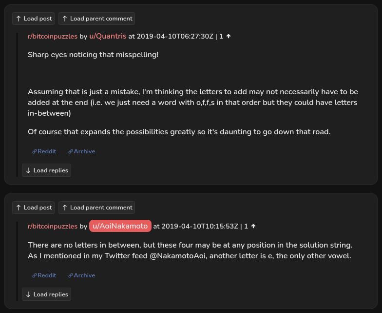

# AoiNakamoto names their Twitter feed

[Original comment](https://www.reddit.com/r/bitcoinpuzzles/comments/bbij0e/meidum_7_mbtc_quizchain_block_18/ekjcc1k/). Cited by the second fact on the AoiNakamoto author record in [satoshi-birthday-quiz](../../../src/collections/satoshi-birthday-quiz.ts), and the reason that record lists the X profile `NakamotoAoi`. A player under Quizchain block 18 guesses how the letters of the answer fit together, and the author corrects them and repeats a hint they had already posted on Twitter, naming the account. The comment went up on April 10, 2019, at 10:15:53 UTC, about four hours after the block. It was never edited.

This is the earliest of several such comments. The same account wrote "I gave a couple of hints at my Twitter feed @NakamotoAoi" under block 30 on April 13 and "Explained at overview available at my Twitter feed @NakamotoAoi" under Quizchain2 block 1 on May 12, 2019. Block 18 itself is not in the dataset; only this comment is archived here.

## Historical provenance

No capture found. On September 25, 2026 the Wayback Machine index was searched for the thread under the `www.reddit.com`, `old.reddit.com` and `np.reddit.com` hosts, and for the comment's own permalink. Only the thread URL has entries, one per host, both from June 11, 2023, 16:53 UTC. Replay of either answers 404 "has not archived that URL", so neither body could be read. The permalink has no entries. Archive.today has no mementos for the `old.reddit.com` thread URL, and MemGator lists nothing for the permalink.

The transcript below comes from the [Arctic Shift](https://arctic-shift.photon-reddit.com/) Reddit archive: the records of the comment and its parent, read on September 25, 2026. The comment record's `edited` field is `false`, its `parent_id` is `t1_ekj476z` and its `link_id` is `t3_bbij0e`, the post "[Meidum] [7 mbtc] Quizchain Block 18" by u/AoiNakamoto, 05:58:34 UTC. The [pullpush](https://pullpush.io/) Reddit archive, read the same day, gives the same author, text and time for the comment.

## Transcript

> There are no letters in between, but these four may be at any position in the solution string. As I mentioned in my Twitter feed @NakamotoAoi, another letter is e, the only other vowel.

## Parent comment

**u/Quantris**, 1 point, 06:27:30 UTC:

> Sharp eyes noticing that misspelling!
>
> Assuming that is just a mistake, I'm thinking the letters to add may not necessarily have to be added at the end (i.e. we just need a word with o,f,f,s in that order but they could have letters in-between)
>
> Of course that expands the possibilities greatly so it's daunting to go down that road.

## Screenshot

The screenshot is a render of both comments in Arctic Shift's ID lookup, not of Reddit, since no readable capture of the Reddit page exists. Capture method and limits: [source archive](../README.md).
