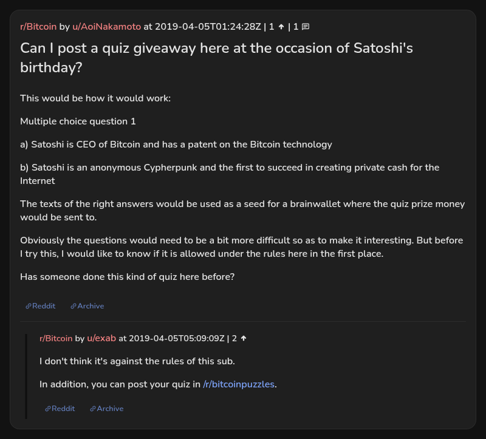

# Can I post a quiz giveaway here at the occasion of Satoshi's birthday?

[Original thread](https://www.reddit.com/r/Bitcoin/comments/b9l37o/). Cited by the first fact on the AoiNakamoto author record in [satoshi_birthday_quiz](../../../src/collections/satoshi_birthday_quiz.ts). The author asks r/Bitcoin whether a quiz giveaway is allowed there, with one sample question and the idea of using the right answers as the seed of a brainwallet. The post went up on April 5, 2019, at 01:24:28 UTC, about nine hours before the [birthday quiz](aoinakamoto-2019-04-05.md), which hashed its answers into a seed instead. It was never edited.

## Historical provenance

No capture found. On September 24, 2026 the Wayback Machine index was searched for the `www.reddit.com` and `old.reddit.com` URLs, with the thread's slug and without it, and under r/bitcoinpuzzles, where the record used to place it. Only the slug URLs have entries. The `old.reddit.com` one, June 11, 2023, 12:31:06 UTC, answers 404 "has not archived that URL" on replay, so its body could not be read. Replay of the `www.reddit.com` entry from the same second jumps to a September 22, 2026 capture, and that one is Reddit's bot check, not the thread. MemGator lists nothing for any of those URLs.

Archive.today lists one capture of the `old.reddit.com` URL, [April 5, 2019, 02:32:34 UTC](http://archive.md/20190405023234/https://old.reddit.com/r/Bitcoin/comments/b9l37o/can_i_post_a_quiz_giveaway_here_at_the_occasion/), an hour after the post. Its body could not be read on September 24, 2026, because archive.today answered every request with 429 or its "One more step" check. Reddit itself answers this machine with a login redirect on `old.reddit.com` and "Prove your humanity" on `www.reddit.com`.

The transcript below comes from the [Arctic Shift](https://arctic-shift.photon-reddit.com/) Reddit archive: the post record and the comment tree for `b9l37o`, read on September 24, 2026. The post record's `edited` field is `false`. The [pullpush](https://pullpush.io/) Reddit archive, read the same day, gives the same subreddit, text, time and comment.

## Transcript

> This would be how it would work:
>
> Multiple choice question 1
>
> a) Satoshi is CEO of Bitcoin and has a patent on the Bitcoin technology
>
> b) Satoshi is an anonymous Cypherpunk and the first to succeed in creating private cash for the Internet
>
> The texts of the right answers would be used as a seed for a brainwallet where the quiz prize money would be sent to.
>
> Obviously the questions would need to be a bit more difficult so as to make it interesting. But before I try this, I would like to know if it is allowed under the rules here in the first place.
>
> Has someone done this kind of quiz here before?

## Comments

**u/exab**, 2 points, top level, 05:09:09 UTC:

> I don't think it's against the rules of this sub.
>
> In addition, you can post your quiz in /r/bitcoinpuzzles.

## Screenshot

The screenshot is a render of the thread in Arctic Shift's ID lookup, not of Reddit, since no readable capture of the Reddit page exists. Capture method and limits: [source archive](../README.md).
