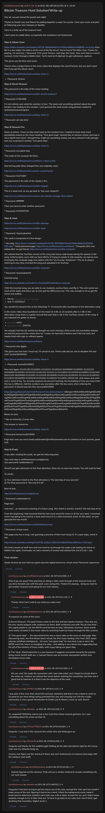

# Bitcoin Treasure Hunt Solution/Write-up

[Original thread](https://www.reddit.com/r/smithlylemoore/comments/p6wzkk/bitcoin_treasure_hunt_solutionwriteup/). The source of every stage answer, the technique tags and the key of the [smith-lyle-moore/born-to-be-wild](../../../src/collections/smith-lyle-moore/born-to-be-wild.ts) record, of its solver record and of one fact on the band's author record. The post went up on August 18, 2021, at 18:22:37 UTC, almost eleven hours after the claim transaction emptied the address. It carries no edit stamp. Three comments come from the band's own account: the congratulations, the explanation of three clues and the reply that nobody found the shortcut.

## Historical provenance

The Wayback Machine caught the thread on both hosts within 14 seconds of the post. Provenance rests on the [old.reddit.com capture](https://web.archive.org/web/20210818182251/https://old.reddit.com/r/smithlylemoore/comments/p6wzkk/bitcoin_treasure_hunt_solutionwriteup/), stamped August 18, 2021, 18:22:51 UTC. Its HTML carries the whole post, and its 86 text blocks match the transcript below both ways, word for word, with Markdown and whitespace set aside. A `www.reddit.com` capture from two seconds earlier holds the same post. Neither holds a comment, because none had been written yet. The captures were read on October 6, 2026. `archive_content: confirmed` on that basis. The archive.today timemaps for the thread did not answer within a minute that day.

The comments come from the [Arctic Shift](https://arctic-shift.photon-reddit.com/) Reddit archive: the post record and the comment tree for `p6wzkk`, read on October 6, 2026. The [pullpush](https://pullpush.io/) Reddit archive, read the same day, gives the same post text and time and the same 10 comments with the same authors, times, scores and parents. The only difference is that pullpush keeps `&` as `&amp;`.

The record names u/26-9-15-20 as the solver on the strength of this post: "we just solved the puzzle last night", posted the day the claim went out, with the band congratulating the group under it.

## Transcript

> Hey all, we just solved the puzzle last night.
>
> Thanks to Smyth Lyle and Moore for putting together a super fun puzzle. I love your music and plan on following your new releases on Spotify.
>
> Here is a write-up of the treasure hunt.
>
> I don't post on reddit often, so hopefully the markdown isn't butchered.
>
> ---
>
> **Step 1) Album Cover**
>
> https://static.wixstatic.com/media/144728_690b95a837b14706a3e8583e0c5b8056~mv2.png
> View file in a hex editor, the data is at the end of the file struct: You've found The Milky Way. Thanks for playing. 12 word key + Password. First word: fortune. Last stop, the moon. Your next stop is a secret museum. Enter through a hidden door. You'll need an 8-digit pin to gain admission, explorer.
>
> This gives you the first seed word.
>
> There's also a single frame in the music video that displays the word Fortune, but you don't need this if you got the album cover.
>
> https://www.smithlylemoore.com/key-check-1
>
> - Password: fortune
>
> ---
>
> **Step 2) Secret Museum**
>
> The password is the date of the moon landing.
>
> https://www.smithlylemoore.com/the-secret-museum7
>
> - Password: 07201969
>
> I'm not entirely sure what the solution is here. The band said something abstract about the gold borders was leading to the solution. I just guessed the seed words using phrases related to apollo/astronaut program.
>
> https://www.smithlylemoore.com/key-check-2
>
> - Password: all man kind
>
> ---
>
> **Step 3) Museum Fire**
>
> Same as before, I have no idea what leads to the solution here. I looked at more seed word possibilities based on the moon landing. "One giant leap" seemed like an obvious choice, but leap is not a bip39 seed word. I thought they might do something cheeky, but only entered it half-jokingly and was surprised it worked: "one giant step".
>
> https://www.smithlylemoore.com/key-check-3
>
> - Password: one giant step
>
> This leads to the museum fire flow:
>
> https://www.smithlylemoore.com/there-s-been-a-fire
>
> Red herring path (they changed this, but originally was):
>
> https://www.smithlylemoore.com/im-a-pyromaniac
>
> - Password: 01271967
>
> The password is the date of the Apollo 1 fire.
>
> https://www.smithlylemoore.com/the-tragedy
>
> This is a dead-end, so you go back to "pay your respects".
>
> https://www.smithlylemoore.com/we-will-rebuild-stronger-than-before
>
> - Password: fffffffffff
>
> Then you have to enter another password:
>
> - Password: FFFFFFFFFFF
>
> ---
>
> **Step 4) Vault**
>
> https://www.smithlylemoore.com/the-passage
>
> https://www.smithlylemoore.com/the-vault
>
> - Password: 4samcodeartist
>
> The vault is comprised of a few things:
>
> - Alt song: https://music.wixstatic.com/mp3/144728_5f57f68e07ba4319b9c189fbc61626b9-320.mp3
> - Vault password page: https://www.smithlylemoore.com/blank
> - Computer (this was added after we got there): https://www.smithlylemoore.com/the-computer
>
> We noticed that the YouTube version of the song had morse code beeps during the speech in the song. Unfortunately, even with our best efforts of trying to isolate it with audacity, we had no luck. Eventually the computer page was added with the "yin & yang / imbalance". The yin & yang is referring to how they inverted the song and uploaded it to YouTube.
>
> https://www.smithlylemoore.com/the-computer
>
> - Password: 4samcodeartist
>
> Inverted song:
>
> https://www.youtube.com/watch?v=3we3eotJZHU&feature=youtu.be
>
> With the inverted song, you are able to use Audacity, overlay them, and flip it. This will cancel out most of the audio and allow you to only get the differences out. This was enough to let us get the morse out audibly.
>
> - Morse: - .-.-. .---- ...-- ... - -.. .- .-.. -
> - Out: T+13STDALT
>
> You needed to interpret this as the following: T+ 13 seconds after touchdown in the alternative song
>
> In the music video, they touchdown on the moon at 1:35, so 13 seconds after is 1:48. In the alternative song, there is a guitar around that part that is not in the YouTube version of the song. If you interpret the guitar as morse.
>
> - .. -. - --- : `INTO`
> - -.. .. --. .. - .- .-.. : `DIGITAL`
>
> We actually had this for awhile but thought we were missing a third word, but eventually realized we had the password the whole time lol. I swear we had tried it before and it did not work, but maybe tried with caps or without spaces.
>
> https://www.smithlylemoore.com/blank
>
> - Password: into digital
>
> This gives you new text: `I must say, I'm proud of you. What code did you use to decipher the last clue? answer00100001`
>
> https://www.smithlylemoore.com/key-check-4
>
> - Password: morse00100001
>
> New text again: `01101100 01101001 01101011 01100101 00100000 01100001 01101110 00100000 01101001 01101101 01101101 01101111 01110010 01110100 01100001 01101100 00101100 00100000 01101001 01110100 00100000 01101110 01100101 01110110 01100101 01110010 00100000 01100100 01101001 01100101 01110011 00101110. click below and enter next 1 word of key. For security purposes (to prevent hacking), the formatting of how you must enter this key is different. Add the numbers you see below after the key word, when entering the password. It should look like this: keyword0010000`
>
> https://gchq.github.io/CyberChef/#recipe=From_Binary('Space',8)&input=MDExMDExMDAgMDExMDEwMDEgMDExMDEwMTEgMDExMDAxMDEgMDAxMDAwMDAgMDExMDAwMDEgMDExMDExMTAgMDAxMDAwMDAgMDExMDEwMDEgMDExMDExMDEgMDExMDExMDEgMDExMDExMTEgMDExMTAwMTAgMDExMTAxMDAgMDExMDAwMDEgMDExMDExMDAgMDAxMDExMDAgMDAxMDAwMDAgMDExMDEwMDEgMDExMTAxMDAgMDAxMDAwMDAgMDExMDExMTAgMDExMDAxMDEgMDExMTAxMTAgMDExMDAxMDEgMDExMTAwMTAgMDAxMDAwMDAgMDExMDAxMDAgMDExMDEwMDEgMDExMDAxMDEgMDExMTAwMTEgMDAxMDExMTA
>
> Binary to ascii:
>
> - like an immortal, it never dies.
>
> The answer is: `tomorrow`
>
> https://www.smithlylemoore.com/key-check-5
>
> - Password: tomorrow0010000
>
> Page text: `now you must email codebreaker@smithlylemoore.com to continue on your journey. good luck. `
>
> ---
>
> **Step 5) Finale**
>
> A day after sending the email, we got the following back:
>
> ```
> Your next stop is smithlylemoore.com/gateway
> Use password: codebreaker11
>
> Once/if you gain admission to the final attraction, there are no more key checks. You will need to load the wallet and find the treasure. The final attraction is your final clue (for the password). It is the end of it all. We’d appreciate if you email us to let us know if/when you take the treasure for yourselves.
>
> To clarify:
>
> 1\) Your admission ticket to the final attraction is “the last stop of your journey”
> 2\) The final password is “the end of it all”
>
> Best of luck.
> ```
>
> https://smithlylemoore.com/gateway
>
> - Password: codebreaker11
>
> Page text:
>
> ```
> And now.... an advanced screening of a future song. Your ticket is word11 word12: the last stop of your journey.
> ```
>
> From the beginning I had assumed that the last word would be moon or at the very least, I assumed moon was going to be used as a seed word since it is a valid mnemonic word. At this point, we just guessed the two words:
>
> https://www.smithlylemoore.com/illstillbelovinyou
>
> - Password: virtual moon
>
> This page only has a song, I am guessing a preview of their next song (?). It's super dope, check it out.
>
> https://music.wixstatic.com/mp3/144728_b22b111462424cf3824203ac3564c2ce-320.mp3
>
> We tried a bunch of stuff here and even tried to rip through the audio a bit looking for morse or hidden text again. Eventually we had a moment of eureka and realized `the end of it all` + star.
>
> ---
>
> **Final solution:**
>
> Seeds: `fortune all man kind one giant step into digital tomorrow virtual moon`
> Password: `supernova`

## Comments

**u/smithlylemoore**, 4 points:

> Way to go you guys!! Was planning on doing a video walk through of the treasure hunt, but you did a fantastic job with this post. Love seeing this. Thanks for playing... doing our best to get another treasure hunt going for our next release.

**u/26-9-15-20**, 1 point, reply to u/smithlylemoore:

> Thanks. Nice! Can't wait to see what you make next

**u/smithlylemoore**, 1 point:

> To espouse on some of the clues:
>
> 2\) Secret Museum. The gold frames relate to the first and last Apollo missions. They also are the only Apollo plaques with sentences on them. Both sentences end with "for all man kind." We urged people to use the BIP39 word list here to help. Ultimately, however, these words were easily revealed in the music video by searching frame by frame through the title screens.
>
> 3\) "One giant step" — the idea behind this was a macro take on the clues on that page. Man discovering tools, the first bitcoin block mined, the first moon landing, HAL from 2001 space odyssey (artificial intelligence)... All were "one giant leap" for man kind. Leap is not in the BIP39 word list, hence us changing it to step... And adding a very literal clue suggesting that: the gif of the ministry of funny walks, with a guy taking one giant step.
>
> 4\) The Vault. 4SamCodeArtist is a clue because it suggests and points towards the puzzles being morse (which both are...). Samuel Morse was an inventor and painter (artist) who developed morse code.

**u/26-9-15-20**, 1 point, reply to u/smithlylemoore:

> Oh yea, nice! We made the connection with 'sam code artist', but I forgot to include that in the write-up. I believe we noticed the morse before realizing the connection, but that was a good hint to hammer it in that it was the objective of the vault.

**u/m0tiv3**, 2 points:

> I was part of the crew that solved this and just wanted to add that it was a blast to work on. So great to see more things being promoted this way and crossing over into the crypto community, it was a great introduction to Smith Lyle & Moore's music as well. Bravo!

**u/Jiyusan_**, 2 points:

> Yo, congrats!!! Definitely wanna see a new hunt from these musical geniuses. iirc I saw something about the ocean on their IG.

**u/Trevor792221**, 1 point:

> Congrats. I was lost in the museum the whole time and kinda gave up

**u/Close2it**, 1 point:

> Congrats and thanks for the walkthrough! Getting all the dots and dashes right for the morse code was my ultimate hang-up.
>
> Anyone ever figure out the shortcut if there was one? (referenced on treasure hunt page with the rainbow road stuff)

**u/smithlylemoore**, 1 point, reply to u/Close2it:

> Nobody figured out the shortcut. Prob will use a similar method to encode something into our next release

**u/raudrin**, 1 point:

> Congrats! I had been trying to get the Morse out of the solo, and got the 'into' part but couldn't make sense of the rest, figuring it had to be a word. I think the background music made it kinda hard to determine whether each note was a dit or dash, at least for me, and I didn't know audacity enough to try to filter that out. I'll have to go back to my notes but I don't think I got anything that resembles 'digital' at all :)

## Screenshot



The screenshot is a render of Arctic Shift's ID lookup, not of the live page or the Wayback capture, which holds no comments. Capture method and limits: [source archive](../README.md).
