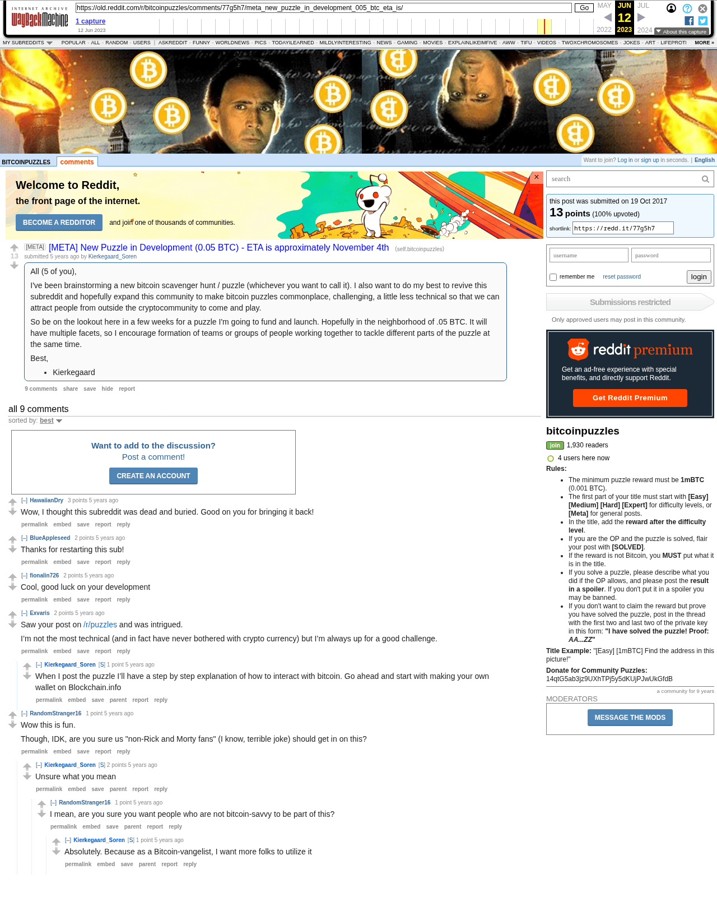

# [META] New Puzzle in Development (0.05 BTC) - ETA is approximately November 4th

[Original thread](https://www.reddit.com/r/bitcoinpuzzles/comments/77g5h7/meta_new_puzzle_in_development_005_btc_eta_is/). The announcement two weeks before the launch, and the source of the first fact on the [Kierkegaard_Soren author record](../../../src/collections/trivia-brainwallet.ts). The post went up on October 19, 2017, at 17:56:12 UTC and was never edited. It names a prize of about 0.05 BTC and no address; the puzzle itself launched at 0.04 BTC on November 4.

## Historical provenance

The Wayback Machine holds two `www.reddit.com` captures from June 7 and June 12, 2023, and one `old.reddit.com` capture from June 12, 2023. archive.today has none. Provenance rests on the [old.reddit.com capture](https://web.archive.org/web/20230612132032/https://old.reddit.com/r/bitcoinpuzzles/comments/77g5h7/meta_new_puzzle_in_development_005_btc_eta_is/), stamped June 12, 2023, 13:20:32 UTC, whose HTML carries the post and the nine comments its header counts. Its body was read on September 30, 2026 and matches the transcript below paragraph by paragraph, both ways, once whitespace is normalized. `archive_content: confirmed` on that basis.

The [Arctic Shift](https://arctic-shift.photon-reddit.com/) Reddit archive and pullpush, read the same day, list the same nine comments with the same authors, times and text, and seven more that the capture no longer shows. The times below come from the capture and match both.

## Transcript

> All (5 of you),
>
> I've been brainstorming a new bitcoin scavenger hunt / puzzle (whichever you want to call it). I also want to do my best to revive this subreddit and hopefully expand this community to make bitcoin puzzles commonplace, challenging, a little less technical so that we can attract people from outside the cryptocommunity to come and play.
>
> So be on the lookout here in a few weeks for a puzzle I'm going to fund and launch. Hopefully in the neighborhood of .05 BTC. It will have multiple facets, so I encourage formation of teams or groups of people working together to tackle different parts of the puzzle at the same time.
>
> Best,
>
> - Kierkegaard

## Comments

All nine comments in the capture, in the order they are displayed, sorted by best.

**u/HawaiianDry**, 3 points, top level, October 19, 2017, 22:16:36 UTC:

> Wow, I thought this subreddit was dead and buried. Good on you for bringing it back!

**u/BlueAppleseed**, 2 points, top level, October 20, 2017, 00:25:37 UTC:

> Thanks for restarting this sub!

**u/fionalin726**, 2 points, top level, October 31, 2017, 05:48:18 UTC:

> Cool, good luck on your development

**u/Exvaris**, 2 points, top level, November 1, 2017, 21:10:35 UTC:

> Saw your post on /r/puzzles and was intrigued.
>
> I’m not the most technical (and in fact have never bothered with crypto currency) but I’m always up for a good challenge.

**u/Kierkegaard_Soren**, 1 point, reply to u/Exvaris, November 2, 2017, 01:00:56 UTC:

> When I post the puzzle I’ll have a step by step explanation of how to interact with bitcoin. Go ahead and start with making your own wallet on Blockchain.info

**u/RandomStranger16**, 1 point, top level, October 31, 2017, 15:11:15 UTC:

> Wow this is fun.
>
> Though, IDK, are you sure us "non-Rick and Morty fans" (I know, terrible joke) should get in on this?

**u/Kierkegaard_Soren**, 2 points, reply to u/RandomStranger16, October 31, 2017, 15:58:36 UTC:

> Unsure what you mean

**u/RandomStranger16**, 1 point, reply to u/Kierkegaard_Soren, October 31, 2017, 21:27:00 UTC:

> I mean, are you sure you want people who are not bitcoin-savvy to be part of this?

**u/Kierkegaard_Soren**, 1 point, reply to u/RandomStranger16, October 31, 2017, 21:27:47 UTC:

> Absolutely. Because as a Bitcoin-vangelist, I want more folks to utilize it

## Screenshot

The screenshot is a render of the archive capture, not of the live page, so it carries the Wayback banner at the top. The "5 years ago" stamps are relative to the capture, June 12, 2023. Capture method and limits: [source archive](../README.md).
