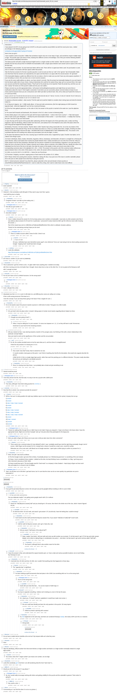

# Brainwallet puzzle - 0.04 BTC reward

[Original thread](https://www.reddit.com/r/bitcoinpuzzles/comments/7asy51/brainwallet_puzzle_004_btc_reward/). The `sourceUrl` of the [trivia-brainwallet record](../../../src/collections/trivia-brainwallet.ts) and the source of every hint on it: the rules, the twelve clues, the prize address, and in the comments the claim, the winner's twelve answers and the author's reference for clue 12. The post went up on November 4, 2017, at 20:05:55 UTC, 94 seconds after the funding transaction confirmed, and was last edited on November 5 at 02:14:17 UTC, nine minutes after the claim. The edits are the two `EDIT` lines at the end.

## Historical provenance

The Wayback Machine holds one capture of each host from June 10, 2023, and a single comment permalink from July 2020. archive.today has none. The `www.reddit.com` capture carries the post and no comments, so provenance rests on the [old.reddit.com capture](https://web.archive.org/web/20230610055046/https://old.reddit.com/r/bitcoinpuzzles/comments/7asy51/brainwallet_puzzle_004_btc_reward/), stamped June 10, 2023, 05:50:46 UTC. Its HTML carries the edited post and 66 comments, while its header counts 73. Its body was read on September 30, 2026 and matches the transcript below paragraph by paragraph, both ways, with whitespace normalized and the spoiler titles read as text. `archive_content: confirmed` on that basis.

The [Arctic Shift](https://arctic-shift.photon-reddit.com/) Reddit archive and pullpush, read the same day, list 79 comments each, with the same authors, times and text for every comment the capture shows. The times below come from the capture and match both. Nine comments show `[deleted]` as their author in the capture, six of them because the account was deleted later, and three of those nine lost their text too.

The winner's answers are Reddit spoilers, `[answer](#s "...")`, which old Reddit renders as a link with the answer in its title. The transcript keeps the markdown the way it was typed, so the answers stay readable here.

## Transcript

> Instructions
>
> I have placed 0.04 BTC (it was going to be 0.05 BTC so the prize would be around $300, but with the recent price rises, I edited accordingly) in the following address:
>
> [1E3NARnUX25UgMvZd5EZTutD9yVHTVGDNC](https://blockexplorer.com/address/1E3NARnUX25UgMvZd5EZTutD9yVHTVGDNC)
>
> Here’s how you get it:
>
> I have created a series of puzzles / riddles that sometimes require only one or two steps in logic, and sometimes require multiple steps in logic. The puzzles span vast areas of trivia, drawing from different corners of knowledge. A lot of this just involves following detailed (and sometimes undetailed) instructions.
>
> The below puzzles will yield a single American English word or a single number as their solution. Take the answer to each puzzle (besides the last two) and put them IN ORDER into brainwallet.io with a single space between each answer (and no space at the end of the last clue).
>
> BrainWallet is case sensitive. So only lowercase letters will be used. There will be no uppercase letters used. No punctuation is used, even in numbers. No answers will have spaces within that answer.
>
> Take the final two answers for the last 2 puzzles (puzzles 11 and 12) and use them as “salt” in the “generic” tab of brainwallet. Make sure that those final two answers are separated by one space and that there is no space after the second answer. Hit “generate”.
>
> If the brainwallet displays a public key different from the one above, check to make sure you don’t have any extra spaces anywhere. If your formatting is correct, then you have one or more incorrect answers.
>
> If you see the same wallet address as above, you have solved it correctly. Take the private key brainwallet displays for you and import it into the bitcoin wallet client of your choice. Going to blockchain.info could be the easiest thing. (sign up for an account there, then open your account and find the import/export feature. They’ll ask for the private key to be imported. Paste the private key, and then you can then “sweep” the funds out of the puzzle’s wallet and into your own wallet.)
>
> Please comment as you feel appropriate below. I will answer technical/logistical questions and might throw out some hints or clarifications about the clues if I feel insight is warranted.
> If and when you are successful, please comment below to boast of your victory and let everyone know you are a real person and I didn’t just take my bitcoin back. Also, tell us what you’ll spend the money on or if you’ll just HODL.
>
> Clues
> 1\) 33 37 2e 37 34 39 33 35 34 20 2d 31 32 32 2e 33 38 39 39 35 36 20 77 68 61 74 20 61 72 65 20 74 68 65 79 20 73 65 6c 6c 69 6e 67 20 28 68 6f 6f 73 69 65 72 20 73 74 72 65 65 74 29
>
> 2\) sopranos.reframed.snubbed - what country? Find the right tool (could be helpful to consider what is being input and what the desired output is).
>
> 3\) 1/2 Beyonce's [approx. 2pi - 0.28]th studio album, 1/2 law and order actor/actress, [the first night playing at USSR closed (on opposite day)] - what else happened? sum the four numerical freeways.
>
> 4\) Of the four inter-galactic governors, on the order of 246, the answer to this puzzle is married to the weak one. (use the adjective form)
>
> 5\) The same both forwards and backwards, this character is the O.G. when it comes to behaving badly.
>
> 6\) Most elderly player to hit a ball out of the park with the bases loaded (MLB) --> what is their home country? --> Take total square miles of said country (per Wikipedia) --> identify the prime factorization of that number --> sum those factors --> multiply that result by the year I was born to get your final answer.
>
> 7\) Upon this day (of the launch of the puzzle) after subtracting 138 from the largest unit of time generally used, a really cool thing happened. Take the identifying, official number from that event, and subtract from it the telephone area code of the place where the other thing ($) that happened that day happened.
>
> 8\) Relativity. Princeton. He had a teacher. Teacher died in 1909. Teacher had a thing named after him. Go to the very bottom of the Wikipedia page for that particular thing. Not the very bottom but close to it. There is a number down there. 8 digits, including one dash. Remove the smallest digit. Remove the dash.
> 74616b65796f75726173736f6e6f766572746f77696b6964617461. The answer is the coordinate data from the resulting entry without any punctuation (use only the digits. In order.)
>
> 9\) The place that darkness fears the most,
> Causing orgs to hold their secrets close,
> Supported by crypto,
> Founder must tiptoe,
> As he collects more things to post.
>
> 10\) Seven individuals, Alaina, Azalea, Alexandra, Augustine, Atticus, Anastasiya, and Alexander, all stand in a straight line, all facing the same direction. Atticus and Azalea have exactly two people between them. Azalea and Alaina are not at the front of the line. Atticus is further ahead in the line than Anastasiya. Alexander has one person in between he and Anastasiya. Augustine is one spot away from either the front or the back of the line. Azalea is directly next to Alaina. Atticus is directly in the middle of the line. Identify the order of the individuals from the front of the line to the back, then take the names of the people in order and convert every letter to their corresponding numerical value in the alphabet (A=1, B=2…Z=26). The answer to this puzzle is all of the numerical values without any spaces between them in the order of their places in line. (AKA, the answer will be a loooonng continuous string of numbers.)
>
> 11\) 1834: a1 a2 a3 b1 b3 b7 c2 c3 d6 f8 h6 --> Name the non-Frenchman.
>
> 12\) Purchase 2 dripping, succulent, sopping pieces of land meat for this number of U.S. dollars.
>
> EDIT: Please refrain from posting direct answers. Glad this is taking off. Also, if you post one of the clues in another subreddit, please link to this post so other people know what they’re doing the work for.
>
> EDIT 2: Solved and prize claimed! If you liked this, please subscribe to this sub and donate to future puzzles at 18no9TMRswUaHbi4ecBPjrPEa2KAckaCmH. I️ want to make this a thing. And I️ want to make future ones more difficult.

## Comments

All 66 comments in the capture, in the order they are displayed, sorted by best.

**u/KingKnee**, 7 points, top level, November 4, 2017, 20:22:44 UTC:

> _brain exploded_

**u/Quantris**, 7 points, top level, November 5, 2017, 02:05:42 UTC:

> Claimed it :) But somebody could still grab it if they want to pay more fees I guess.
>
> I sent half the prize to charity.

**u/HawaiianDry**, 2 points, reply to u/Quantris, November 5, 2017, 02:08:13 UTC:

> Congrats! At least I can take my time eating now :)

**u/Kierkegaard_Soren**, 2 points, reply to u/Quantris, November 5, 2017, 02:08:52 UTC:

> How did you get number 12?

**u/Kierkegaard_Soren**, 1 point, reply to u/Quantris, November 5, 2017, 02:12:30 UTC:

> And which charity?

**u/Quantris**, 4 points, reply to u/Kierkegaard_Soren, November 5, 2017, 02:17:37 UTC:

> Sorry! I totally cheesed the answer for #12 by trying various even numbers on brainwallet. I was lucky my other answers were fine (I was dubious about answers for #5 and #11 in particular). I presumed it's about steak but didn't get the reference (even after knowing the answer...)
>
> Part of the reward was sent to 1HB5XMLmzFVj8ALj6mfBsbifRoD4miY36v which is wikileaks' donation address.
>
> Thanks for the entertaining evening! Hope you do more!

**u/Kierkegaard_Soren**, 1 point, reply to u/Quantris, November 5, 2017, 02:20:00 UTC:

> There is a twitter account called 2 hams for $20. Check it out.

**u/Quantris**, 3 points, reply to u/Kierkegaard_Soren, November 5, 2017, 02:25:07 UTC:

> > 2 hams for $20
>
> Oh wow, I definitely have seen that before (years ago?); nice reference! Turns out I was trying to be too clever putting synonyms into Google; "sopping meat" would have been enough.

**u/wellfeded**, 2 points, reply to u/Kierkegaard_Soren, November 5, 2017, 02:14:39 UTC:

> Looks like wikileaks:
>
> https://blockexplorer.com/address/1HB5XMLmzFVj8ALj6mfBsbifRoD4miY36v

**u/maricci1529**, 5 points, top level, November 4, 2017, 20:27:43 UTC:

> all i know is, number 11) you sunk my battleship

**u/HawaiianDry**, 6 points, top level, November 4, 2017, 22:58:29 UTC:

> This is awesome! I got five of them so far...I'm glad I didn't have anything else I needed to do today.
>
> edit: this is turning out to be a lot harder than I thought. Seven down but no clue on the other five. I'm not so great at the thesaurus stuff.
>
> edit 2: auuugh my brain

**u/Grimnur87**, 3 points, top level, November 5, 2017, 01:49:53 UTC:

> For #12 all I have so far is a British foursome. On the wrong track?

**u/Kierkegaard_Soren**, 2 points, reply to u/Grimnur87, November 5, 2017, 01:53:28 UTC:

> Lol

**u/Hazamattaz**, 3 points, top level, November 4, 2017, 20:26:01 UTC:

> Cool. I will give this a shot.

**[deleted]**, 3 points, top level, November 5, 2017, 00:30:39 UTC:

> Absolutely love this! 4, 8, 9, 11 and 12 still elude me, and differing time zones are calling me to sleep.
>
> If this is still running tomorrow I’ll be back on it.
>
> I love the concept. If you can keep these going in the future I’ll be a regular for sure :)

**u/HawaiianDry**, 3 points, reply to [deleted], November 5, 2017, 00:32:58 UTC:

> For 8, the teacher wasn't the person's teacher anymore in 1909 when he died. That gave me a little trouble.

**[deleted]**, 2 points, reply to u/HawaiianDry, November 5, 2017, 01:02:29 UTC:

> Oh, just had 9 click into place when I reread it. Being aware of certain recent tweets regarding bitcoin helped me there.

**u/HawaiianDry**, 2 points, reply to [deleted], November 5, 2017, 01:09:18 UTC:

> I thought you were going to bed? :)

**[deleted]**, 2 points, reply to u/HawaiianDry, November 5, 2017, 01:18:55 UTC:

> Haha, it may be calling but I’m yet to answer. I’m now at an impasse on 4, 11, 12 so they will have to wait ‘til tomorrow.
>
> Good luck on your hunt for the remaining answers.

**[deleted]**, 1 point, reply to u/HawaiianDry, November 5, 2017, 00:48:37 UTC:

> Ahh yes, thanks for that. I was steering towards a teacher of his younger years, but thinking of this with a closer relationship to this particular concept helped.
>
> Now, just need to work out the significance of this number and the one provided.

**u/sg77**, 3 points, reply to [deleted], November 5, 2017, 01:07:38 UTC:

> For #8, the number provided seems to be the same idea as #1, and from there it's straightforward.
>
> I think the only answers I'm missing are 3 4 5 9.

**[deleted]**, 3 points, reply to u/sg77, November 5, 2017, 01:24:11 UTC:

> How could I miss that? Great, that’s 8 solved for me now.
>
> 5 I would consider a best guess at this point. I can’t think of anything else that fits the description. But would only vaguely describe the person.
>
> A little hint for 9, this is a single stage logic puzzle, rather than each line pointing you in a different direction. The poem neatly describes the word you are looking for, and details around it.

**u/HawaiianDry**, 2 points, reply to u/sg77, November 5, 2017, 01:19:27 UTC:

> Since I'm missing more than those, I can probably take a break and get something to eat.

**[deleted]**, 3 points, top level, November 5, 2017, 01:24:32 UTC:

> Satoshi would be proud.

**u/Kierkegaard_Soren**, 3 points, top level, November 5, 2017, 01:36:57 UTC:

> I️ love that y’all are into this. But that said, it is easy to be into a puzzle with a $300 prize

**u/HawaiianDry**, 1 point, reply to u/Kierkegaard_Soren, November 5, 2017, 01:52:11 UTC:

> True story, although I have been doing puzzles for [a lot less](https://www.reddit.com/r/Bitcoin/comments/1dy3jk/bitcoin_riddle_7_the_lost_coin/c9v4njj/) :)

**u/mtshmtha**, 3 points, top level, November 5, 2017, 02:25:45 UTC:

> Now that this is solved. Can someone provide the answers?

**u/Quantris**, 5 points, reply to u/mtshmtha, November 5, 2017, 02:53:41 UTC:

> Will do. Not sure I'm doing spoilers the right way (sidebar says to use them but doesn't explain the syntax). Anyway here we go.
>
> 1\) [answer](#s "numbers are hex for ASCII, giving you lat/long coordinates for a store that sells: furniture")
>
> 2\) [answer](#s "it's a what3words address for a location in: Mozambique")
>
> 3\) [step 1](#s "1/2 lemonade 1/2 ice tea is an Arnold Palmer") [step 2](#s "opposites -> the last day playing at US open") [step 3](#s "Arnold Palmer's last US open round was June 17 1994, same day as the famous O.J. Simpson car chase") [answer](#s "Freeways involved in the chase were 5, 91, 110, and 405; the sum is: 611")
>
> 4\) [answer](#s "this refers to fundamental forces, and at 246 GeV the weak and electromagnetic forces merge into electroweak. The answer is: electromagnetic")
>
> 5\) [answer](#s "The clue indicates a palindromic name; the original sinner: Eve")
>
> 6\) [step 1](#s "Julio Franco -> Dominican Republic -> 18,655 sq. mi -> 5, 7, 13, 41") [step 2](#s "Kierkegaard (see OP's username) was born in 1813") [answer](#s "(5 + 7 + 13 + 41) * 1813 = 119658")
>
> 7\) [step 1](#s "138 years ago today, patent US221222 is issued to Elkins for something cool: a fridge") [step 2](#s "Same day, patent on cash register issued to Ritty from Drayton, Ohio: area code 937") [answer](#s "221222 - 937 = 220285")
>
> 8\) [step 1](#s "Talking about Einstein. Teacher that died in 1909 is Minkowski") [step 2](#s "At bottom of wikipedia for Minkowski space, we see GND: 4293944-6; follow the instructions to get 4939446") [step 3](#s "decode the hex-ASCII, which sends you to wikidata") [answer](#s "look up 4939446 in wikidata; take only digits from the attached coordinates to get: 5203242011492")
>
> 9\) [answer](#s "a poem about: Wikileaks")
>
> 10\) [step 1](#s "logic out that the order of people has to be Alexandra, Augustine, Alexander, Atticus, Anastasiya, Alaina, Azalea") [answer](#s "follow instructions to get: 1125241144181121721192091451125241144518120209321191141192011992511121914112611251")
>
> 11\) [answer](#s "the coordinates are where pieces were located at the end of a famous chess match in 1834, between the frenchman De la Bourdonnais and the non-frenchman: McDonnell")
>
> 12\) [answer](#s "A reference to @buy_2_hams, where the price is: 20")

**u/Kierkegaard_Soren**, 2 points, reply to u/Quantris, November 5, 2017, 03:52:23 UTC:

> Thanks for walking folks through this so I️ didn’t have to do it later!! Hope you enjoyed it. I️ hope to do these in the future when I have the appropriate funds. Might even do them if people “ante up” into pots where they participate for the large prize

**u/Kierkegaard_Soren**, 2 points, reply to u/Quantris, November 5, 2017, 04:01:44 UTC:

> Were you able to figure all of these out on your own or did you take clues from other comments?

**u/Quantris**, 3 points, reply to u/Kierkegaard_Soren, November 5, 2017, 04:21:40 UTC:

> There used to be a comment about #2 (now deleted?) which I saw. I probably would have tried the right thing eventually, though. And of course, I didn't figure out the answer for #12, instead took a chance it would be a small, even, round-ish number.
>
> Otherwise yes, all my own work, with liberal use of Google searches. I spent quite a while trying to confirm my answer for 11.

**u/HawaiianDry**, 1 point, reply to u/Quantris, November 5, 2017, 17:55:46 UTC:

> Wow, nice job! I was stuck as follows:
>
> 4\) The first Google results I got were Rick & Morty. I'd probably phrase it as "infinitesimal governors" or something of the sort instead.
>
> 11\) Dang, I never considered chess notation. I plotted out the dots, but kept thinking it was a constellation or a flag. I got hung up on John Herschel's discovery of NGC 3603.
>
> 12\) Never would have got it. The top Google result for "land meat" is a company in New Zealand - I kept trying to figure out how much they sell steaks for, to convert it into US dollars.

**u/Kierkegaard_Soren**, 2 points, reply to u/mtshmtha, November 5, 2017, 02:27:29 UTC:

> Yeah I️ can fill them out in full when I️ get back home, but I’m sure that the victor can do so more quickly. Any particular one you’re interested in?

**[deleted]**, top level, November 4, 2017, 23:32:48 UTC:

> [removed]

**[deleted]**, top level, November 4, 2017, 23:41:42 UTC:

> [deleted]

**u/HawaiianDry**, 1 point, reply to [deleted], November 4, 2017, 23:43:30 UTC:

> If you got the part about Beyonce correct, the next part can just be googled without needing to refer to Law & Order.

**u/castiel0504**, 2 points, reply to u/HawaiianDry, November 4, 2017, 23:46:56 UTC:

> > 1/2 law and order actor/actress
>
> Can you elaborate maybe? i am getting same google search with 1/2 or without

**u/HawaiianDry**, 1 point, reply to u/castiel0504, November 4, 2017, 23:50:52 UTC:

> Search for "half [Beyonce answer] half" and you should get it. Of course, then there's the whole rest of the clue, which I haven't figured out yet.

**u/castiel0504**, 2 points, reply to u/HawaiianDry, November 5, 2017, 00:14:01 UTC:

> its weird but when i do raw math, and search i get answer 0.75, but idk why i have the feeling that i could be wrong?

**u/HawaiianDry**, 1 point, reply to u/castiel0504, November 5, 2017, 00:15:45 UTC:

> You'll need to do the math and find the Beyonce answer first. If you search "half [lots of math] half" it won't work.

**u/castiel0504**, 2 points, reply to u/HawaiianDry, November 5, 2017, 00:16:59 UTC:

> I did the math for Beyonce answer, and i got it, thats why i ask

**u/HawaiianDry**, 1 point, reply to u/castiel0504, November 5, 2017, 00:20:53 UTC:

> Did you search "half [name of the album] half"?

**u/castiel0504**, 2 points, reply to u/HawaiianDry, November 5, 2017, 00:27:46 UTC:

> Nope, maybe i haz dumb, i did raw math and come up with number as an answer. If i do that search i get 0.75 for law and order answer. Maybe i am to blunt or taking things in consideration very porly :( . And when i do that search i get some Iced tea called "Half Half"...

**u/HawaiianDry**, 3 points, reply to u/castiel0504, November 5, 2017, 00:29:17 UTC:

> You found it, although there's also another name for the drink.

**u/Grimnur87**, 2 points, reply to u/HawaiianDry, November 5, 2017, 00:25:09 UTC:

> I have the answer to that, and understand the square brackets part, so I have a date and various possible locations, but no luck finding four freeways to sum.

**u/HawaiianDry**, 1 point, reply to u/Grimnur87, November 5, 2017, 00:31:19 UTC:

> I tried both Dec 28 1922 and Dec 26 1991, but I couldn't find anything else that happened on those days.

**u/Quantris**, 3 points, reply to u/HawaiianDry, November 5, 2017, 00:32:01 UTC:

> The "opposite day" is significant.

**u/HawaiianDry**, 1 point, reply to u/Quantris, November 5, 2017, 00:34:18 UTC:

> I've been looking up golf tournaments that took place in the USSR, but something tells me I'm on the wrong track.

**u/Kierkegaard_Soren**, 3 points, reply to u/HawaiianDry, November 5, 2017, 00:41:28 UTC:

> You’re on the wrong track

**u/castiel0504**, 2 points, reply to u/Kierkegaard_Soren, November 5, 2017, 00:44:56 UTC:

> Dude with your brain like that.... You can be master of SAW traps :D

**u/Grimnur87**, 2 points, reply to u/HawaiianDry, November 5, 2017, 00:42:46 UTC:

> You have to opposite everything. I believe we're looking at a June in the last 30 years.

**u/HawaiianDry**, 1 point, reply to u/Grimnur87, November 5, 2017, 00:46:13 UTC:

> Ah...thank you. If "closed" had been capitalized, it would have made more sense ;)

**u/Fettergutt**, 2 points, reply to u/HawaiianDry, November 5, 2017, 00:57:48 UTC:

> this one could have literally just been the only question in the puzzle. SO many layers!

**u/castiel0504**, 3 points, reply to u/Fettergutt, November 5, 2017, 01:02:41 UTC:

> indeed my head is spinning with russians!

**u/HawaiianDry**, 1 point, reply to u/Grimnur87, November 5, 2017, 01:03:25 UTC:

> So, [this](https://en.wikipedia.org/wiki/British_European_Airways_Flight_548) happened on the same day, and there are numbered freeways [nearby](https://www.google.com/maps/place/Staines-upon-Thames,+UK/). Not nearly 100% sure this is it, however.

**u/Fettergutt**, 2 points, reply to u/HawaiianDry, November 5, 2017, 01:04:13 UTC:

> Wrong Date.

**[deleted]**, reply to u/Fettergutt, November 5, 2017, 01:06:02 UTC:

> [removed]

**u/Epicurus1**, 2 points, top level, November 5, 2017, 00:44:29 UTC:

> Do we have to battle Mecha Godzilla at the end too? My tempest skills arn't what they were.

**u/filsmartins**, 2 points, top level, November 5, 2017, 00:49:21 UTC:

> Nice!

**u/likemsan**, 2 points, top level, November 5, 2017, 01:23:51 UTC:

> Take the identifying, official number from that event fetches a 6 digit number and leads to a 6 digit number eventually instead of a single digit number.

**u/Quantris**, 2 points, reply to u/likemsan, November 5, 2017, 01:33:16 UTC:

> Yes it does; that's fine? "single number" just means one number, not one digit.

**u/HawaiianDry**, 2 points, top level, November 5, 2017, 02:01:14 UTC:

> Looks like somebody [got it](https://blockexplorer.com/tx/c8d236ad1fd9e3e1f5a3907aabe263fe9c134763fa2af015886eb93c64fe3d5d)! And here I am still wondering what the heck "land meat" is...

**u/WREN_PL**, 1 point, top level, November 4, 2017, 21:04:01 UTC:

> Would you tell me the answer if I say _please_ ?

**u/Kierkegaard_Soren**, 1 point, reply to u/WREN_PL, November 4, 2017, 21:05:31 UTC:

> No, but I would really encourage working with others and getting visibility for this puzzle and this subreddit in general. That’s what I’m going for

**u/WREN_PL**, 2 points, reply to u/Kierkegaard_Soren, November 4, 2017, 21:06:24 UTC:

> Hey, worth a shot :-)

**u/akerue**, 1 point, top level, November 4, 2017, 23:56:30 UTC:

> Commenting so I can find this when I'm not on my phone :)

## Screenshot

The screenshot is a render of the archive capture, not of the live page, so it carries the Wayback banner at the top. The "5 years ago" stamps are relative to the capture, June 10, 2023. The spoilers show only their link text there. Capture method and limits: [source archive](../README.md).
