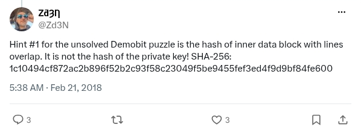

# Demobit hint 1

[Original post](https://x.com/Zd3N/status/966275899757879298). Cited by [demobit-2018](../../../src/collections/zden/demobit-2018.ts). The distinction between the inner data block and the private key is part of the hint.

## Historical provenance

No capture found. The Wayback Machine index and the MemGator aggregator were searched on September 23, 2026 for both the `twitter.com` and `x.com` URL. Wayback indexes each URL once, at August 18, 2025, 09:49:58 UTC, but neither entry holds the post: the `twitter.com` one is a redirect to `x.com`, and the `x.com` one is X's "Something went wrong" page without the hint text or the hash. The oldest trace is the [March 16, 2018 capture of Zden's puzzle page](https://web.archive.org/web/20180316114954/http://crypto.haluska.sk/), which links "Hint #1" to this post without quoting it. So the transcript below was checked only against the current page and screenshot.

## Transcript

> Hint #1 for the unsolved Demobit puzzle is the hash of inner data block with lines overlap. It is not the hash of the private key! SHA-256:
> 1c10494cf872ac2b896f52b2c93f58c23049f5be9455fef3ed4f9d9bf84fe600

## Screenshot

Capture method and limits: [source archive](../README.md).
