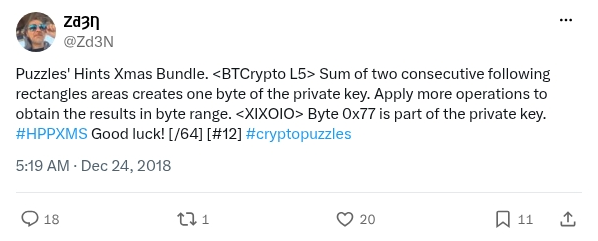

# Christmas hints for Level 5 and XIXOIO

[Original post](https://x.com/Zd3N/status/1077146640090316800). Cited by [level_5](../../../src/collections/zden/level-5.ts) and [xixoio](../../../src/collections/zden/xixoio.ts). This preserves the tweet's wording, including "consecutive", rather than substituting a later version of the hint.

## Historical provenance

[Wayback capture from January 29, 2022, 18:39:39 UTC](https://web.archive.org/web/20220129183939/https://twitter.com/Zd3N/status/1077146640090316800) contains both hints with the same wording as the transcript below, including "consecutive".

## Transcript

> Puzzles' Hints Xmas Bundle. &lt;BTCrypto L5&gt; Sum of two consecutive following rectangles areas creates one byte of the private key. Apply more operations to obtain the results in byte range. &lt;XIXOIO&gt; Byte 0x77 is part of the private key. #HPPXMS Good luck! [/64] [#12] #cryptopuzzles

## Screenshot

Capture method and limits: [source archive](../README.md).
